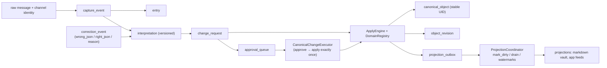
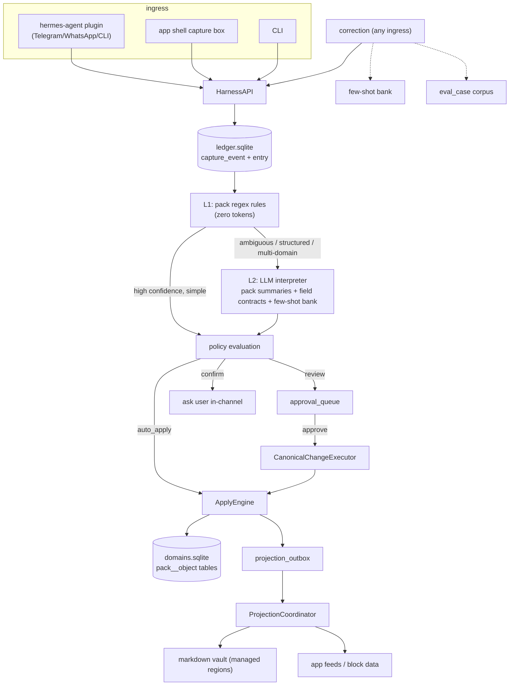
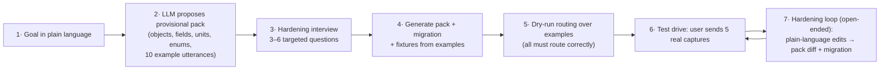

# `<NAME>` — Open-Source Lifestyle Agent Harness

## End-to-End Product, Architecture & Implementation Plan

**Status:** Approved plan, ready for engineering takeover
**Date:** 2026-07-16
**Source system:** Finn's private Hermes deployment (as-is spec: `HermesWorkspace/docs/HERMES_AS_IS_E2E_SPEC_2026-07-16.md`), waves 0–5 of its remediation plan assumed complete
**License target:** MIT · **Name:** `<NAME>` placeholder throughout (candidates in §13.1)
**Audience:** an engineering team that has *not* seen the private codebase and must ship the public v1 end-to-end

---

## Table of contents

1. [Executive summary & product definition](#1-executive-summary--product-definition)
2. [Market assessment](#2-market-assessment)
3. [What we have today (the private system)](#3-what-we-have-today-the-private-system)
4. [Target architecture](#4-target-architecture)
5. [Domain Pack specification](#5-domain-pack-specification)
6. [Guided domain creation](#6-guided-domain-creation)
7. [Multi-domain routing design](#7-multi-domain-routing-design)
8. [Correction & supersession workflow](#8-correction--supersession-workflow)
9. [Universal app shell & block system](#9-universal-app-shell--block-system)
10. [Evaluation replay framework](#10-evaluation-replay-framework)
11. [Phased implementation plan (P0–P9)](#11-phased-implementation-plan-p0p9)
12. [Security, privacy & extraction protocol](#12-security-privacy--extraction-protocol)
13. [Risks & open decisions](#13-risks--open-decisions)
14. [Handover appendix](#14-handover-appendix)

---

# 1. Executive summary & product definition

## 1.1 What this is

`<NAME>` is a **local-first personal agent harness that turns natural-language captures into structured, domain-specific data and usable applications** — and that you can *remix* to any domain that is your passion.

A user:

1. Describes what they want to manage in ordinary language ("I want to track my sourdough journey").
2. Receives a working personalized domain — a schema, routing rules, policies, and an app view — hardened through a short conversational interview.
3. Captures information conversationally from the channels they already use (Telegram, WhatsApp, CLI, web).
4. Corrects mistakes in one message, with full provenance preserved.
5. Watches the system get measurably better, because **every correction becomes a replayable test case**.

The long-term direction is a stackable system of linked domain applications — travel, health, food, finance, and any user-defined area — where a single capture can touch several domains without merging them into one universal schema.

## 1.2 Why it can win

The core engine already exists and is battle-tested in daily private use: a capture-first durable ledger, a hybrid zero-token/LLM router, a policy-gated apply engine with exactly-once approval execution, a durable projection coordinator, and a correction/few-shot feedback loop. This plan extracts that engine into a clean MIT-licensed core, replaces every hardcoded personal domain with a **Domain Pack** format anyone can author or generate, and ships a schema-driven universal app whose views are composed from **remixable blocks**.

Nothing in the open-source landscape combines these properties (§2). Agent runtimes store memory as markdown or vectors. Memory layers store personalization facts. Life-loggers have no schemas or corrections. Text-to-SQL tools have no capture loop. PKM tools have no agent.

**Positioning: the structured-life data layer for agent runtimes.**

## 1.3 Target user

- **Primary:** technical power users who want a reliable personal data system without manually configuring databases, schemas, background workers, or application infrastructure.
- **Secondary (must not be excluded):** non-technical users, for whom setup is one command and the daily workflow is entirely conversational. Channels are optional: the CLI + local web app work with zero channel configuration.

## 1.4 Product promise (contract with the user)

1. **Capture first.** The raw message and its provenance are durably stored before any lossy interpretation.
2. **Never drop.** Failed or ambiguous interpretation degrades to review, an unfiled card, or ledger-only capture — never silence.
3. **One-message corrections.** "no, that run was 8k not 5k" fixes the canonical record, preserves history, and teaches the router.
4. **Your app, your schema.** Describe a domain; get a working schema and app view; harden both in plain language.
5. **Local first.** All canonical data lives on the user's machine in SQLite. Hosted/multiplayer is an export path, not a requirement.
6. **Provably improving.** Corrections auto-generate eval cases; CI replays them; regressions block release.

## 1.5 v1 public release scope (from the PRD, all mapped to phases in §11.11)

| # | PRD item | Phase |
|---|---|---|
| 1 | Guided domain creation | P6 |
| 2 | Provisional schema generation | P6 |
| 3 | Plain-language schema hardening | P6 |
| 4 | Multi-domain routing (incl. multi-context messages) | P2 |
| 5 | Correction and supersession workflow | P3 |
| 6 | Local raw capture archive | P1 |
| 7 | Review queue | P4 (API) + P5 (UI) |
| 8 | Generated application shell | P5 |
| 9 | Food demonstration pack | P8 |
| 10 | Travel reference pack | P8 |
| 11 | Evaluation replay framework | P7 |
| 12 | Idempotent apply & projections, execution receipts, stable global IDs | P1/P3/P4 |
| 13 | Optional Obsidian and channel adapters; Postgres export path | P4/P8; §13.4 |

Health and finance packs may ship as experimental packs after the routing and correction guarantees are stable, exactly as the PRD allows.

---

# 2. Market assessment

Research performed 2026-07-16 across five adjacent categories. Conclusion first: **the intersection this product occupies is empty.** Every neighbor solves one or two of the five pillars (capture-first ledger · plain-language domain creation · hybrid routing · correction→eval loop · schema-driven apps); none combines them.

## 2.1 Category map

| Category | Representative projects | What they do well | What they lack (vs `<NAME>`) |
|---|---|---|---|
| Agent runtimes / channel assistants | [Nous hermes-agent](https://github.com/nousresearch/hermes-agent) (MIT, Python, 30k+ stars since Feb 2026), [OpenClaw](https://github.com/openclaw/openclaw) (MIT, Node, 20+ channels), [Khoj](https://github.com/khoj-ai/khoj) (AGPL, YC-backed second brain), QwenPaw, OpenHuman | Channels, agent loop, plugins/skills, persona, scheduling | Memory is markdown files or vectors. No typed canonical stores, no provenance ledger, no policy-gated apply, no corrections-as-data, no domain apps |
| Agent memory layers | [Mem0](https://mem0.ai), [Zep](https://www.getzep.com) (temporal KG), [Letta/MemGPT](https://www.letta.com), honcho, hindsight | Personalization facts, recall benchmarks, temporal queries | Facts ≠ canonical domain records. No user-visible schema, no review queue, no supersession semantics, no apps, no eval-from-correction loop |
| Life loggers / capture bots | [LIFE-LOGGER](https://github.com/naborajs/LIFE-LOGGER) (Telegram→GitHub markdown), assorted telegram-llm-bots | Low-friction capture | No schema, no routing quality story, no corrections, no structured queries, no apps |
| Text-to-SQL / schema generators | WrenAI, DB-GPT, JSON-schema builders | NL→schema/SQL competence | Developer tools. No capture loop, no provenance, no lifestyle product surface |
| Local-first structured PKM | Obsidian, Anytype, AppFlowy, Tana (closed) | Typed structure, local-first values, plugin culture | The human does all data entry. No conversational capture, no router, no automatic structuring |

Sources: [hermes-agent repo](https://github.com/nousresearch/hermes-agent) · [hermes-agent plugin docs](https://hermes-agent.nousresearch.com/docs/user-guide/features/plugins) · awesome-hermes-agent lists ([0xNyk](https://github.com/0xNyk/awesome-hermes-agent), [SamurAIGPT](https://github.com/SamurAIGPT/awesome-hermes-agent)) · [OpenClaw](https://github.com/openclaw/openclaw) + [Wikipedia](https://en.wikipedia.org/wiki/OpenClaw) · [Khoj](https://github.com/khoj-ai/khoj) · memory-layer comparisons ([apiscout.dev](https://apiscout.dev/guides/zep-vs-mem0-vs-letta-agent-memory-api-2026), [particula.tech](https://particula.tech/blog/agent-memory-frameworks-tested-mem0-zep-letta-cognee-2026), [atlan.com](https://atlan.com/know/best-ai-agent-memory-frameworks-2026/), [mcp.directory](https://mcp.directory/blog/mem0-vs-letta-vs-zep-vs-cognee-2026)) · [LIFE-LOGGER](https://github.com/naborajs/LIFE-LOGGER) · [text-to-SQL roundup](https://medevel.com/llm-powered-text-to-sql-1300/) · assistant roundups ([vellum.ai](https://www.vellum.ai/blog/best-open-source-personal-ai-assistants), [tosea.ai](https://tosea.ai/blog/openhuman-personal-ai-agent-guide-2026)).

## 2.2 Where our uniqueness lies

1. **Provenance-first canonical data.** Every structured row traces to a raw capture event; corrections append revisions; approval decision state and application state are independently queryable. No neighbor has this discipline — it is the difference between "a bot wrote something in a file" and "a system you can trust with your life data."
2. **The remix surface is a spec, not a fork.** Domain Packs (§5) make "build your own domain app" a YAML-authoring (or fully conversational) exercise. Passion-domain communities (bakers, divers, climbers, whisky nerds, language learners) can share packs the way Obsidian users share plugins.
3. **Routing that earns trust.** Zero-token rules for the hot path, LLM only on ambiguity, confidence-gated policies, cost guard, and multi-domain span fan-out. Competitors either burn tokens on everything or file everything in one bucket.
4. **Corrections are the product.** The correction→few-shot→eval-corpus loop turns every user complaint into (a) an immediate fix, (b) a prompt improvement, and (c) a permanent regression test. This is the "improves through use" promise made real, and it's the hardest pillar for competitors to retrofit.
5. **Distribution tailwind.** The first adapter targets hermes-agent's fast-growing MIT ecosystem (plugin registry + awesome lists), while the runtime-agnostic core keeps us portable to OpenClaw/MCP. We are complementary to runtimes, not competing with them — every runtime user is a potential `<NAME>` user.

## 2.3 Positioning statement & taglines

> For people with passions they actually want to track, `<NAME>` is the open-source data layer that turns chat messages into a structured personal database and a working app — unlike assistants that remember things as prose, it gives you canonical, correctable, queryable domain data you own.

Tagline candidates: *"Describe your passion. Get an app. Talk to it."* · *"The structured-life data layer for agent runtimes."* · *"Your life, as data you can trust."*

## 2.4 Distribution strategy

1. **hermes-agent ecosystem first:** publish the adapter to the pip entry-point group `hermes_agent.plugins`, PR both awesome-hermes-agent lists, post in Nous community channels.
2. **Show HN / lobste.rs launch** with a 90-second demo GIF: sourdough domain created from one sentence → capture → correction → app view updates.
3. **Docs site with a pack gallery** — the remix community is the long-term moat; seed it with food (demo), travel (reference), and 2–3 community-candidate packs (workouts, reading log, plant care).
4. **"Remix in an afternoon" tutorial** as the canonical onboarding artifact (§11 P9).

---

# 3. What we have today (the private system)

This section is the porting team's mental model of the source system. Everything here is verified against the running system as of 2026-07-16.

## 3.1 Topology

Three private code locations feed this plan:

| Location | Role | Disposition |
|---|---|---|
| `~/.hermes/hermes-agent` | Nous Research runtime (MIT, v0.14.0, Python ≥3.11): gateway, channels, agent loop, plugin/tool registry, cron | **Consume as upstream dependency** via the adapter; never fork |
| `~/HermesWorkspace` (private) | ~9,300 LOC `lib/` domain logic **plus personal data git-tracked in the same repo** (SQLite DBs, 297 Obsidian notes) | **Reference for porting.** The OSS repo must be fresh — no history import (§12) |
| `~/.hermes/plugins/logbook` | 1,899 LOC plugin: 7 tools, classifier, security-critical `store.py` (1,022 LOC), 12 plain-SQL migrations | Reference for porting |

## 3.2 The capture substrate (already domain-agnostic — port nearly as-is)



Key private modules and their fates:

| Private module (LOC) | What it does | OSS fate |
|---|---|---|
| `plugins/logbook/store.py` (1,022) | RO/RW connection discipline, parameterized writes, `safe_join` path safety, `redact_secrets`, migration runner, capture/correction/approval primitives | **Port** → split into `core/ledger/` + `core/security/` |
| `plugins/logbook/classify.py` (298) | Ordered-regex L1 classifier, confidence 0.85/0.5/0.3, rule-demotion from corrections, domain→folder map | **Rewrite** → registry-driven, rules come from packs (§7) |
| `lib/interpret/router.py` (741) | L2 escalation: structured-domain prefixes force LLM, skip-LLM heuristics, daily cost guard, few-shot injection, schema-field context, payload validation | **Port mechanics, rewrite domain wiring** → `core/routing/` |
| `lib/interpret/stage.py` (899) | Apply-policy evaluation, never-drop fallback builders, versioned interpretation insert | **Port** → `core/policy/` + `core/routing/fallback.py` |
| `lib/apply/engine.py` (480) | ApplyEngine, DomainRegistry, DomainHandler, OperationSpec; journals every op | **Port** → `core/apply/engine.py` |
| `lib/apply/canonical_executor.py` (356) | Approve → apply exactly once; result receipts; schedules projections | **Port** → `core/apply/executor.py` |
| `lib/apply/object_journal.py` (298) | Canonical UIDs, `ensure_canonical_object`, `write_object_revision`, changed-field diffs | **Port** → `core/apply/journal.py` |
| `lib/feed/projection_coordinator.py` (376) | Durable dirty-queue: `mark_dirty`/`drain`/watermarks, adapter registry | **Port** → `core/projections/coordinator.py` |
| `lib/feed/managed_notes.py` (257) | Managed-region markdown writer (free zones preserved) | **Port** → `core/projections/markdown.py` |
| 12 plain-SQL migrations (~878 LOC) + stdlib runner | `schema_version` table, lazy `ensure_migrated`, additive-only convention | **Port** runner + rewrite substrate DDL cleanly |
| `scripts/build_fewshot_bank.py`, `scripts/reinterpret_history.py` | correction_event → fewshot.json; idempotent history replay | **Port + extend** into `core/evals/` (§10) |
| `lib/travel/` (1,718), Roamboard/MiseKit adapters, Obsidian folder taxonomy, `_RULES`, projects registry, persona docs | Finn's life | **Do not port.** Travel is *re-expressed* as a reference pack (P8); Roamboard/MiseKit stay private showcases |

## 3.3 The twelve invariants (carried over verbatim; the architecture must preserve all of them)

1. **Capture first:** raw source and provenance reach the ledger before lossy interpretation.
2. **Never drop:** failed/ambiguous interpretation becomes review, an unfiled card, or ledger-only state.
3. **Canonical structured stores own domain truth;** markdown and app feeds are projections.
4. **Projection failure is recoverable:** rendering/network failure never rolls back canonical capture.
5. **Stable identity:** every replayable source and applied object has an idempotency reference or canonical UID.
6. **Corrections preserve history:** versions/events append; provenance is never silently rewritten.
7. **Approval is observable:** decision state and application state are independently queryable.
8. **Markdown reverse sync is scoped:** only managed regions may propose canonical changes (v1 ships forward-only projection; reverse sync is post-v1, but the managed-region format ships from day one).
9. **External app writes are owner-scoped and acknowledged:** hosted state is never canonical until the local engine applies it (relevant to the future multiplayer path, §13.4).
10. **One shared apply path** for every ingress (chat, CLI, web, imports, future adapters).
11. **One shared projection path:** every canonical commit enqueues the same idempotent projection refresh.
12. **No secret projection:** credentials and channel identifiers never enter notes, feeds, receipts, or health output.

## 3.4 Operational lessons the OSS design bakes in (from the as-is spec's WARN findings)

These are scars, not theory. Each one shaped a design decision below:

| Private-system finding | OSS design consequence |
|---|---|
| Approval resolution didn't execute the change (fixed in Wave 1 by CanonicalChangeExecutor) | Executor is **core**, not optional; "approved" without "applied" is a bug class with a dedicated eval gate (P3) |
| Direct captures could leave app projections stale (fixed by ProjectionCoordinator) | All projections flow through the outbox/watermark coordinator from day one; projection lag is a first-class health metric (P4) |
| 267-item review backlog made the queue meaningless | Review queue ships with SLO counters + bulk triage UX in v1 (P5); policy defaults tuned so review is the exception |
| 48 FK violations accumulated silently in a domain store | `integrity_check` + FK check on every store is a release-blocking CI gate and a runtime health check (P1) |
| Live-count test assertions and wall-clock fixtures made gates flaky | Frozen clock + invariant-based assertions are mandatory test conventions (P7) |
| Domain vocabulary drift (`health.supplement` vs `health.supplements`) | Pack schema owns the vocabulary; aliases are declared data, not scattered strings (§5) |
| Whole-file note writes clobbered user free-text | The managed-region markdown writer is the *only* markdown write path in core (P4) |

---

# 4. Target architecture

## 4.1 Monorepo layout

```
<name>/
├── LICENSE                      # MIT
├── README.md                    # the pitch + 5-minute quickstart
├── core/                        # pip package: <name>-core
│   └── <name>_core/
│       ├── ledger/              # capture substrate: events, entries, idempotency, migrations runner
│       ├── security/            # RO/RW discipline, safe_join, redact_secrets (port of store.py discipline)
│       ├── packs/               # pack loader, validator, schema compiler, pack migrations, registry
│       ├── routing/             # L1 rules engine + L2 LLM router + span fan-out + cost guard
│       ├── interpret/           # LLM interpreter, few-shot bank, payload validation, never-drop fallbacks
│       ├── policy/              # apply_policy evaluation (op × object × channel × confidence)
│       ├── apply/               # ApplyEngine, DomainRegistry, CanonicalChangeExecutor, object journal
│       ├── projections/         # ProjectionCoordinator, markdown adapter, app-feed adapter
│       ├── wizard/              # guided domain creation + hardening loop (§6)
│       ├── evals/               # correction→corpus, replay runner, LLM cassettes, scoring (§10)
│       ├── llm/                 # provider abstraction (OpenAI-compatible + Anthropic)
│       ├── api/                 # FastAPI app: capture/query/review/correct/packs/blocks endpoints
│       └── cli.py               # `<name>` CLI: init, capture, new-domain, review, eval, serve, pack
├── app/                         # universal app shell (Vite + React SPA, built assets served by core/api)
│   └── src/blocks/              # block registry + built-in blocks (§9)
├── adapters/
│   ├── hermes_agent/            # plugin.yaml + register(ctx) → thin wrappers over core API (P8)
│   └── mcp/                     # MCP server exposing the same tool surface (post-v1)
├── packs/
│   ├── food/                    # demonstration pack (P8)
│   ├── travel/                  # reference pack (P8)
│   └── _template/               # `pack new` scaffold
├── docs/                        # docs site (MkDocs Material) + pack gallery
├── examples/                    # example transcripts, demo scripts, seed data (synthetic only)
└── .github/workflows/           # ci.yml (lint+test), evals.yml (replay gate), packcheck.yml, leakscan.yml
```

Rationale for the pieces an eng team might second-guess:

- **Python core, FastAPI API, React SPA.** Python because the source system and the primary runtime ecosystem (hermes-agent plugins) are Python. FastAPI because the API server must also be importable as a library (adapters call core functions in-process; the SPA calls HTTP). React+Vite because the block system needs a real component model for remixers — HTMX would make "write a custom block" a core-team-only activity. The SPA builds to static assets served by the FastAPI app: **one process, `<name> serve`, zero Node at runtime.**
- **SQLite, two databases.** `ledger.sqlite` (substrate tables, §4.3) and `domains.sqlite` (pack-owned tables, named `<pack>__<object>`, e.g. `food__recipe`). Same lazy plain-SQL migration runner as the private system (no Alembic — a deliberate simplicity choice that has already survived 12 migrations in production). Cross-DB references are soft (by `entry_id`/`object_uid`), matching the proven private pattern. All UIDs are ULIDs and all timestamps UTC ISO-8601, which keeps the Postgres export path (§13.4) a schema translation rather than a redesign.
- **Runtime adapters are dumb.** All intelligence lives in core. The hermes-agent adapter is a `plugin.yaml` + `register(ctx)` that maps ~7 tools onto `HarnessAPI` calls (§4.4). Porting to OpenClaw/MCP later means re-mapping the same 7 calls.

## 4.2 Process model

- `<name> serve` — long-running local process: FastAPI (API + SPA) + background workers (projection drain loop, scheduled jobs). This is the only daemon.
- Agent-runtime ingress (hermes-agent gateway etc.) runs as its own process (owned by that runtime); the adapter talks to core either in-process (same venv) or via `http://127.0.0.1:<port>` — **decision locked: HTTP**, because it survives venv/runtime mismatches and makes every adapter identical.
- `<name>` CLI — one-shot commands (capture, review, eval, pack, new-domain) that call the same API.

## 4.3 Substrate schema (ledger.sqlite; final table list)

Port of the proven private schema, cleaned:

| Table | Purpose |
|---|---|
| `capture_event` | Raw payload, channel, source ref (idempotency), timestamps, actor |
| `entry` | The user-facing capture unit; routing result, domain, status (`applied/review/ledger_only/unfiled`) |
| `source_link` | entry ↔ external identity links (message IDs, import refs) |
| `interpretation` | Versioned structured interpretation per entry (`{entry_id, version, payload_json, interpreter, confidence}`) |
| `change_request` | Proposed domain operations (one per routed span), status independent of approval |
| `approval_queue` | Review items: decision state (`pending/approved/denied/expired`) + resolver metadata |
| `canonical_object` | Stable ULID per domain object (`<pack>:<object_type>:<ulid>`) |
| `object_revision` | Append-only revision journal with changed-field diffs and provenance |
| `correction_event` | `{target_kind, target_id, reason_code, wrong_json, right_json, applied_change_request_id}` |
| `projection_outbox` + `projection_watermark` | Durable dirty-queue and per-adapter convergence watermarks |
| `apply_policy` | Policy rows seeded from packs, user-overridable (§5.5) |
| `schema_registry` | Compiled pack schemas + versions (routing context + validation source) |
| `eval_case` | Auto-generated + fixture eval cases (§10) |
| `cost_ledger` | Per-day LLM spend for the cost guard |

## 4.4 `HarnessAPI` — the adapter contract

The entire runtime-facing surface. Adapters translate their runtime's tool-call convention into these; nothing else is exposed:

```python
capture(text, channel, source_ref, attachments=None) -> CaptureReceipt
    # CaptureReceipt: entry_id, routed=[...(domain, object_type, operation, disposition)], status
query(domain=None, object_type=None, filters=None, q=None, limit=50) -> rows          # read-only
correct(text=None, entry_id=None, object_uid=None, action=None) -> CorrectionReceipt  # NL or explicit
review_list(status="pending", domain=None) -> items
review_resolve(approval_id, decision, note=None) -> ExecutionReceipt                  # approve ⇒ applied exactly once
new_domain(goal_text) -> WizardSession          # §6; wizard continues via wizard_reply()
wizard_reply(session_id, text) -> WizardTurn
```

Every mutating call returns a **receipt** (PRD reliability requirement): what was decided, what was applied, canonical UIDs touched, projection status (`refreshed | pending`).

## 4.5 End-to-end data flow



---

# 5. Domain Pack specification

The Domain Pack is the remix surface — the single artifact a community member authors (or the wizard generates) to add a domain. **A pack is data, never code** in v1: no arbitrary Python execution from third-party packs (§12.4). The generic ApplyEngine executes declared operations against the compiled schema; packs that outgrow declarative operations can ship a Python handler **only** via a separately-installed pip package that registers through the entry-point mechanism, which is an explicit trust decision by the user.

## 5.1 Layout

```
sourdough/
├── pack.yaml            # manifest
├── schema.yaml          # object types + fields
├── routing.yaml         # rules, example utterances, LLM hints
├── operations.yaml      # allowed operations per object type
├── policy.yaml          # apply-policy defaults
├── projections.yaml     # app blocks config + markdown templates
├── prompts/             # optional interpreter prompt fragments
├── evals/
│   ├── fixtures.jsonl   # golden cases, ship with the pack
│   └── corrections.jsonl# user-local, auto-appended (gitignored in pack repos)
└── migrations/          # generated SQL, one file per schema version
```

Install = directory drop-in at `~/.<name>/packs/<pack>/`, or `pip install <name>-pack-sourdough` (entry-point group `<name>.packs`), or `<name> pack add <git-url>`. Discovery is directory scan + entry-point scan at startup; `<name> pack list/validate/upgrade` manage lifecycle.

## 5.2 `pack.yaml` (manifest)

```yaml
name: sourdough
version: 1.2.0            # semver; MAJOR = breaking schema change
title: "Sourdough Journey"
description: "Track starters, bakes, experiments, and what you learn."
author: "..."
license: MIT
core_compat: ">=0.3,<2"   # core validates on load
aliases: [bread, baking.sourdough]   # legacy/alternate domain names accepted at ingress
```

## 5.3 `schema.yaml` (object types)

```yaml
objects:
  bake:
    title_field: loaf_name
    fields:
      loaf_name:   {type: text, required: true}
      baked_at:    {type: datetime, required: true, default: capture_time}
      flour_mix:   {type: text}
      hydration:   {type: number, unit: percent, min: 40, max: 120}
      bulk_hours:  {type: number, unit: hours}
      result:      {type: enum, values: [dense, decent, good, great], allow_other: true}
      notes:       {type: text, long: true}
      photos:      {type: attachment, many: true}
    links:
      starter:     {to: sourdough.starter, cardinality: many_to_one}
  starter:
    fields:
      name:        {type: text, required: true}
      created_on:  {type: date}
      status:      {type: enum, values: [active, dormant, retired]}
```

Field types (closed set in v1): `text, number, integer, boolean, date, datetime, duration, enum, attachment, location`. `unit` is declared, never assumed (a hard lesson from the private system's supplement-dose ambiguity). `links` may target other packs (`to: travel.trip`) — that is the PRD's "domain-owned facts with explicit cross-domain links."

The **schema compiler** turns this into: (a) `CREATE TABLE sourdough__bake ...` DDL in `migrations/`, (b) a `schema_registry` row (field contract JSON used as LLM routing context and apply-time validation), (c) block data bindings (§9).

## 5.4 `routing.yaml`

```yaml
rules:                                  # L1, zero-token; ordered
  - match: "(bak(ed|ing)|loaf|boule|batard)"
    object: bake
    confidence_boost: 0.1
  - match: "(starter|levain)\\b"
    object: starter
examples:                               # doubles as few-shot seed AND eval fixtures
  - text: "baked a 75% hydration country loaf, bulk 5h, came out great"
    expect: {object: bake, operation: create,
             fields: {hydration: 75, bulk_hours: 5, result: great}}
  - text: "fed the rye starter"
    expect: {object: starter, operation: update}
negative_examples:                      # guard against over-matching
  - text: "the app build is toast"      # dev talk, not baking
llm_hints: >
  Hydration is baker's percentage. "Doubled in 4h" describes the starter,
  not bulk fermentation.
```

Minimum 8 examples + 2 negative examples per pack — **enforced by `pack validate`**, because routing quality on user-defined domains is the product's make-or-break (§7).

## 5.5 `operations.yaml` + `policy.yaml`

```yaml
# operations.yaml — the closed vocabulary the ApplyEngine may execute
bake:    [create, update, correct, delete]
starter: [create, update, correct, merge, delete]
```

```yaml
# policy.yaml — seeds apply_policy rows; user overrides win and survive pack upgrades
defaults:
  - {operation: create,  min_confidence: 0.8, action: auto_apply}
  - {operation: update,  min_confidence: 0.85, action: auto_apply}
  - {operation: correct, action: auto_apply}      # explicit user corrections always apply
  - {operation: delete,  action: review}
  - {operation: merge,   action: review}
  - {match: {channel: email}, action: review}     # channel-conditional rows supported
fallback: unfiled_card                            # never-drop tier for this domain
```

Actions: `auto_apply | review | confirm | reject`. `confirm` asks the user in-channel and applies on affirmative reply (used for sensitive domains, e.g. medication regimens).

## 5.6 `projections.yaml`

```yaml
app:
  icon: "🍞"
  views:
    - {id: bakes,   title: "Bakes",   block: timeline,
       object: bake, config: {date_field: baked_at, media_field: photos}}
    - {id: search,  title: "Find",    block: search,
       objects: [bake], config: {facets: [flour_mix, result, hydration]}}
    - {id: starters, title: "Starters", block: list,
       object: starter, config: {group_by: status}}
    - {id: stats,   title: "Progress", block: stats,
       object: bake, config: {measures: [{field: result, agg: distribution},
                                         {field: hydration, agg: trend}]}}
markdown:
  folder: "Sourdough"
  note_template: bake_note.md.j2       # rendered inside managed regions only
```

## 5.7 Pack evolution & migrations

- Schema edits go through `<name> pack migrate <pack>`: diffs old vs new `schema.yaml`, generates additive SQL (new columns/tables, enum widening) into `migrations/`, bumps version. **Destructive changes** (drop/rename/narrow) require `--breaking`, generate a MAJOR bump, and emit a data-preserving migration plan (rename = add + backfill + tombstone old column) — never silent data loss.
- On pack upgrade, core applies pending pack migrations with the same `schema_version` runner as substrate migrations, then re-registers the field contract.
- The wizard's hardening loop (§6) uses exactly this path, so generated and hand-edited packs stay migratable forever.

---

# 6. Guided domain creation

The flagship flow. It must work identically in **chat** (via any runtime adapter) and the **CLI/app shell wizard**, because the same `wizard/` engine drives both.

## 6.1 Flow



Interview questions are *targeted*, generated from what the proposal left ambiguous — cadence ("per bake or per day?"), units ("hydration in percent or grams?"), key views ("do you care more about browsing history or searching by ingredient?"), correction style, privacy (does this domain need `confirm` policies?). Never more than 6 questions; the PRD's promise is a working app from ordinary language, not a form.

## 6.2 Hardening is a first-class, ongoing verb

After creation, any time, in any channel:

> "in sourdough, split flour_mix into flour_type and mix_ratio, and add a 'crumb shot' photo field"

→ wizard produces a **pack diff preview** (fields added/renamed/typed, migration summary, affected policies/views) → user confirms → migration applies → `schema_registry` + few-shot context update → an eval case is appended asserting the new field routes. This is PRD item #3 ("plain-language schema hardening") and it reuses §5.7 wholesale.

## 6.3 Provisional-schema quality guardrails

- The generator prompt includes the **pack authoring style guide** (field naming, unit discipline, enum-with-`allow_other` bias, "events vs regimens" distinction learned from the private health domain).
- Generated packs always pass `pack validate` before activation (schema compiles, ≥8 examples route in dry-run, policies well-formed).
- Everything is reviewable text on disk — a power user can open `schema.yaml` in an editor at any point; the wizard is a convenience layer over the same files.

---

# 7. Multi-domain routing design

Routing is the product's make-or-break: the PRD demands the tool be "VERY good at routing and identifying what a message is about, whether it spans multiple contexts." The private system's two-layer design is proven; the OSS work is generalizing it to **runtime-defined domains** and **multi-domain fan-out**.

## 7.1 Layer 1 — zero-token rules (the hot path)

- Rules come from installed packs' `routing.yaml` (compiled at pack load into one ordered matcher), plus **learned aliases** promoted from corrections. No hardcoded domain list anywhere in core — the private `STRUCTURED_DOMAIN_PREFIXES` constant is replaced by a per-pack `interpretation: structured|simple` flag in `pack.yaml` (structured ⇒ always escalate to L2 for field extraction; simple ⇒ eligible for L1-only capture).
- Confidence model (ported): exactly one pack matches ⇒ 0.85 (+pack-declared boosts, capped); multiple packs match ⇒ 0.5 and escalate; none ⇒ 0.3 and escalate.
- **Rule demotion (ported):** rules repeatedly implicated in corrections get their confidence capped, pushing their traffic to L2 until fixed. This is the cheap half of the learning loop.
- L1-only capture is permitted only when: single match ∧ confidence ≥ 0.85 ∧ pack is `simple` ∧ text is short ∧ no correction intent detected. Everything else escalates.

## 7.2 Layer 2 — one LLM call, structured fan-out

One call per escalated capture. Context assembled from: (a) compact pack summaries — name, description, 3 example utterances each; (b) full field contracts from `schema_registry` for the L1-shortlisted packs (all packs' summaries, but contracts only for likely ones — token discipline); (c) the few-shot correction bank (§8.4); (d) open-context hints packs may register (e.g. travel's "currently active trip" — generalized from the private open-trip context).

Output schema (enforced via structured output / JSON-schema mode, retry once on invalid — ported behavior):

```json
{
  "captures": [
    {"domain": "food", "object_type": "dining_note", "operation": "create",
     "span": "amazing tsukemen at Rokurinsha", "confidence": 0.9,
     "fields": {"dish": "tsukemen", "venue": "Rokurinsha"},
     "links": [{"to_domain": "travel", "relation": "occurred_during"}]},
    {"domain": "travel", "object_type": "timeline_item", "operation": "create",
     "span": "at Tokyo Station before the 3pm shinkansen", "confidence": 0.85,
     "fields": {"place": "Tokyo Station"}}
  ],
  "unmatched_text": null,
  "needs_clarification": false,
  "clarifying_question": null
}
```

- **Fan-out:** each element becomes its own `change_request`, policy-evaluated independently — one message can auto-apply into food while its travel half goes to review. `links` create cross-domain link records between the resulting canonical objects (PRD: "a single capture may connect travel, food, health, and finance without merging them into one universal schema").
- **`unmatched_text`** non-null triggers the never-drop ladder for the remainder. **`needs_clarification`** with a `confirm`-capable channel asks the user one question; otherwise the capture goes to review with the question attached (the review queue shows *what the router wanted to know* — a major triage UX win).

## 7.3 Never-drop ladder (ported, generalized)

1. Pack-declared fallback (e.g. travel's dated flexible timeline item).
2. **Unfiled domain card** — structured-ish JSON preserved, no domain commitment.
3. Ledger-only entry.

Nothing is ever rejected. Fallback tier is recorded on the entry so evals can measure "how often do we fail to route" per pack.

## 7.4 Cost & calibration

- Daily LLM cost guard (ported): configurable USD cap; past it, rules-only + review flagging. Cost per interpretation recorded in `cost_ledger`; surfaced in health UI.
- **Calibration harness (new):** the eval corpus (§10) reports confidence calibration per pack (do 0.9-confidence routes actually succeed 90% of the time?) so the auto-apply thresholds in `policy.yaml` are tuned from data, not vibes. Miscalibrated packs get a docs-linked warning from `pack validate --stats`.

---

# 8. Correction & supersession workflow

The PRD's second core capability: "safely correcting routing, extraction, and interpretation errors without losing provenance," in one conversational interaction.

## 8.1 The one-message contract

> "that bake was 80% hydration not 75" · "the Rokurinsha note should be under travel too" · "undo that last capture" · "merge those two starters"

Any ingress accepts corrections. The router detects correction intent (ported `CORRECTION_INTENT_RE` + LLM confirmation); the interpreter resolves the target (most-recent-matching entry/object, or explicit ID from the app UI) and produces a correction operation.

## 8.2 Correction semantics (all ported)

| Action | Effect |
|---|---|
| `amend` | New `object_revision` with changed fields; prior revision preserved |
| `move` | Re-route entry to another domain/object; original interpretation superseded, not deleted |
| `merge` | Two canonical objects → survivor + tombstone with link; review-gated by default |
| `undo` | Reverting revision appended (never row deletion); projections refreshed |
| `mark_wrong` | Records the error without knowing the fix — feeds the eval corpus as a "known bad" case |

Every correction writes a `correction_event` with `wrong_json`/`right_json`/`reason_code` and (where applied) the linked change request — the provenance triple that powers §8.4 and §10. **No correction leaves orphaned canonical records** (PRD): the executor refuses correction application unless referential integrity checks pass, and FK checks are a runtime health gate.

## 8.3 Supersession rules

- Interpretations are versioned; a correction inserts version N+1 and marks N superseded. Queries default to latest; provenance queries can walk the chain.
- Canonical objects never lose revisions. "Delete" = tombstone revision; hard purge is an explicit, separate, confirm-gated maintenance command (privacy escape hatch).

## 8.4 The learning loop

1. `correction_event` lands →
2. nightly (or on-demand) **few-shot bank rebuild** selects representative wrong→right pairs per reason code, keeps the bank under a token budget, injects into L2 prompts (ported `build_fewshot_bank.py`);
3. rule demotion caps offending L1 rules (§7.1);
4. an **eval case is auto-appended** (§10) — the new, product-defining step;
5. repeated corrections of the same shape surface in the app as a suggested pack edit ("you've corrected hydration units 3× — add `unit: percent`?") → one tap opens the hardening flow (§6.2).

---

# 9. Universal app shell & block system

One local web app renders every domain. Domains differ by **which blocks they compose**, not by generated code — travel reads as list/timeline, recipes as search-heavy, workouts as history + future planning, exactly per the locked product decision.

## 9.1 Built-in block catalog (v1)

| Block | Renders | Config surface (examples) |
|---|---|---|
| `capture_feed` | Reverse-chron entries w/ routing badges + one-tap correct | domains filter |
| `list` | Sortable/groupable table of objects | columns, group_by, sort |
| `timeline` | Date-anchored cards w/ media | date_field, media_field, range zoom |
| `detail` | One object: fields, revision history, provenance chain, linked objects | field layout |
| `search` | Full-text (SQLite FTS5) + facet filters | objects, facets |
| `stats` | Distributions, trends, streaks | measures: field × agg |
| `history` | Periodized past view (weeks/months) w/ comparisons | period, measures |
| `planner` | Future-dated items + "plan next" creation affordance | date_field, statuses |
| `review_queue` | Global: pending approvals w/ diff preview, approve/deny/edit, bulk triage, SLO counters | filters |

`review_queue`, `capture_feed`, and `detail` are also **global surfaces** (not per-domain): the review queue is the operational heart of the product and gets first-class treatment (backlog lesson, §3.4).

## 9.2 How blocks bind to data

Blocks never query SQL directly. Each block declares a **data contract** (e.g. `timeline` needs `object`, a `datetime` field, optional attachment field); the pack's `projections.yaml` binds contract slots to schema fields; the core API serves a generic `/api/blocks/<view_id>/data` endpoint that compiles the binding into safe, parameterized queries (RO connection, enforced by the ported store discipline). Adding a field to a schema automatically makes it available to facets/columns/measures.

## 9.3 The remix path for custom blocks

1. **Config-level remix (most users):** rearrange views, choose blocks, tune facets/measures — pure YAML.
2. **Custom block (React devs):** a block = React component + JSON-schema for its config + declared data contract, registered in `app/src/blocks/registry.ts`. Ships in-tree via PR, or side-loaded from `~/.<name>/blocks/` (dev mode, built with the provided Vite config). Custom blocks are trusted code and documented as such (§12.4).
3. **Bespoke app (power users):** consume the same HTTP API from any external app — the pattern proven privately by Roamboard/MiseKit, which remain the reference examples in docs (described, not shipped).

## 9.4 Correction UX in the shell

Every rendered object carries its provenance: hover/tap → original capture text, interpretation confidence, revision history. Inline edit = a `correct` call (same path as chat — invariant 10), never a raw row update. The capture feed's "wrong domain?" one-tap opens a move/merge dialog. **The app shell is a client of the harness, with no privileged write path.**

---

# 10. Evaluation replay framework

The PRD elevates this to release scope: "every correction becomes a replayable test case." The private system has all the raw material (correction_event, `reinterpret_history.py`, verification gate) but never wired it into a regenerating corpus — **this is the flagship new build**, and it is also our answer to the hardest OSS problem: keeping routing quality high across thousands of user-defined domains we will never see.

## 10.1 Eval case format (`eval_case` table + JSONL export)

```json
{"id": "ec_01J...", "source": "correction",
 "raw_text": "baked an 80% loaf, bulk 4h",
 "context": {"packs": ["sourdough@1.2.0", "food@2.0.1"], "date": "2026-07-16",
             "open_hints": []},
 "expected": {"captures": [{"domain": "sourdough", "object_type": "bake",
              "operation": "create", "fields": {"hydration": 80, "bulk_hours": 4}}]},
 "provenance": {"correction_event_id": 1234},
 "created_at": "2026-07-16T10:00:00Z"}
```

Three sources: **pack fixtures** (ship with packs, from `routing.yaml` examples), **corrections** (auto-appended when a correction resolves — expected = the corrected interpretation, input = the *original* raw capture and pack context), **curated** (hand-written contract cases: approval-executes-once, never-drop ladder, multi-domain fan-out).

## 10.2 Replay runner

`<name> eval [--packs ...] [--live-llm]`

- **Frozen clock** injected everywhere (the wall-clock flakiness lesson is codified: no eval may read real time).
- **LLM cassettes by default:** recorded request/response pairs keyed by a normalized prompt hash make CI deterministic and free. `--live-llm` re-records and reports drift (run nightly against a pinned model, not per-PR).
- Scoring: routing accuracy (domain/object/operation exact), field extraction (per-field precision/recall), disposition correctness (auto vs review), calibration curves (§7.4). Output: per-pack scorecard + diff vs the committed baseline snapshot.

## 10.3 Gates

- **CI (per PR):** full corpus replay with cassettes; any regression vs baseline fails the build. Substrate contract suites (approval-executes-exactly-once, never-drop, idempotency, FK-clean, projection convergence) run alongside — the ported verification-gate pattern with invariant-based assertions only.
- **Release:** live-LLM replay on the pinned model + `pack validate --stats` on bundled packs + the §12 leak scan.
- **False completed-action interpretations** (system claims something applied that didn't) are tagged as their own eval category and are **release-blocking at zero occurrences** — a direct PRD safety requirement.

## 10.4 The remixer workflow

`<name> eval` runs the user's *own* corpus (their fixtures + their corrections) against *their* installed packs — every remixer gets a personal regression suite for free, and `pack publish` refuses packs whose fixtures don't pass. Users can export sanitized correction-derived cases (`<name> eval export --sanitize`, PII-stripped + reviewed in a diff) as PR contributions to upstream packs — the community flywheel: **using the product generates the test suite that protects the product.**

---

# 11. Phased implementation plan (P0–P9)

Assumes a 2-engineer team. Total ≈ **28 eng-weeks (~3.5 calendar months)** with P5 ∥ P6 parallelized. Every phase ends with a verifiable acceptance gate; do not start the next phase's dependent work with a red gate (contract-freeze discipline that already saved the private system twice).

**Dependency graph:** P0 → P1 → P2 → P3 → P4 → {P5 ∥ P6} → P7 → P8 → P9. (P7's runner skeleton should be stood up during P2 — see P2 checklist — so eval cases accumulate from the first router commit.)

## P0 — Repo bootstrap & extraction guardrails (2 wk)

**Goal:** a fresh public-ready repo where it is *structurally difficult* to leak personal data, plus the ported substrate DDL.

- [ ] Decide the name (§13.1); register GitHub org, PyPI names (`<name>-core`, `<name>-pack-*` prefix), domain for docs.
- [ ] Fresh repo (NO history from private repos; private repos never added as remotes — enforce with a pre-push hook + CI check on remote URLs).
- [ ] MIT LICENSE, CODE_OF_CONDUCT, CONTRIBUTING (with the pack authoring style guide seed), SECURITY.md.
- [ ] CI skeleton: ruff + pyright + pytest on 3.11–3.13; Node build for `app/`.
- [ ] **Leak gates in CI from day one:** gitleaks; custom scanner (denylist file of personal names/places/emails kept in a *private* repo, fetched via secret in CI); binary-file and `*.sqlite` blockers; fixture linter (all example data must come from `examples/synthetic/`).
- [ ] Write the substrate DDL (§4.3) as migrations `ledger_001_substrate.sql` etc., cleanly re-typed (not copied) from the private migrations, with the vocabulary drift fixed (singular domain names, one target-vocabulary format).
- [ ] Port the migration runner + `schema_version` mechanics with tests.
- [ ] Decision record (ADR-001..004): HTTP adapter contract, two-database layout, ULID identity, packs-are-data.

**Gate:** CI green on a walking skeleton (`<name> init` creates both DBs, migrations apply, integrity+FK checks pass); a seeded fake-PII commit is rejected by the leak gates (test the guard, not just install it).

## P1 — Core substrate (3 wk)

**Goal:** capture-first ledger with idempotency, receipts, and never-drop — the invariants live here.

- [ ] Port `store.py` discipline → `core/ledger/` + `core/security/`: RO/RW connections, parameterized-write helpers, `safe_join`, `redact_secrets` (unit-tested against the private system's attack cases: path traversal, secret echo).
- [ ] `capture()` transaction: validate → insert `capture_event` + `entry` + `source_link` (+tags) → return receipt. Interpretation is *staged after* the durable insert (invariant 1); partial-completion semantics documented and tested.
- [ ] Idempotency: dedupe by `source_ref`; replay-safe re-capture returns the original receipt.
- [ ] Never-drop ladder data model: entry statuses `applied/review/ledger_only/unfiled` + unfiled-card storage.
- [ ] `query()` read-only API with domain/type/filter/FTS5 params.
- [ ] `HarnessAPI` façade + FastAPI wiring for `capture/query`; CLI `capture`, `init`, `serve` (API-only mode).
- [ ] Attachment storage (content-addressed files under `~/.<name>/attachments/`).
- [ ] Health endpoint: integrity_check + FK check per store, counts, last-capture timestamp.

**Gate:** contract test suite green: capture-first ordering observable, idempotent double-capture, receipts complete, FK/integrity clean under crash-injection tests (kill between substeps; ledger anchor survives).

## P2 — Pack system & registry-driven routing (4 wk)

**Goal:** domains defined at runtime; the two-layer router with multi-domain fan-out. *The make-or-break phase.*

- [ ] Pack loader/validator: parse the five YAML files, semver/compat checks, ≥8 examples + ≥2 negatives enforced, directory + entry-point discovery, `pack list/validate/add`.
- [ ] Schema compiler: `schema.yaml` → DDL migration + `schema_registry` contract JSON + field-binding metadata. Pack migration apply path.
- [ ] `_template` pack + `pack new` scaffold.
- [ ] L1 matcher compiled from installed packs: ordered rules, confidence model, boosts/caps, rule-demotion hooks (wired to correction events in P3).
- [ ] `llm/` provider abstraction: OpenAI-compatible client (covers DeepSeek/OpenAI/OpenRouter/Ollama) + Anthropic; JSON-schema structured output w/ prompted-JSON fallback + retry-once.
- [ ] L2 interpreter: context assembly (pack summaries, shortlisted field contracts, hints), fan-out output schema, span handling, `unmatched_text` → never-drop ladder, clarification channel-awareness.
- [ ] Cross-domain link records on fan-out.
- [ ] Cost guard + `cost_ledger` + per-capture cost on receipts.
- [ ] **Stand up the eval runner skeleton now** (fixture replay + cassettes, minimal scoring) so every routing commit is measured from the start; full framework lands in P7.
- [ ] Temporary dev pack ("plants" or similar synthetic domain) used purely for routing tests.

**Gate:** with two synthetic packs installed, the routing eval fixture set (≥60 cases incl. 15 multi-domain and 10 negatives) scores ≥90% routing accuracy with cassettes; a message spanning both packs produces two policy-independent change requests with a link record; cost guard trips correctly in a fixture.

## P3 — Apply, policy & corrections (3 wk)

**Goal:** policy-gated exactly-once apply and the full correction/supersession loop.

- [ ] Port ApplyEngine/DomainRegistry/OperationSpec; generic declarative handler executes `operations.yaml` vocab against compiled schemas (create/update/correct/merge/delete w/ tombstones).
- [ ] Port object journal: canonical ULIDs, revisions, changed-field diffs.
- [ ] Policy evaluator: `policy.yaml` seeds `apply_policy` rows; user overrides persist across pack upgrades; `confirm` action w/ channel callback.
- [ ] Port CanonicalChangeExecutor: approve → apply **exactly once**, execution receipts, projection scheduling stub.
- [ ] Approval queue API: list/resolve with decision-vs-application state separately queryable.
- [ ] Correction intent detection + target resolution; `correct()` API (NL + explicit); the five correction actions (§8.2); `correction_event` writes.
- [ ] Few-shot bank builder + injection into L2 prompts; rule demotion wired.
- [ ] Correction → auto-append `eval_case` (closing the private system's gap).

**Gate:** contract suites green: approve-applies-exactly-once (incl. double-resolve and crash-between attempts), one-message correction round-trip (wrong capture → NL correction → revision + provenance chain + eval case exists), merge leaves no orphans (FK gate), policy matrix fixture (auto/review/confirm × confidence) fully covered.

## P4 — Projections & review queue API (2 wk)

**Goal:** durable, idempotent projections; the review surface.

- [ ] Port ProjectionCoordinator: outbox, `mark_dirty`/`drain`, per-adapter watermarks, retry-from-durable-state; background drain loop in `serve`.
- [ ] Markdown adapter: managed-region writer (free zones sacred), pack `note_template` rendering, vault layout from `projections.yaml` (generic vault; Obsidian just opens it — the "optional Obsidian adapter" of the PRD).
- [ ] Block-data adapter: materialized view-data cache or direct compiled queries (choose direct-first; cache only if profiling demands).
- [ ] Projection lag metrics in health output; `pending` status on receipts until convergence (PRD: projection state visibly pending after canonical changes).
- [ ] Review queue API: filters, diff previews (proposed vs current canonical), bulk operations, SLO counters (pending count, overdue count, oldest item age).

**Gate:** kill-the-daemon convergence test (canonical commit with projections down → restart → projections converge, watermark advances, receipt flips to refreshed); managed-region fuzz test (random user edits outside markers always survive re-render); review SLO counters accurate against fixtures.

## P5 — Universal app shell (4 wk) — parallel with P6

**Goal:** the product becomes visible: one SPA, nine blocks, review-first operations.

- [ ] SPA scaffold (Vite+React+TS), served from FastAPI static mount; local-only default binding; token-gated API if bound beyond localhost.
- [ ] Block registry + data-contract binding compiler + `/api/blocks/<view>/data` endpoint (RO, parameterized).
- [ ] Ship the nine built-in blocks (§9.1) against synthetic packs; responsive; keyboard-friendly.
- [ ] Global surfaces: home (per-domain cards from pack manifests), capture box, capture feed w/ one-tap correction, review queue UI (approve/deny/edit-then-approve, bulk triage), health panel (store integrity, projection lag, LLM spend, eval score).
- [ ] Detail view provenance chain: capture text → interpretation (confidence) → revisions.
- [ ] Correction dialogs (move/merge/amend) calling `correct()` — no privileged writes.
- [ ] Custom-block side-load dev path + docs page.
- [ ] Empty states that teach ("No domains yet — describe what you want to track").

**Gate:** scripted walkthrough on synthetic data passes: install two packs → capture from web box → see it in timeline/search/stats → correct from detail view → revision chain visible → review queue drains to zero → health panel all green. Lighthouse perf ≥85 local.

## P6 — Guided domain creation wizard (3 wk) — parallel with P5

**Goal:** the flagship "describe your passion → working app" flow, in chat and CLI/web.

- [ ] Wizard engine: session state machine (goal → proposal → interview → generate → dry-run → test-drive → hardening), resumable, channel-agnostic (`new_domain`/`wizard_reply` API).
- [ ] Proposal generator prompt + pack authoring style guide; outputs full pack files + 10 examples.
- [ ] Interview question generator (max 6, targeted at ambiguities: cadence/units/views/privacy).
- [ ] Generate → `pack validate` → dry-run routing over examples (all must route; failures regenerate with feedback).
- [ ] Test-drive mode: next N captures get verbose routing explanations + instant-correct affordance.
- [ ] Hardening loop: NL edit → pack diff preview → confirm → migration + registry refresh + fixture append (§6.2). Also triggered by repeated-correction suggestions (§8.4).
- [ ] CLI `new-domain` + app-shell wizard UI (same engine).
- [ ] Wizard evals: 10 golden goal-statements (incl. "sourdough journey") must produce packs that pass validation and route their own examples ≥95%.

**Gate:** cold start to working domain in ≤10 minutes: fresh install → one-sentence goal → interview → capture 5 synthetic messages → all visible in app blocks → one hardening edit round-trips with a migration. Recorded as the demo script for P9.

## P7 — Evaluation replay framework, complete (2 wk)

**Goal:** finish §10 beyond the P2 skeleton; make quality enforceable.

- [ ] Cassette store: normalized prompt-hash keying, record/replay modes, drift report (`--live-llm`).
- [ ] Frozen-clock injection audit across core (no `datetime.now()` outside the clock provider — lint rule).
- [ ] Full scoring: routing/field/disposition/calibration + per-pack scorecards + committed baseline snapshots + regression diff.
- [ ] Correction→eval_case backfill command for pre-P3 data (`eval backfill`).
- [ ] `eval export --sanitize` (PII strip + human diff review step) for community contribution.
- [ ] CI wiring: PR gate (cassettes, zero regressions), nightly live-LLM job (pinned model), release gate incl. zero false-completed-action cases.
- [ ] Curated contract-case set: approval-exactly-once, never-drop ladder, multi-domain fan-out, idempotent re-capture, projection convergence.

**Gate:** deliberately break a router heuristic on a branch → CI fails with a legible per-pack diff; restore → green. Nightly live job produces a drift report artifact.

## P8 — Demo & reference packs + hermes-agent adapter (3 wk)

**Goal:** proof the remix surface works, plus the first runtime adapter (distribution).

- [ ] **Food demonstration pack:** recipes/dining/ideas with the concept→recipe→experiment→observation lifecycle distilled from the private design (§23 of the as-is spec) — the "look how deep a pack can go" showcase. ≥25 fixtures.
- [ ] **Travel reference pack:** trips/timeline items/bookings-lite, generalized from the private travel domain (no Roamboard); demonstrates open-context hints (active trip), cross-domain links (dining ↔ trip), planner block. ≥25 fixtures.
- [ ] Both packs authored *through the public pack format only* — any missing capability found while building them is a core bug to fix now (dogfood gate).
- [ ] hermes-agent adapter: `plugin.yaml` + `register(ctx)` exposing `capture/query/correct/review/new_domain` tools over HTTP to `<name> serve`; agent behavioral guidance snippet (capture-first instructions) as a documented skill/SOUL fragment; publish via pip entry-point `hermes_agent.plugins`.
- [ ] Adapter conformance test: scripted hermes-agent session (capture → correct → review) against a live local stack; pin supported hermes-agent version range.
- [ ] Founder-as-user-0 validation: Finn re-expresses ≥2 of his real private domains as private packs on a production install; friction log filed as issues (personal packs and data are NOT committed anywhere public).
- [ ] Quickstart: `pipx install <name>-core && <name> init && <name> serve` + optional hermes-agent hookup guide.

**Gate:** on a clean machine (fresh VM), the quickstart + food pack + a Telegram capture via hermes-agent → app timeline, in under 15 minutes, following only public docs. Both packs' fixtures green in CI.

## P9 — Docs, audit & launch (2 wk)

**Goal:** ship it.

- [ ] Docs site (MkDocs Material): concepts (ledger/packs/routing/corrections/evals — largely condensed from this document), quickstart, pack authoring guide + style guide, block remix guide, adapter guide, architecture page with the §4.5 diagram.
- [ ] "Remix in an afternoon" tutorial (build a plant-care pack from scratch).
- [ ] Pack gallery page (food, travel, template, community-candidate list).
- [ ] **Final leak audit (release-blocking):** full-repo + full-docs scan with the private denylist; manual review of every fixture/example/screenshot; verify git history contains zero commits authored before P0; confirm no personal data, secrets, or private URLs anywhere.
- [ ] External security pass on the API surface (localhost binding defaults, token auth, path safety, SQL parameterization) + SECURITY.md disclosure process.
- [ ] README with the 90-second demo GIF (P6 gate recording); versioned v0.x release + changelog; PyPI publish.
- [ ] Launch: Show HN post, awesome-hermes-agent PRs (both lists), Nous community post, lobste.rs.
- [ ] Post-launch triage rotation + issue templates (bug / pack submission / routing miss w/ eval-case attach).

**Gate:** docs walkthrough executed by someone outside the build team on a clean machine with zero verbal help; leak audit signed off; release tagged; launch posts live.

## Effort summary

| Phase | Weeks | Parallel |
|---|---|---|
| P0 Bootstrap & guardrails | 2 | — |
| P1 Core substrate | 3 | — |
| P2 Packs & routing | 4 | eval skeleton inside |
| P3 Apply & corrections | 3 | — |
| P4 Projections & review API | 2 | — |
| P5 App shell | 4 | ∥ P6 |
| P6 Domain wizard | 3 | ∥ P5 |
| P7 Eval framework | 2 | — |
| P8 Packs & adapter | 3 | — |
| P9 Docs & launch | 2 | — |
| **Total** | **28 eng-wk** | **~3.5 months for 2 eng** |

---

# 12. Security, privacy & extraction protocol

## 12.1 The fresh-repo rule (absolute)

The private HermesWorkspace repo has personal SQLite databases and 297 personal notes **in git history**. Therefore: the public repo starts empty; porting is *reading private code and re-typing/adapting it in the new repo*; no `git filter-repo`, no subtree, no shared remotes. CI enforces: no `*.sqlite`, no binary blobs without allowlist, gitleaks + private-denylist scan on every push (P0).

## 12.2 What stays private, forever

Finn's data and vault; Roamboard and MiseKit (they become *described* reference architectures in docs, not shipped code); persona docs (SOUL/AGENTS/CONTEXT — the public repo ships neutral templates); his personal packs; the PII denylist file itself.

## 12.3 Runtime security posture (inherited + hardened)

- All writes parameterized; table/column names validated against the compiled schema registry (no user-string SQL).
- RO connections for every query path incl. block data.
- `safe_join` path discipline for vault/attachment writes; workspace-rooted only.
- Secret redaction on anything echoed into notes/receipts/logs (invariant 12).
- API binds 127.0.0.1 by default; non-local binding requires explicit flag + bearer token.
- No telemetry. Ever. (It is also the ecosystem's norm and a positioning asset.)

## 12.4 Third-party trust model

Packs are data (YAML/SQL-generated/JSONL) — installing one cannot execute code; the loader validates and the ApplyEngine only executes the closed operation vocabulary. Two explicitly-trusted extension tiers exist and are documented as such: pip-installed packs with Python handlers (entry-point, user chose to install code) and side-loaded custom blocks (user-built React). LLM prompt-injection via captured text is mitigated by: interpreter output constrained to the structured schema, policy gates on destructive ops, and `confirm` for sensitive domains — captured text can never directly trigger tool execution.

---

# 13. Risks & open decisions

## 13.1 Name (decide in P0)

Requirements: not "Hermes" (Nous collision), pronounceable, pypi/gh/domain available, evokes structure-for-passions. Candidates to check: **Trellis** (structure your passions grow on — front-runner), Loam, Almanac, Fieldbook, Waypost, Lorebook, Tally. Run trademark + package-name checks before P0 exit.

## 13.2 Engineering risks

| Risk | Likelihood | Mitigation |
|---|---|---|
| Routing quality collapses on arbitrary user domains | Med-High | Mandatory pack examples/negatives; eval-first culture from P2; calibration reporting; test-drive mode; clarification path (never guess silently) |
| hermes-agent API drift breaks the adapter | Med | HTTP adapter isolation; pinned version range + conformance test in CI; adapter is ~300 LOC, cheap to update; MCP adapter as second leg post-v1 |
| LLM structured-output inconsistency across providers | Med | JSON-schema mode where available, prompted-JSON + retry fallback everywhere (proven pattern); cassette tests per provider |
| Scope creep in the app shell (it wants to become a framework) | Med | Nine blocks, hard cap for v1; custom-block escape hatch absorbs pressure |
| Wizard generates plausible-but-bad schemas | Med | Style guide in prompt; validate+dry-run gates; hardening loop makes fixes cheap; schemas are always inspectable text |
| Personal-data leak during extraction | Low (with protocol) | §12.1 gates + P9 release-blocking audit |
| Non-technical setup friction kills adoption breadth | Med | pipx one-liner; zero-channel local mode; channels optional; 15-min clean-machine gate (P8) |
| Community packs of low quality dilute the brand | Med | `pack validate` bar; gallery curation; fixture-pass requirement for listing |

## 13.3 Product decisions already made (do not relitigate)

Runtime-agnostic core + hermes-agent adapter first · one universal app with remixable blocks (no per-domain codegen) · MIT · packs-are-data · SQLite-first · HTTP adapter contract · corrections auto-append evals.

## 13.4 Deferred (post-v1) with design hooks in place

- **Postgres export / hosted multiplayer** (PRD §14): ULIDs + UTC + soft cross-DB refs keep this a translation. Design doc only in v1; the remote-edits-return-as-proposals model is invariant 9.
- **Obsidian reverse-sync** (managed-region edit → review-gated correction): the region format ships in v1; the watcher is post-v1.
- **OpenClaw + MCP adapters**; voice capture; email ingestion; import pipelines (CSV/Apple Health-style) as pack-declared importers.
- Health/finance packs as experimental after routing+correction guarantees stabilize (per PRD).

---

# 14. Handover appendix

## 14.1 Glossary

**capture_event** raw inbound payload w/ provenance · **entry** user-facing capture unit · **interpretation** versioned structured reading of an entry · **change_request** proposed domain operation · **canonical_object** stable-ULID domain record · **object_revision** append-only change journal · **correction_event** wrong→right provenance record · **approval queue** review items w/ decision state independent of application state · **CanonicalChangeExecutor** approve→apply-exactly-once · **ProjectionCoordinator** outbox/watermark projection refresher · **pack** the domain definition artifact (§5) · **block** a reusable app view component (§9) · **never-drop ladder** fallback tiers ensuring no capture is rejected · **cassette** recorded LLM request/response for deterministic replay.

## 14.2 Reference map into the private system (for the porting team, read-only)

| To understand… | Read (private) |
|---|---|
| Whole-system behavior & invariants | `HermesWorkspace/docs/HERMES_AS_IS_E2E_SPEC_2026-07-16.md` (esp. §6, §7, §17, §20–24) |
| Ledger/store discipline & security | `~/.hermes/plugins/logbook/store.py` |
| L1 classifier + confidence + demotion | `~/.hermes/plugins/logbook/classify.py` |
| L2 escalation, cost guard, few-shot injection | `HermesWorkspace/lib/interpret/router.py`, `stage.py` |
| ApplyEngine / executor / journal | `HermesWorkspace/lib/apply/engine.py`, `canonical_executor.py`, `object_journal.py` |
| Projection coordination + managed notes | `HermesWorkspace/lib/feed/projection_coordinator.py`, `managed_notes.py` |
| Correction bank + replay seeds | `HermesWorkspace/scripts/build_fewshot_bank.py`, `reinterpret_history.py` |
| Verification-gate pattern | `HermesWorkspace/tests/run_verification_gate.py`, `tests/test_wave0_contracts.py` |
| hermes-agent plugin API | `~/.hermes/hermes-agent/hermes_cli/plugins.py`, `tools/registry.py`, and the logbook `plugin.yaml`/`__init__.py` |
| Deep domain design thinking (health/recipes) | as-is spec §21–23 — the source of the pack style guide's hardest-won rules (units, regimen-vs-event, lifecycle promotion) |

Access model: porting engineers get read access to the private repos for reference; the extraction protocol (§12.1) governs everything that crosses into public.

## 14.3 Verification quick-reference (private system, for behavior comparison)

```bash
cd ~/HermesWorkspace && .venv/bin/python tests/run_verification_gate.py
cd ~/dev/roamboard && PATH="$HOME/.nvm/versions/node/v22.16.0/bin:$PATH" pnpm test
```

## 14.4 Definition of done for the public v1

Every PRD item in the §1.5 table shipped and gated · all twelve §3.3 invariants covered by contract tests · P8 clean-machine 15-minute gate passed · P9 leak audit signed · eval baseline committed with CI regression gate live · launch posts published.

---

*Prepared 2026-07-16 from the as-is production snapshot, the codebase extraction inventory, and market research current as of July 2026. Waves 0–5 of the private remediation plan are treated as complete; where public-v1 design deviates from private behavior, the deviation is deliberate and noted inline.*
