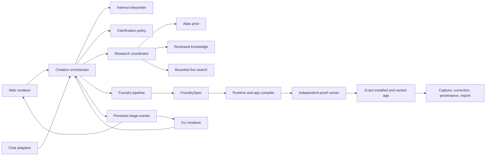

# Universal interest-to-app creation harness

Status: proposed release design; no production implementation is represented as complete.

## Contents

- [1. Make one creation path the product](#1-make-one-creation-path-the-product)
- [2. Current code proves the path is still split](#2-current-code-proves-the-path-is-still-split)
- [3. Define what “any interest” guarantees](#3-define-what-any-interest-guarantees)
- [4. Give the user one decision at a time](#4-give-the-user-one-decision-at-a-time)
- [5. Use one persisted creation orchestrator](#5-use-one-persisted-creation-orchestrator)
- [6. Compile the rich specification into the runtime](#6-compile-the-rich-specification-into-the-runtime)
- [7. Give UI and CLI the same structured turns](#7-give-ui-and-cli-the-same-structured-turns)
- [8. Make the CLI conversation the contract](#8-make-the-cli-conversation-the-contract)
- [9. Gate release on independent interest coverage](#9-gate-release-on-independent-interest-coverage)
- [10. Replace the current path in reversible slices](#10-replace-the-current-path-in-reversible-slices)

## 1. Make one creation path the product

Every keyed creation should run through the researched `FoundrySpec` pipeline.
The atlas should suggest search terms and possible practices, but it should
never choose the finished app. Broad interests should trigger a short narrowing
step before research. Specific interests should move directly to an editable
practice summary.

The non-technical journey should be:

> say an interest → confirm what you want to do → add two real notes → compare
> three useful apps → check what the app will track → try it → save one real
> note → own it

The system may ask fewer questions when the goal is precise. It may ask at most
two narrowing questions before it produces a practice summary or explains why
it cannot continue.

## 2. Current code proves the path is still split

| Defect | Evidence | Effect |
| --- | --- | --- |
| The researched bridge is conditional | `wizard/engine.py:774-795` defines “thin atlas” as the bridge trigger | Indexed interests can still bypass the best reasoning path |
| A starter can install before research | `wizard/engine.py:891-897` returns `_install_starter()` | A lexical match can become the product decision |
| Conversational create asks for one concept | `wizard/escalation.py:218-230` calls `concept_count=1` | The user never receives the three alternatives promised by the product |
| The rich spec is compressed into the old pack shape | `wizard/bridge.py:47-50` caps the runtime projection at three objects and sixteen fields | Rich domain identity, relationships, and experience can disappear before daily use |
| The web flow exits before test-drive | `CreateDomain.tsx:65-74` navigates when the turn reaches `test_drive` or awaits `capture` | Creation appears finished before the user sees the proof step |
| Technical structures leak into the hobbyist flow | `CreateDomain.tsx:292-320` renders schema and edit objects with `JSON.stringify` | The approval seam speaks implementation language |
| Foundry Studio asks the user to design tests | `FoundryStudio.tsx:261-275` requires action and observable-result fields | The primary user must perform a research-methods task |
| The CLI is a JSON transport, not a guided interface | `cli.py:1657-1662` prints every wizard turn with `json.dumps` | A user cannot complete the journey as a natural terminal conversation |

A local reproduction on 25 August 2026 also showed the lexical limits. “Drinks”
offered only “Tasting notes.” “Vintage trail maps” became “Hike log.” “I want
to get better at chess” became “Get shelf,” “Get timeline,” and “Get chart.”

The targeted bridge, elicitation, Foundry CLI, and interest-suite contract tests
still pass. Those tests prove their stated seams. They do not prove the universal
creation promise because the independent protected interest set is documented
at 0/20 on the offline path.

## 3. Define what “any interest” guarantees

“Any interest” cannot mean that one model call is always correct. It should mean
that every non-empty input reaches one explicit, testable outcome. The system
must never snap silently to an unrelated app.

| Input shape | Required behavior | Acceptable outcome |
| --- | --- | --- |
| Specific practice | Confirm an editable practice summary | Research and propose apps |
| Broad category, such as “drinks” | Offer three to five practice directions with concrete examples | Narrow, mix directions, or describe another practice |
| Ambiguous word | Name the plausible meanings in plain language | User selects or rewrites the meaning |
| Obscure or jargon-heavy practice | Ask for two real examples, then research | Researched build or named evidence gap |
| Hybrid interest | Preserve both parts and ask which loop leads | One mixed brief with explicit boundaries |
| Existing notes or data | Preview what can be read and what will remain unchanged | Import evidence into the brief after consent |
| High-stakes practice | Separate personal recording from professional advice or unsafe automation | Safe tracker boundary or explicit refusal of the unsafe feature |
| Non-English practice | Preserve the user’s language and domain terms | Localized brief and routing tests in that language |
| No model or research key | Build only from user-supplied language | “Built from your notes” version that can add research without losing data |
| Provider, budget, or research failure | Preserve the session and completed receipts | Retry, switch provider, continue with the user’s notes, or stop |

The total-handling invariant is:

```text
understood and researched
OR narrowed with the user
OR built from the user's notes with clear limits
OR stopped with the exact missing requirement and a recovery action
```

## 4. Give the user one decision at a time

| Stage | What the user sees | What the system does | Exit rule |
| --- | --- | --- | --- |
| Start | One large prompt: “What would you like an app for?” | Scans for secrets, extracts topic and likely practice | Non-empty, safe input |
| Understand | One editable sentence about the person’s practice | Measures breadth, ambiguity, risk, and evidence coverage | Confirmed summary or narrowing needed |
| Narrow | Practice directions such as “taste and compare” or “manage a bottle collection” | Uses the atlas only as a prior and generates no app yet | One direction, a mix, or user-written alternative |
| Examples | “Add two notes you might write” | Uses the first for design and seals the second for a final check | Two user-authored examples, unless the user accepts the limits of building from their notes |
| Research | Named stage progress, elapsed time, and optional cost | Retrieves reviewed evidence, bounded search, or labelled model recall | Evidence receipt or named fallback |
| Compare | Three structurally different product concepts | Connects each loop and trade-off to the brief and evidence | Select, remix, or revise the brief |
| Model | “Here is what the app will keep track of,” with examples and useful questions | Derives identity, time, relationships, lifecycle, constraints, and workloads | Plain-language approval |
| Build | “Finding useful patterns → shaping the app → making it → checking it” | Compiles one versioned specification and emits stage events | Exact app, runtime manifest, evidence, and receipt exist |
| Prove | The second note’s result, plain-language checks, and the working preview | Runs independent routing, schema, security, accessibility, and artifact checks | Every release-blocking check passes |
| First use | The real app with one suggested first action | Applies one real capture through the normal provenance path | Capture applies or enters guided repair |
| Ready | App name, what it is based on, local folder, and export action | Marks the app active | First real capture and required proof passed |

Raw JSON, SQL, and internal identifiers belong behind one “See technical
details” disclosure. They never appear in the main approval path.

The UI prototype at `docs/prototypes/create-flow/release-create.html` explores
three structures. Variant A, the guided canvas, is the release recommendation.
It keeps the current decision central, progress persistent, and proof nearby.

## 5. Use one persisted creation orchestrator

### Architecture and data flow



Create a `core/domain_foundry_core/creation/` package. It should become the only
authority for state transitions. Existing UI, CLI, Model Context Protocol (MCP),
Telegram, and Hermes adapters should render its structured turns.

| Component | Responsibility |
| --- | --- |
| `models.py` | `PracticeBrief`, `PracticeDirection`, `UserExample`, `CreationTurn`, `BuildRun`, and `ProofResult` contracts |
| `interpreter.py` | Typed extraction of subject, practice hypotheses, breadth, ambiguity, language, risk, and missing facts |
| `policy.py` | Deterministic decision about whether to ask, confirm, research, downgrade, or stop |
| `orchestrator.py` | Persisted state machine, idempotent transitions, cancellation, resume, and session history |
| `research.py` | Atlas prior, reviewed corpus, live search, model recall, evidence tier, and source closure |
| `compiler.py` | `FoundrySpec` to runtime manifest, exact HTML app, schema, routing, evidence, and receipt |
| `proof.py` | Sealed held-out replay, workload checks, security, accessibility, and artifact identity |
| `events.py` | Append-only stage events for Server-Sent Events (SSE) and terminal progress |
| `renderers/web.tsx` | Web components for choices, progress, concepts, model summary, proof, and first use |
| `renderers/cli.py` | Plain-language interactive terminal renderer plus `--json` for automation |

The persisted states should be closed and monotonic:

```text
intake
  → clarify? → examples → brief_confirm
  → research → concepts → concept_confirm
  → compile → model_confirm → prove
  → first_use → ready
```

Every active state may also move to `paused`, `cancelled`, or `failed`. `prove`
may move to `repair`, then back to `prove`. A session may not enter `ready`
without an exact compiled artifact, a passing held-out check, and one applied
real capture.

## 6. Compile the rich specification into the runtime

The current bridge projects a rich `FoundrySpec` into a small `ShortlistModel`.
That is useful as compatibility glue, but it should not remain the product
boundary. The release runtime needs all declared entities, relationships,
workloads, views, actions, corrections, and provenance.

Compile one `RuntimeManifest` from `FoundrySpec` with these sections:

- **Domain:** all entity, field, relationship, constraint, transition, and index declarations.
- **Experience:** navigation, view, region, action, state, vocabulary, and visual tokens.
- **Routing:** positive examples, negative examples, domain vocabulary, confidence policy, and intended object mappings.
- **Proof:** user-authored cases, standard cases, artifact hashes, and required thresholds.
- **Ownership:** spec identity, migration version, evidence snapshot, export version, and restore rules.

The exact compiled `app.html` should run in two modes. Embedded mode should use
a versioned `postMessage` bridge to the local FastAPI host. Standalone mode
should use the bundled local store. The HTML stays identical; only the storage
adapter changes after a nonce-bound handshake.

This closes the current product split. The app the user previews becomes the app
they use inside Domain Foundry and the app they export. Captures still pass
through validation, correction, provenance, and policy because the embedded
adapter delegates writes to core.

## 7. Give UI and CLI the same structured turns

### Core turn contract

```json
{
  "session_id": "...",
  "phase": "clarify",
  "status": "awaiting_user",
  "title": "What does whisky mean for you?",
  "body": "Pick the closest practice. You can combine options.",
  "choices": [
    {"id": "taste", "label": "Taste and compare", "example": "Remember drams and how they changed"},
    {"id": "collect", "label": "Manage bottles", "example": "Track what is open, sealed, or nearly empty"}
  ],
  "input": {"kind": "choice_or_text", "multiple": true},
  "progress": {"completed": 1, "total": 9},
  "evidence": null,
  "recovery_actions": []
}
```

The core returns semantics, not HTML and not terminal prose. The web renderer
uses native controls and domain previews. The CLI renderer numbers choices and
accepts numbers, labels, or natural language. Automation keeps a `--json` mode,
but the default CLI is conversational.

### API endpoints

| Method | Path | Purpose | Response |
| --- | --- | --- | --- |
| `POST` | `/api/create` | Start from a goal or artifact | `CreationTurn` |
| `GET` | `/api/create/{session_id}` | Resume the current state | `CreationTurn` |
| `POST` | `/api/create/{session_id}/reply` | Apply one answer or action | `CreationTurn` |
| `GET` | `/api/create/{session_id}/events` | Stream persisted stage progress with SSE | `CreationEvent` stream |
| `POST` | `/api/create/{session_id}/cancel` | Cancel future work and preserve receipts | Final `CreationTurn` |
| `GET` | `/api/create/{session_id}/preview` | Return the exact sandboxed app artifact | HTML or artifact metadata |

Errors should use stable codes and plain recovery text. Provider failure,
budget exhaustion, insufficient evidence, compiler refusal, and proof failure
must remain distinct because each has a different recovery action.

## 8. Make the CLI conversation the contract

The default command should be `domain-foundry create`. Keep `new-domain` as a
deprecated alias for one release cycle. `--json` should preserve the automation
surface.

```text
$ domain-foundry create

What would you like an app for?
> whisky

What would you like to do with whisky?

  1  Taste and compare whisky
     Keep tasting notes and notice how a bottle changes.

  2  Keep track of bottles
     Remember what you bought, opened, and still have.

  3  Learn regions and styles
     Keep what you learn alongside your tastings.

  4  Make and improve drinks
     Save recipes, substitutions, and results.

Choose any that fit, or describe it in your own words.
> 1 and 2, but tasting matters most

Your focus:

You want to compare tastings and keep the bottle details close by. A useful app
would let you add a tasting quickly, then compare it with earlier notes.

Is that right? [continue/change]
> continue

Add a note you might write on a normal day.
> peated dram, iodine and orchard fruit, 12 year, neat

Add a different kind of note. This one will check the app after it is built.
> opened the Ardbeg 10 tonight, about two-thirds left

Find app ideas using reviewed sources?

This may cost about $0.18 with your current setup. Your API key, existing
entries, and local files stay on this computer.

Continue? [continue/details/not now]
> continue

Looking at how people taste and compare whisky…

✓ Your focus
✓ Useful whisky terms and patterns from 4 reviewed sources
✓ Different ways the app could work
✓ Three app ideas

These could work well:

  1  Bottle shelf
     Start with what you own. Open a bottle to see its pours and history.
     A tasting takes an extra step.

  2  Tasting Bench  — closest to what you described
     Start with a dram. Compare nose, palate, finish, serving, and bottle context.
     Bottle details stay close by.

  3  Palate Atlas
     Start with flavor words and notice patterns across bottles.
     It gets more useful as you add notes.

Choose one, mix them, or change the focus.
> 2, but add the bottle shelf from 1

Tasting Bench will start with a tasting. It will also include a bottle shelf,
so each note can link to its bottle, opening date, and remaining level.

Here is what Tasting Bench will keep track of:

  Bottle  distillery, expression, age statement, cask, opened date, level
  Dram    time, bottle, serving, nose, palate, finish, score
  History every correction, with the earlier value saved

It can answer:

  • Which bottles produce the notes I enjoy most?
  • How did a bottle change after opening?
  • What have I tasted from one region, cask, or distillery?

Build Tasting Bench? [build/change/details]
> build

Putting your app together…

✓ Organized bottles and tastings
✓ Made the app
✓ Checked that pasted text stays text
✓ Checked keyboard use and small screens
✓ Tried your second note

Your second note went to the right place:
“opened the Ardbeg 10 tonight, about two-thirds left”
→ Bottle / open event / level about 67%

Try the app at:
http://127.0.0.1:8787/passions/tasting-bench

Try one real note now, or type “later”.
> Lagavulin 16 neat; smoke, dried fruit, long finish; 8/10

Saved to Tasting Bench as a tasting:
Lagavulin 16 · neat · smoke, dried fruit, long finish · 8/10

Is that right? [yes/fix/details]
> fix: score was 8.5, not 8

Updated the score to 8.5. The earlier value stays in the edit history.

Tasting Bench is ready to use.

  App       http://127.0.0.1:8787/passions/tasting-bench
  Based on  4 reviewed sources and your choices
  Folder    ~/.domain_foundry/packs/tasting-bench
  Export    domain-foundry export tasting-bench
```

A specific prompt, such as “compare my sourdough fermentation and crumb,” should
skip the numbered practice choices. It should show one editable summary, then
continue with the same examples, research, app ideas, checks, and first use.

If research is unavailable, the CLI should say “Built from your notes” before it
asks for examples. It should still try the second note and one real entry before
calling the app ready. It must not imply that the result uses reviewed sources.

## 9. Gate release on independent interest coverage

### Machine gates

| Gate | Release threshold |
| --- | --- |
| Total handling | 100% of non-empty cases end in research, narrowing, a built-from-notes state, or a named recoverable stop |
| Wrong snap | Zero case activates an app from an unconfirmed catalogue match |
| Broad-interest policy | 100% of labelled broad and ambiguous cases receive a relevant narrowing step |
| Held-out isolation | 100% of sealed examples are absent from every design and routing-training prompt |
| User task proof | Both user-authored examples pass before `ready` |
| Independent interest routing | At least 90% intended object routing in each interest bucket and provider tier; no aggregate score may hide a failing bucket |
| First use | 100% of release journeys apply one real capture or enter guided repair before activation |
| Concept quality | Three concepts pass structural-distinctness validation; sampled cases pass independent human review |
| Model quality | Every entity, relationship, constraint, and index traces to a workload, evidence item, or user decision |
| Artifact identity | Preview, installed app, and export use the same `app.html` hash |
| Safety | Invalid schema writes and executable untrusted payloads are rejected |
| Accessibility | Zero serious or critical automated findings, 320-pixel reflow, keyboard completion, reduced motion, and manual screen-reader completion |
| Ownership | Export, restore, correction history, restart, and deletion pass for every golden and sampled generated app |

Expand the current interest evaluation into separate protected sets:

- **Breadth:** broad categories, ambiguous words, and multi-practice interests.
- **Topology:** collecting, practice, care, making, study, events, projects,
  location, comparison, planning, relationships, and mixed workflows.
- **Language:** at least the supported launch languages and mixed-language jargon.
- **Rarity:** obscure practices whose probe vocabulary is absent from the atlas.
- **Risk:** personal health, finance, safety, and other high-stakes boundaries.
- **Degradation:** no key, provider timeout, cost cap, missing research, compiler
  refusal, failed held-out test, cancel, resume, and restart.

Keep the visible development set separate from the protected release set. A
held-out miss should improve the interpreter, research, compiler, or runtime.
It should never add the missing test token to the atlas.

### Human gates

Public release still needs the existing independent corpus, licensing,
accessibility, security, provider, external-user, and publication receipts.
The external-user sessions should now include:

1. one broad interest that requires narrowing;
2. one specific but unindexed interest;
3. one person with existing notes or data;
4. one no-key session observed separately from the keyed promise.

The reviewer should stop the session if they must explain a schema, acceptance
criterion, provider tier, or routing rule to the participant.

## 10. Replace the current path in reversible slices

1. **Lock the contract.** Add `PracticeBrief`, `CreationTurn`, state invariants,
   broad-interest fixtures, and the full CLI snapshot before changing behavior.
2. **Understand before ideas.** Add the interpreter and deterministic
   clarification policy. Keep the current compiler behind the new state machine
   until breadth and collision tests pass.
3. **Use Foundry for every keyed build.** Remove the thin-atlas condition and
   starter-install short circuit. Always request three concepts on user-facing
   create. Keep the atlas only in the research prior.
4. **Compile the full runtime.** Replace `FoundrySpec → ShortlistModel` as the
   product boundary with `FoundrySpec → RuntimeManifest`. Keep the shortlist
   projection only as a temporary compatibility adapter.
5. **Add durable progress.** Run research and compilation as resumable jobs,
   persist stage receipts, and stream them through SSE. Do not show fake
   percentages or an unverified completion estimate.
6. **Ship the guided UI and conversational CLI.** Render the same structured
   turns, keep technical detail optional, and hold the user in creation through
   proof and first use.
7. **Prove parity.** Run the same journey through UI, CLI, MCP, Telegram, and
   Hermes. Assert identical phase transitions, spec identity, held-out result,
   capture receipt, correction chain, and export hash.
8. **Retire the split path.** After old sessions migrate and the release gates
   pass, remove `/foundry` as a separate creation experience. Keep it as an
   advanced inspection surface for the same session and specification.

Guard the migration with `DOMAIN_FOUNDRY_CREATE_V2`. Existing wizard sessions
remain readable. New sessions can roll back to the previous orchestrator while
the flag exists, but a v2 `FoundrySpec` or owned app should never be downgraded
or overwritten.

The implementation is ready for public-release review only after the protected
interest sets, exact-artifact runtime, broad-interest usability sessions, and
all existing human receipts pass against one clean candidate.
