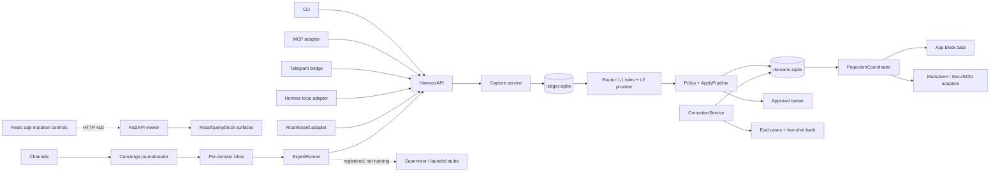

# Domain Foundry: vision, product-gap, and harness review

**Review snapshot:** 2026-08-08 HST  
**Status:** Decision draft — mark choices inline, add comments, and turn selected slices into issues  
**Scope:** Current repository, documented value proposition, first-run experience, application shell, Domain Pack model, agent integrations, mesh, testing, release readiness, and comparisons with Paperclip and bb

## How to use this document

1. Read the executive judgment and the five release blockers.
2. Mark one product posture in [The strategic choice](#the-strategic-choice).
3. Mark the component choices in [Harness/component decision sheet](#harnesscomponent-decision-sheet).
4. Select architecture candidates in [Deepening opportunities](#deepening-opportunities).
5. Approve, reject, or edit the proposed proof plan and 90-day sequence.

This is intentionally a decision document rather than a backlog. The point is to decide what Domain Foundry is, which promises v0.1 must prove, and which modules earn the right to exist. Implementation issues should come after those choices.

---

## Executive judgment

Domain Foundry has the hard part of a trustworthy personal-data system: durable capture, provenance, canonical records, policy-gated application, correction history, replayable evaluations, local SQLite ownership, and several working ingress adapters. The repository is not an empty scaffold.

It is not yet the product described by **“Describe your passion. Get an app. Talk to it.”** The gap is not primarily another list of backend features. It is the absence of one honest, coherent, end-to-end activation loop.

The most accurate description of the current repository is:

> A local-first structured-capture engine with declarative domain packs, canonical correction semantics, generic projections, and embedded adapters for a few agent/channel runtimes.

The recommended north star is:

> **Turn one sentence and the data you already have into a trusted local app that your agent can use and safely reshape.**

The recommended sequence is:

1. **Ship the structured-life substrate as the v0.1 wedge.** Be excellent at capture → canonical data → correction → useful view through MCP and one first-party app.
2. **Use three deep hobby experiences to earn the “app foundry” promise.** Travel/Roamboard, sourdough, and Japanese study cover planning/geo, observation/experimentation, and interactive/proactive workflows.
3. **Defer the general per-domain agent mesh as a headline feature.** Keep it experimental until agents actually run cross-platform, recover, expose activity, and improve the hobby outcome.

Do not release the current commit under the broad promise yet. Five blockers make the present onboarding materially misleading:

1. The web app renders mutation controls whose server endpoints return `410 Gone`.
2. Generic prompt-to-domain generation is deterministic keyword scaffolding, not model-assisted domain design; its evaluation tests examples generated from the same rules.
3. Seven of eight realistic held-out hobby captures failed immediately despite every generated pack reporting 100% dry-run accuracy.
4. The README’s `pipx install` packages are not published; GitHub has no release or tag, and the demo is still a placeholder.
5. `agent.yaml` registration reports success while its expert process is not running and launchd installation is stubbed.

### Product health scorecard

These scores are review judgments, not telemetry. A 5 means the public promise is independently demonstrated through a real user surface.

| Dimension | Current | Why |
|---|---:|---|
| Capture and data durability | 4.5/5 | Strong ledger, idempotency, never-drop behavior, WAL/concurrency tests, provenance, and restart convergence. |
| Correction and trust | 4/5 | Revisions, approvals, correction-to-eval loop, diffs, and policy gates are substantive. Browser correction is currently broken. |
| Domain Pack substrate | 3/5 | Useful declarative schema/routing/policy/projection model and reference packs. Lifecycle, capability breadth, compatibility, and independent validation are incomplete. |
| Prompt-to-hobby generation | 1/5 | Curated archetypes work; generic generation is literal-keyword scaffolding with a circular self-eval. |
| “Get an app” experience | 1/5 | Generic block shell exists, but primary mutations fail and there is no web creation flow or domain-native workflow depth. |
| Any-agent integration | 2/5 | MCP is a credible generic on-ramp; Telegram and Hermes work in-process. No universal conformance contract, subscription-runtime discovery, or stable remote write seam. |
| Agent mesh | 1.5/5 | Durable queues, sessions, schedules, outbound, and observability exist. Process install/run lifecycle is stubbed and rich behavior is hard-coded. |
| Safety and ownership | 3.5/5 | Local-first, token gate, parameterized SQL, read-only sources, leakscan, and disclosure docs are strong. Extension capabilities and model-data egress need a clearer threat model. |
| Documentation and clarity | 2.5/5 | Large evidence-rich corpus, but public docs expose internal phase material, contradict the runtime, and omit the only proof that matters: a working first loop. |
| Distribution and release | 1/5 | Builds and audits mostly work from checkout; no public packages, tag, release, demo, live-provider matrix, or independent security pass. |

---

## What was actually exercised

### Repository and release gates

| Check | Observed result | Interpretation |
|---|---|---|
| Python tests | `288 passed, 2 skipped` on Python 3.14.4 | Broad and healthy substrate coverage; the local interpreter is newer than the documented 3.11–3.13 matrix. |
| Ruff | Clean | Static lint gate is healthy. |
| Pyright | 0 errors | Type gate is healthy. |
| Frontend source build | Passed after a clean dependency install; MapLibre emitted an 803 kB chunk warning | CI builds the SPA on Node 22, but there is no browser behavior suite. |
| Quickstart gate | Green with the repository virtual environment on `PATH` | Init, setup, food/travel activation, capture, fan-out, query, and idempotent structured import work from checkout. |
| Release audit | Failed with the default home in the restricted environment; green with an explicit disposable `DOMAIN_FOUNDRY_HOME` | The gate is comprehensive but should create its own isolated workspace like CI does. |
| MkDocs | Builds | Rendering is not proof that links, commands, counts, or product claims are current. |
| Browser | No browser instance was available in this review session | No visual screenshot claim is made. Server calls and source inspection were used for behavior evidence. |

### The critical web contract failure

The React client sends mutations to HTTP:

- capture: [`app/src/lib/api.ts`](https://github.com/finnqiao/domain_foundry/blob/main/app/src/lib/api.ts#L73)
- pack activation: [`app/src/lib/api.ts`](https://github.com/finnqiao/domain_foundry/blob/main/app/src/lib/api.ts#L91)
- correction and review resolution: [`app/src/lib/api.ts`](https://github.com/finnqiao/domain_foundry/blob/main/app/src/lib/api.ts#L105)

The FastAPI implementation deliberately returns `410 Gone` for those same operations:

- capture and correction: [`core/domain_foundry_core/api/app.py`](https://github.com/finnqiao/domain_foundry/blob/main/core/domain_foundry_core/api/app.py#L102)
- activation and review resolution: [`core/domain_foundry_core/api/app.py`](https://github.com/finnqiao/domain_foundry/blob/main/core/domain_foundry_core/api/app.py#L222)
- wizard: [`core/domain_foundry_core/api/app.py`](https://github.com/finnqiao/domain_foundry/blob/main/core/domain_foundry_core/api/app.py#L350)

Direct calls against the served app confirmed `410` for `/api/capture`, `/api/packs/activate`, and `/api/correct`. The app therefore exposes a capture box, Install buttons, correction actions, and review controls that cannot succeed.

The current contract tests seed mutations with an in-process `HarnessAPI` and then assert that HTTP mutations return `410`; see [`tests/contract/test_app_shell.py`](https://github.com/finnqiao/domain_foundry/blob/main/tests/contract/test_app_shell.py) and [`tests/contract/test_wizard.py`](https://github.com/finnqiao/domain_foundry/blob/main/tests/contract/test_wizard.py#L197). This tests the mesh decision but bypasses the user journey.

This also contradicts accepted [ADR-001](adr/ADR-001-http-adapter-contract.md), which says the CLI, SPA, and adapters use the same HTTP contract. The later mesh design changed the implementation but did not supersede the decision record or provide a working browser bridge.

### The prompt-to-domain blind spot

The wizard does not currently use the configured LLM to design a domain. It selects one of a small number of hard-coded archetypes or falls back to a generic object with `title`, `logged_at`, `rating`, `amount`, and `notes`; see [`wizard/blueprint.py`](https://github.com/finnqiao/domain_foundry/blob/main/core/domain_foundry_core/wizard/blueprint.py#L293).

The generic route rule is built from the literal words in the user’s goal. Its examples are then built from the same literal subject word. The dry run evaluates those generated examples with a `HeuristicProvider`; see [`wizard/engine.py`](https://github.com/finnqiao/domain_foundry/blob/main/core/domain_foundry_core/wizard/engine.py#L158). Passing proves internal consistency, not hobby understanding.

The repository’s golden wizard test states the limitation directly: generated packs must route **their own** examples at ≥95%; see [`tests/contract/test_wizard.py`](https://github.com/finnqiao/domain_foundry/blob/main/tests/contract/test_wizard.py#L1).

An independent held-out smoke used eight prompts from or adjacent to the golden goals. Every generated pack reported 100% self-eval accuracy:

| Goal | Realistic first capture | Result |
|---|---|---|
| Bouldering | “sent a tough V5 on the overhang today, crux was the heel hook” | `_unfiled` |
| Model rockets | “launched my Estes Alpha III to about 300 feet, recovery was clean” | `_unfiled` |
| Guitar | “worked on sweep-picked arpeggios for 45 minutes” | `_unfiled` |
| Dreams | “dreamed I was walking through an endless library” | `_unfiled` |
| Meditation | “sat for 20 minutes this morning, mind kept wandering” | `_unfiled` |
| Reading | “finished The Dispossessed last night, five stars” | `_unfiled` |
| Cycling | “rode 42 km along the coast in 1 hour 38 minutes” | `_unfiled` |
| Coffee | “V60 Ethiopian, 15g in and 250g out, tasted like blueberry” | Applied to `coffee` |

The result was **1/8 useful first captures** in deterministic/no-key mode. The `new-domain` success message nevertheless said every domain was live and 100% accurate. The bouldering projection ID was also generated as `entrys`.

This does not imply heuristic mode is worthless. It implies it must be labeled honestly as a scaffold, evaluated on held-out language, and given a repair loop before activation.

### Distribution truth

As of this review:

- `domain-foundry-core`, `domain-foundry-mcp`, `domain-foundry-telegram`, and `domain-foundry-hermes-agent` return 404 from the PyPI JSON API.
- The public GitHub repository has no tags or releases.
- The README’s 90-second demo remains a placeholder.
- Live success probes for each documented provider, an external security review, and a lived production week remain open in [`LAUNCH_CHECKLIST.md`](https://github.com/finnqiao/domain_foundry/blob/main/LAUNCH_CHECKLIST.md).

The checkout path works. The public five-minute install path does not yet exist.

### Other contract and documentation drift

- [`docs/concepts/packs.md`](concepts/packs.md) describes directory/Git sources, entry-point handlers, upgrades, and migrations. The current CLI source resolver accepts bundled names or local directories, and entry points discover pack paths rather than executable handler implementations.
- `pack validate` proves structural basics but does not replay positive/negative examples or deeply validate every cross-file schema, projection, migration, prompt, and evaluation relationship.
- The public docs navigation includes leak-audit phases, private overlay instructions, mesh as-built notes, open production gates, retirement material, and founder-validation internals. These are useful maintainer records but weaken a new user’s reading path.
- Test counts have drifted across the docs: the README’s `288/2` is current, while some tutorials still report `219/2` and the historical leak audit reports `92`.
- The docs home still says “MCP later” while the README presents MCP as a tested harness.
- Several bundled-pack catalog descriptions expose migration vocabulary such as “personal.sqlite parity” and “Phase 0 alias decisions” inside the end-user app.
- The frontend has no component, accessibility, or browser E2E suite. Its MapLibre bundle is over 800 kB in the current build. `npm audit` currently reports four affected package entries (two moderate, two high, flowing through Vite/PostCSS/Nanoid); they need applicability/upgrade triage rather than silent acceptance.

---

## Current system map

### Modules that are already deep

- **`HarnessAPI` capture path.** Deleting it would distribute capture-first ordering, routing, policy, application, correction, projection receipts, and error handling across every caller. It earns its place.
- **Projection adapter seam.** Block data, Markdown, and GeoJSON are multiple real adapters behind a common interface; the seam has leverage.
- **LLM provider seam.** Heuristic, Anthropic, OpenAI-compatible, tiered, and cassette adapters make this a real seam.
- **Source driver seam.** Fixtures, SQLite, and dictionary/JSON sources show useful interchangeable implementations.
- **Clock, ID, path, and store modules.** Small interfaces protect strong invariants; they pass the deletion test.

### Where the system has split into competing truths

- HTTP is documented as the stable write seam, while current adapters embed Python and the web write path is removed.
- A Domain Pack is described as “six YAML files,” but packs now also carry `agent.yaml`, migrations, fixtures, and sometimes templates.
- Packs are positioned as enough to create any hobby app, while rich behavior such as food geo handling and Japanese quiz/SRS lives in core code.
- The universal app shell is described as a generated app, but it is a generic renderer over a fixed block catalog.
- The mesh claims per-domain agents, while registration and durable queues are more complete than process execution and agent-runtime integration.

---

## The strategic choice

Domain Foundry can pursue all three horizons over time, but v0.1 must choose one primary job and make the others subordinate.

### Option A — Structured-life data layer for agent runtimes

> Give any assistant a trustworthy, local, typed memory for the hobbies and personal domains where prose memory is not enough.

**Primary user:** Agent-native technical hobbyist.  
**Hero outcome:** Connect MCP, activate/create one domain, capture a real event, correct it, query it, and inspect the local data.  
**Why it fits now:** The strongest modules already serve this job.  
**Risk:** “Get an app” must be narrowed to “get a useful structured view” until deeper experiences exist.

- [ ] Choose Option A as the v0.1 headline.

### Option B — The personal app foundry

> Describe how you practice a hobby or manage part of your life; get a domain-native app and agent you can reshape in conversation.

**Primary user:** Hobbyist/creator who wants bespoke personal software without maintaining it.  
**Hero outcome:** Prompt → proposed behaviors and permissions → working app → first real item → natural-language change.  
**Why it can win:** This is more magical and more differentiated than memory or logging.  
**Risk:** It requires workflows, actions, connectors, automation, media, computed state, and stronger UI generation—not only schemas and views.

- [ ] Choose Option B as the v0.1 headline and accept a larger pre-release build.

### Option C — A personal domain-agent operating system

> Run an isolated agent for every area of your life, with durable inboxes, sessions, schedules, tools, and proactive contact.

**Primary user:** Advanced operator already running several personal agents.  
**Hero outcome:** Concurrent domain agents receive and initiate work without head-of-line blocking or data loss.  
**Why it matters later:** It can turn static personal databases into active collaborators.  
**Risk:** Orchestration becomes the product and obscures hobby value; operational and security scope expands dramatically.

- [ ] Choose Option C as the v0.1 headline.

### Recommended posture

- [ ] **Recommended: sequence A → B → C.** Market v0.1 as the structured personal-data layer, demonstrate it through a genuinely app-like Travel/Roamboard experience, and keep mesh experimental until real retention demands proactive isolated agents.
- [ ] Alternative: commit fully to B now and delay public release until the application capability model is deep enough.
- [ ] Alternative: keep the existing broad story and ship an explicit technical preview rather than a product release.

### Proposed positioning

**One sentence**

> Domain Foundry turns what you tell your agent into trustworthy local apps for the parts of life you care about.

**Technical sentence**

> An open, local-first compiler and runtime for personal domains: typed records, routing, corrections, views, agents, and portable packs.

**What it is not**

- Not another general agent runtime.
- Not assistant memory made of opaque summaries or vectors.
- Not a general no-code builder for public SaaS products.
- Not a hosted account that owns the user’s canonical data.
- Not a promise that arbitrary hobby software can be generated safely from one unconstrained prompt.

---

## The north-star magic loop

The competitors’ strongest lesson is choreography. Paperclip is memorable because one goal wakes an agent, produces a reviewable strategy, and populates a work board. bb is memorable because a prompt changes the workbench the user is already using.

Domain Foundry’s loop should be:

1. **Connect.** Detect an existing agent subscription/runtime or guide one API key/local model. Offer a no-key demo.
2. **Describe.** “I’m planning trips and want an itinerary, bookings, map, food list, packing checklist, and notes.”
3. **Propose.** Show the records, actions, views, automations, integrations, and data-access permissions the foundry will contain.
4. **Prove before activation.** Run held-out examples, show failures, and repair them with the user.
5. **Materialize.** Open the new app immediately—not a JSON receipt or a pack directory.
6. **Use real data.** Import Roamboard or log one real item. The right domain-native view updates.
7. **Reshape safely.** “Add a packing checklist grouped by traveler.” Show a diff, migration, affected views/tests, and rollback plan; then apply.
8. **Own and share.** Export the pack and data separately, with secrets removed and compatibility declared.

### Activation definition

A foundry is **activated** only when all of these are true:

- It was created or installed successfully.
- One held-out, user-authored capture became the intended canonical object.
- The object is visible in a useful domain view.
- The user can correct it from the same surface.
- Restarting the runtime preserves and reopens the state.

Pack validation alone is not activation.

---

## Audiences and jobs

### Primary for v0.1 — the agent-native hobbyist

“I already use Claude, Codex, Cursor, Hermes, or another MCP client. I want it to remember and manage a domain as correctable structured data without building another backend.”

Needs:

- One install and one connection path.
- A no-key or existing-subscription path.
- A visible local-data and provider-egress story.
- A useful first hobby in under ten minutes.
- Natural correction and easy export.

### Secondary — the pack author/remixer

“I understand a hobby deeply and want to package its concepts, workflows, views, examples, and safe automations for other people.”

Needs:

- A complete pack contract and conformance suite.
- Preview, fixtures, compatibility, migrations, rollback, and publishing.
- Clear separation between safe data, trusted code, connectors, and renderer extensions.

### Secondary — the existing-app owner

“I already have Roamboard, a SQLite database, an Obsidian vault, or exported history. I want Foundry to layer agent interaction and canonical semantics on top without replacing it.”

Needs:

- Read-only dry run, reconciliation, shadow mode, and idempotency.
- Bidirectional ownership rules and conflict semantics.
- A stable adapter interface and long-running proof.

### Later — the nontechnical hobbyist

This audience is not excluded, but the current product does require terminals, local daemons, keys/config, and systems vocabulary. Reaching this audience implies a signed desktop/mobile distribution, app-based onboarding, managed process lifecycle, backups, and exceptionally plain trust UX.

---

## Capability map: what “any hobby app” actually requires

The current Domain Pack contract is strong for structured logging. “Any hobby app” needs a broader but still constrained capability alphabet.

| Capability | Current state | Gap to a credible foundry |
|---|---|---|
| Entities and events | Strong | Preserve event-vs-regimen discipline; add richer relationships and lifecycle rules. |
| Capture and routing | Strong for curated packs; weak for generic creation | Independent held-out tests, repair loop, multilingual/synonym coverage, and clearer confidence UX. |
| Canonical actions | Create/update/correct/merge/delete | Domain commands such as schedule, complete, grade, promote, book, compare, and plan without hard-coding each in core. |
| Queries and views | Fixed list/timeline/search/stats/history/planner/map blocks | Composition, derived values, domain actions, responsive layouts, saved filters, and view-specific empty/onboarding states. |
| Workflows and state machines | Mostly implicit/core-specific | Declarative states, transitions, invariants, approvals, and action availability. |
| Derived metrics | Limited block measures and hard-coded logic | Safe formulas/aggregations with dependency tracking and tests. |
| Media and artifacts | Attachments exist in substrate | Pack-declared photo/file capture, galleries, OCR/metadata policy, storage quotas, and portability. |
| Time and proactivity | Mesh schedules, mainly daily/simple | Reminders, time zones, missed-run policy, notification permissions, and a visible activity history. |
| Interactive sessions | Japanese quiz is hard-coded | General session primitives proven by a second domain before extracting a shared seam. |
| Imports and connectors | Notes, SQLite, JSON/JSONL, Roamboard | Pack-declared mappings, OAuth/local connectors, sync ownership, capability scopes, dry run, and conformance. |
| External side effects | Deliberately limited | Explicit capability grants, proposal/approval, idempotency, receipts, revocation, and sandboxing. |
| Agent behavior | `agent.yaml` persona/tools/autonomy; registered expert stubs | Real provider/runtime adapter, lifecycle, tool scopes, cost/quota visibility, and activity/run records. |
| Evolution | Migrations and hardening exist | Pack version compatibility, upgrade preview, backup, rollback, and data/pack export. |
| Sharing | Gallery documentation | Searchable registry, provenance/signing, compatibility, quality score, install/update/uninstall, and maintainer policy. |

The architectural question is not “allow arbitrary code or not.” It is how far a safe declarative capability model can go before a user must opt into a separately installed, permissioned implementation adapter.

---

## Gap register

### P0 — release blockers

#### 1. Restore one truthful write path

Choose and implement one canonical local mutation seam. The SPA, CLI, MCP, Telegram, Hermes, Roamboard, and tests must execute the same contract or pass the same conformance suite. Supersede ADR-001 if HTTP is no longer the decision.

**Exit evidence:** A browser E2E clicks Create domain, Capture, Correct, Install, Approve, and Deny against the packaged app; the same outcome suite runs through MCP and CLI.

#### 2. Replace self-evaluation with acceptance evidence

Separate pack proposal from pack acceptance. Generated examples can help train/shape a pack; they cannot be the release score. Add held-out utterances written independently of the generator, including synonyms that omit the hobby name.

**Exit evidence:** A 20-hobby held-out suite, a five-real-capture activation test, failure-aware copy, and a user repair step before “live.”

#### 3. Decide what “app” means for v0.1

If it means a generic but useful structured view, say that. If it means a domain-native application like Roamboard, the pack capability model and UI must support the actual travel workflows before launch.

**Exit evidence:** One filmed vertical slice where the app—not a CLI JSON receipt—does meaningful hobby work.

#### 4. Publish an installable, reversible release

Claim the names, publish to TestPyPI, smoke the built artifact in a clean environment, publish the four distributions or simplify them, tag GitHub, create a release, document upgrade/backup/uninstall, and add `doctor`.

**Exit evidence:** Clean macOS and Linux machines go from public artifact to activated foundry. Windows support is either proven or explicitly unsupported.

#### 5. Align every public claim and document

Remove or archive phase/handoff/private-migration pages from public navigation. Fix stale test counts, “MCP later,” Git source/handler claims, web capture claims, pack-file counts, and internal catalog descriptions. Record the current write decision in an ADR.

**Exit evidence:** Automated docs link/command/claim tests and a short public docs IA: start, concepts, build a pack, connect an agent, operate/recover, contribute.

### P1 — make the wedge deep

- Build three complete hobby experiences rather than adding more shallow packs.
- Add domain-aware capture/conversation to every hobby surface.
- Add a pack lifecycle: source → inspect → permissions → install → validate → activate → upgrade → rollback → export/uninstall.
- Add a first-class agent adapter/conformance model, including authenticated subscription-backed CLI runtimes where safe.
- Add explicit connector and extension capabilities, least privilege, secrets scoping, receipts, and revocation.
- Move internal diagnostic surfaces behind Settings/Developer Mode; make Inbox/Needs attention the human-facing trust surface.
- Make release/eval workspaces hermetic and add built-wheel, packaged-SPA, browser, and upgrade tests.

### P2 — earn the platform story

- Cross-platform process supervision and real per-domain agent lifecycle.
- Portable registry/marketplace with compatibility, provenance, permissions, and quality signals.
- Signed desktop distribution and managed local daemon lifecycle.
- Mobile capture/notifications and carefully designed remote access.
- Optional hosted sync/multiplayer only after ownership, proposal, and conflict semantics are proven.
- Community governance, compatibility windows, deprecation policy, and maintainer capacity controls.

---

## Deepening opportunities

Select candidates to explore. These intentionally stop short of proposing exact interfaces; the next step for a selected candidate is a design grilling against constraints and ADRs.

### 1. Canonical capture/change module

**Files/modules:** `api/harness.py`, `api/app.py`, CLI, MCP, Telegram, Hermes clients, Roamboard, mesh concierge/expert, frontend `api.ts`.  
**Problem:** Callers disagree about the write seam. The mesh adds a second journal/inbox path before the ledger, while the SPA calls removed endpoints. Understanding one capture requires bouncing across ingress-specific orchestration.  
**Solution:** Concentrate all user-visible mutations behind one small, executable operation contract and make each ingress an adapter at that seam. Decide where durability begins and ensure a message is journaled exactly once.  
**Benefits:** Higher locality for capture-first invariants, more leverage for every new runtime, and one conformance test surface.  
**ADR note:** This contradicts the current implementation of ADR-001 and the code already contradicts the accepted decision. ADR-001 must be superseded or re-affirmed with a working implementation.

- [ ] Explore candidate 1.

### 2. Domain lifecycle module

**Files/modules:** wizard blueprint/engine/hardening/session, pack loader/registry/schema compiler, migrations, supervisor registration, CLI pack commands.  
**Problem:** Proposal, validation, installation, activation, migration, expert registration, upgrade, and rollback are spread across modules. `PackRegistry` does not yet provide the complete lifecycle callers assume.  
**Solution:** Deepen one domain lifecycle module so callers ask for outcomes—propose, inspect, accept, upgrade, rollback, export—while validation, storage, migrations, and registration stay inside the implementation. Keep source types as adapters.  
**Benefits:** Locality for pack evolution, a smaller interface for agents and UI, and end-to-end lifecycle tests instead of command-by-command tests.

- [ ] Explore candidate 2.

### 3. Domain experience module

**Files/modules:** projections/blockdata, block registry and React blocks, `projections.yaml`, custom blocks, pack schemas and policies.  
**Problem:** The current block seam is real for rendering data, but too shallow for the promise of arbitrary hobby apps. Domain actions, workflows, derived state, and UX copy leak into core or do not exist.  
**Solution:** Decide the bounded capability alphabet an experience can declare and render without trusted code, and identify the separate trusted adapter path for behaviors that exceed it. Prove the seam with two genuinely different implementations before generalizing each capability.  
**Benefits:** Leverage beyond generic timelines, locality for domain behavior, and a meaningful “app” acceptance surface.

- [ ] Explore candidate 3.

### 4. Agent runtime module

**Files/modules:** `agent.yaml`, mesh supervisor/expert/concierge/inbox/outbound/sessions/schedules, MCP/Hermes adapters, Japanese quiz/SRS.  
**Problem:** Agent configuration, provider execution, durable messaging, domain-specific interactive logic, and OS process management are interleaved. An expert can be “registered” while not running. Japanese-specific behavior in the generic Expert implementation reduces locality.  
**Solution:** Separate agent-runtime adaptation and process lifecycle from domain capabilities and from the durable substrate. Demote or isolate the mesh until at least two real domain agents prove the seam.  
**Benefits:** Honest status, cross-platform testing, safer permissions, and a smaller mental model for users who only want MCP-backed capture.

- [ ] Explore candidate 4.

### 5. Independent evidence module

**Files/modules:** wizard dry run, routing fixtures, eval runner/scoring/baseline, corrections/few-shot bank, tutorial snapshots, release audit.  
**Problem:** Generated rules and generated examples share an implementation, so the interface test surface does not represent user language. Mechanism tests are reported as product proof.  
**Solution:** Separate training/generated examples, held-out acceptance cases, correction-derived regressions, live-provider drift, and task-level user journeys. Make each public claim point to one independent proof.  
**Benefits:** Trustworthy launch gates, faster diagnosis, and less risk that hundreds of green tests hide a broken activation path.

- [ ] Explore candidate 5.

### 6. Provider implementation locality

**Files/modules:** `llm/provider.py`, provider registry, config/onboarding, cassettes, cost tiering.  
**Problem:** The provider interface is useful, but transport dialects, tier selection, config resolution, request-shape compatibility, cassette behavior, and usage accounting are concentrated in a very large implementation.  
**Solution:** Preserve the public provider seam while moving internal responsibilities into cohesive modules. Add capability discovery and live probes as part of provider activation.  
**Benefits:** Better locality for vendor changes and simpler provider conformance tests without fragmenting the caller interface.

- [ ] Explore candidate 6.

---

## Harness/component decision sheet

Mark one choice per row. The recommendation optimizes for a credible v0.1 and preserves the larger north star.

| Decision | Recommended choice | Alternatives | Why it matters |
|---|---|---|---|
| v0.1 wedge | [ ] Structured-life layer demonstrated through one app-like hero | [ ] App foundry now · [ ] Agent OS now | Sets the proof burden and docs vocabulary. |
| Canonical write seam | [ ] Local daemon contract shared by SPA/adapters, authenticated when enabled | [ ] In-process only · [ ] Local IPC/sidecar bridge · [ ] Hybrid with explicit conformance | Current split breaks the product. |
| First generic agent protocol | [ ] MCP | [ ] ACP · [ ] Python SDK · [ ] REST/OpenAPI | MCP reaches many existing assistants with the smallest surface. |
| Subscription-backed agents | [ ] Add explicit CLI-runtime adapters after the MCP path is green | [ ] API keys only · [ ] Ambient auto-discovery | Reuse is magical, but inherited authority is a security risk. |
| Pack safety model | [ ] Declarative pack + separately installed permissioned behavior adapter | [ ] Data-only forever · [ ] Arbitrary code in packs · [ ] Generated standalone apps | Keeps ordinary sharing safe without pretending all domains are data-only. |
| App model | [ ] Universal shell with deeper declarative capabilities and domain themes/actions | [ ] Current fixed blocks · [ ] Per-domain code generation · [ ] Fully custom frontend plugins | Determines whether “get an app” is honest. |
| Domain automation | [ ] Shared schedules/actions only; mesh experimental | [ ] Long-lived agent per domain by default · [ ] One global agent only | Avoid orchestration before value. |
| Distribution | [ ] `pipx` technical preview plus signed desktop later | [ ] Desktop first · [ ] Docker first · [ ] Hosted first | Aligns audience and setup burden. |
| Canonical storage | [ ] Keep SQLite ×2 for v0.x | [ ] One SQLite DB · [ ] Postgres now | Existing design is strong; do not spend differentiation budget here. |
| Marketplace | [ ] Curated gallery + install by source after lifecycle is safe | [ ] Open registry now · [ ] No sharing | Quality and security need to precede scale. |
| Telemetry | [ ] No content telemetry; opt-in anonymous activation metrics | [ ] No telemetry at all · [ ] Default-on anonymous metrics | Product learning and privacy need an explicit decision. |

### Open product decisions

1. Is the word **app** reserved for a domain-native experience, or can a schema-driven set of generic views count?
2. Is a **foundry** the whole user workspace, one hobby/domain, or the compiler that produces domains?
3. Does “talk to it” mean capture only, query/chat, domain actions, or all three with visibly different modes?
4. Are agents a replaceable ingress to the same domain runtime, or does every domain own an autonomous agent process?
5. Can a third-party pack request network/filesystem/calendar/email access? If yes, what user-readable capability and approval model governs it?
6. Is the primary release audience comfortable with Python/pipx and local daemons? If not, desktop distribution is part of v0.1, not polish.

---

## UI and activation review

The source-based UI assessment scored **20/40 (acceptable, significant work required)** on Nielsen’s ten heuristics. Browser visual inspection was unavailable, so this is not a visual-polish score.

| Heuristic | Score | Main issue |
|---|---:|---|
| Visibility of status | 3/4 | Good busy states/receipts; success and mutation failure handling are inconsistent. |
| Match to user’s world | 2/4 | `domain`, `pack`, `object`, `ledger`, `projection`, `disposition`, and internal catalog language leak through. |
| User control | 2/4 | Correction/history help; no deep links, activation undo, or safe bulk-review recovery. |
| Consistency | 2/4 | Cohesive visual primitives but false actions and inconsistent terminology. |
| Error prevention | 2/4 | Preview and policy gates help; raw merge UIDs and one-click bulk actions are risky. |
| Recognition over recall | 2/4 | Users leave a domain to capture and must interpret routing receipts. |
| Flexibility/efficiency | 2/4 | Capture shortcut and filters exist; URLs, contextual capture, and keyboard patterns do not. |
| Minimal design | 2/4 | Calm shell, but diagnostics and developer machinery compete with hobbies. |
| Error recovery | 1/4 | Raw server errors, no review-mutation recovery, and no one-click repair of unfiled items. |
| Help/documentation | 2/4 | Developer docs are visible; first-task guidance is not. |

### Highest-impact UI gaps

1. **P0 — No shell path completes the flagship promise.** The empty state says to describe a passion but only offers starter installation, and those Install buttons fail against the running server.
2. **P1 — Capture is context-free and disappears inside a domain.** A domain timeline can say “Capture something above” where no capture box exists.
3. **P1 — Operator machinery outranks hobby value.** Home, Feed, Review, Add a source, Health, Docs, and every domain share the primary navigation.
4. **P1 — Trust copy is technical at failure time.** `unfiled`, `ledger`, `object_type`, confidence, and disposition ask the user to debug the harness.
5. **P1 — Keyboard/mobile/accessibility behavior needs a release pass.** Focus visibility, tab keyboard behavior, dialog focus, map alternatives, touch targets, and mobile layouts need explicit tests.

Recommended information architecture:

- **Today/Home** — persistent capture/ask and recent activity.
- **Your passions** — the user’s apps, not their schemas.
- **Inbox/Needs attention** — unfiled/review/correction failures in plain language.
- **Settings** — sources, providers, health, extensions, backups, developer docs.

---

## Benchmark lessons

### Paperclip

Paperclip’s product idea is extremely legible: **“If OpenClaw is an employee, Paperclip is the company.”** Its loop is goal → agent wakes → review strategy → approve → populated work board and transcript. Its primitives—adapter, skill, plugin, environment driver, tasks, heartbeats, budgets, approvals, audit activity, export/import—are named and operational.

Copy:

- One metaphor, one job, and an explicit “what this is not.”
- A visible activation story that combines autonomy with human authority.
- Separate extension classes rather than one vague plugin system.
- Portable, secret-scrubbed configurations and work history.
- Doctor/update/backup/rollback and layered release tests.

Do not copy:

- Org-chart theater where one capable agent is enough.
- Planning/task movement as the finished user outcome.
- “Any agent” before the generic adapter is first-class and tested.
- Default permission/sandbox bypass or ambient connector inheritance.
- Platform breadth and contribution volume faster than maintainers can secure/review.

Sources: [Paperclip repository](https://github.com/paperclipai/paperclip), [five-minute path](https://docs.paperclip.ing/guides/getting-started/five-minute-path/), [agent adapters](https://docs.paperclip.ing/guides/org/agent-adapters/), [plugin SDK](https://docs.paperclip.ing/reference/plugins/sdk/), [security advisories](https://github.com/paperclipai/paperclip/security).

### bb

bb’s durable product object is a **thread of work** running in a known environment on a known machine through a selectable provider. Its magic is that a user can ask the workbench to change itself and then use the new UI/CLI/tool capability inside the same workbench.

Copy:

- A small noun system with strong ownership and persistence.
- UI, CLI, API, scripts, and agents as peers over shared contracts.
- Reuse authenticated provider subscriptions with explicit capability discovery.
- Observable activity, delegation, file changes, approvals, and background work.
- “The tool builds itself” translated into safe, live reshaping of a domain app.

Do not copy:

- Developer prerequisites if nontechnical users are in the initial audience.
- Trusted same-origin extension code without declared permissions and isolation.
- Full-access defaults or unauthenticated command/file surfaces.
- Many product surfaces before one core outcome is delightful.
- Agent orchestration as a substitute for durable hobby value.

Sources: [bb homepage](https://getbb.app/), [vision](https://github.com/get-bb/bb/blob/main/docs/VISION.md), [system overview](https://github.com/get-bb/bb/blob/main/docs/system-overview.md), [repository](https://github.com/get-bb/bb).

### The shared lesson

Both projects are clear because their primitives support a visible job:

- Paperclip: company → goal → agent → task/run → approval/cost.
- bb: project → thread → environment → provider → event/change.
- Proposed Domain Foundry: **workspace → domain → record/event → action → view → agent/connector → revision.**

The exact nouns should be finalized in `CONTEXT.md` after the product posture is selected. Public copy should translate them into hobbies/passions, entries, plans, and apps rather than expose every internal noun at once.

---

## Proof strategy

### Gate 0 — public artifact

- Build from a clean tag, not a dirty checkout.
- Install the wheel/sdist and every advertised adapter into clean environments.
- Assert bundled packs, staged SPA, migrations, license, and metadata exist.
- Run install → upgrade → backup → rollback → uninstall.
- Execute docs commands exactly as published.

### Gate 1 — contract parity

Run one conformance journey through each supported ingress:

`create domain → activate → capture → query → correct → review → export → restart`

Required v0.1 adapters: CLI, packaged SPA, MCP. Telegram/Hermes may be additional supported adapters only if they pass the same suite. Do not substitute in-process calls for the interface under test.

### Gate 2 — generated-domain acceptance

- At least 20 hobby prompts outside the hand-authored archetypes.
- At least 10 held-out utterances per hobby, authored independently of the generator.
- Five real user captures before a generated domain is called hardened.
- Schema review for domain concepts, events vs entities/regimens, units, enums, links, views, and actions.
- Negative/adversarial cases and cross-domain captures.
- Results split by heuristic/no-key, each provider/model, language, and cost tier.

Initial thresholds to debate:

- [ ] ≥90% intended-domain routing on held-out utterances.
- [ ] ≥85% required-field extraction accuracy.
- [ ] 0 false completed external actions.
- [ ] 100% of misses preserved and surfaced with a one-click repair path.
- [ ] Median correction time under 60 seconds.

### Gate 3 — three golden hobby outcomes

#### Travel/Roamboard — flagship

- Import existing trips in dry-run and reconcile every row.
- Show trips, itinerary, bookings, map, food places, packing checklist, and notes.
- Capture a multi-domain dining/travel message.
- Ask itinerary questions and make a correction.
- Add one feature in plain language and migrate safely.
- Run shadow comparison for at least seven consecutive days.

#### Sourdough — observational/scientific

- Create recipe → bake → observation → learning lifecycle.
- Handle units and derived comparisons.
- Attach a crumb photo.
- Correct hydration and preserve revision/eval history.
- Compare bakes in a genuinely useful view.

#### Japanese — interactive/proactive

- Import cards and preserve reconciliation.
- Start/resume a quiz session without blocking another domain.
- Schedule a due-card nudge with time-zone and missed-run behavior.
- Expose session/activity history and allow pause/revoke.

### Gate 4 — safety and ownership

- Threat-model local HTTP/IPC, DNS rebinding/Host headers, browser extensions, custom blocks, pip handlers, generated SQL, prompt injection, connectors, and subscription-backed agents.
- Default-deny external writes and ambient credentials.
- Present capabilities before install/activation and make grants revocable.
- Redact secrets from prompts, receipts, logs, exports, and support bundles.
- Fuzz migrations, paths, SQL identifiers, malformed packs, and hostile captures.
- Independent security review before a non-preview release.

### Gate 5 — usability

With at least five people who did not build the repo:

- Time from landing page to installed runtime.
- Time to connected agent or no-key demo.
- Time to activated foundry.
- First-capture success without help.
- Ability to explain where data lives and when a provider sees it.
- Ability to correct a wrong record and recover an unfiled capture.
- Ability to stop, back up, export, and uninstall.

### Gate 6 — retention

The founder week is necessary but not sufficient. Recruit three external design partners across the golden domains.

Track:

- **Activated foundries:** meet the activation definition above.
- **Weekly useful foundries:** used on at least three days with at least three successful domain actions.
- Correction and unfiled rate by domain/version.
- Pack edits required before day-seven usefulness.
- Seven- and 28-day retention.
- Data-loss, false-action, and unrecoverable-migration incidents: target zero.

---

## Proposed 90-day sequence

The durations are ordering guidance, not estimates until the component decisions are made.

### Slice 0 — truth before launch

- Freeze the broad release.
- Choose the product posture and meaning of “app.”
- Resolve/supersede ADR-001 and repair or remove every false web action.
- Add a browser journey that fails on the current commit.
- Make the release audit hermetic.
- Rewrite status/docs to distinguish proven, experimental, and planned.

**Exit:** No advertised control is knowingly nonfunctional; one executable contract matches docs and ADRs.

### Slice 1 — one honest activation loop

- Public artifact/install or an explicitly labeled source-only technical preview.
- MCP + packaged SPA + CLI conformance.
- Creation from the app, held-out test drive, first real capture, correction, and restart.
- Plain-language receipts and one-click repair for unfiled/misrouted captures.
- Record a real demo from this exact release artifact.

**Exit:** A new user reaches an activated foundry in under ten minutes without repository knowledge.

### Slice 2 — Travel/Roamboard proves “app”

- Decide and implement the minimum missing capabilities for the Roamboard experience.
- Import/shadow/reconcile existing travel data.
- Make map, itinerary, bookings, dining, packing, and correction workflows cohesive.
- Natural-language reshape with preview/migration/rollback.

**Exit:** Finn can use Foundry instead of or underneath Roamboard for a full trip without loss of utility.

### Slice 3 — generalize only what two domains prove

- Build sourdough and Japanese outcomes.
- Compare what each forced into core.
- Deepen the domain experience and agent runtime modules only where two real adapters/implementations justify a seam.
- Publish the capability and compatibility model.

**Exit:** A new domain with similar needs can be implemented without editing unrelated core modules.

### Slice 4 — ecosystem preview

- Pack lifecycle, export/import, permissions, compatibility, upgrade, rollback.
- Curated contribution path and conformance kit.
- Three external pack authors and three external users.
- Security review and stable/deprecation policy.

**Exit:** A third party can build, test, publish, install, inspect, and remove a pack without maintainer hand-holding or hidden trust.

---

## Immediate issue candidates after decisions

Do not create these until the strategic and component choices are marked.

1. Browser E2E reproducing `410` for all visible mutations.
2. Supersede ADR-001 with the selected canonical mutation seam.
3. Restore SPA capture/activate/correct/review or make the shell honestly read-only.
4. Held-out 20-hobby generated-domain evaluation, starting with the eight cases in this review.
5. Separate “scaffold” from “activated/hardened” wizard states and copy.
6. Web domain creation and domain-aware capture/repair flow.
7. Built-artifact clean install/upgrade/rollback gate.
8. Public-doc information architecture and executable claim checker.
9. Pack lifecycle and compatibility design.
10. Travel/Roamboard golden outcome spec.
11. Agent adapter/conformance and capability-permission design.
12. Demote mesh UI/CLI output to experimental until the lifecycle is real.

---

## Final release standard

Domain Foundry should launch when the answer to this sentence is unambiguously yes:

> A person who did not build the repository can install a public artifact, connect an agent or use the no-key demo, describe one hobby, see a domain-appropriate app, log/import real data, correct a mistake, understand where the data went, restart safely, and reproduce the proof themselves.

The repository is closer than it feels on data integrity and further than it appears on product truth. The next breakthrough is not more surface area. It is making one vertical slice so coherent that the strong substrate becomes visible as trust and the first prompt becomes useful personal software.
