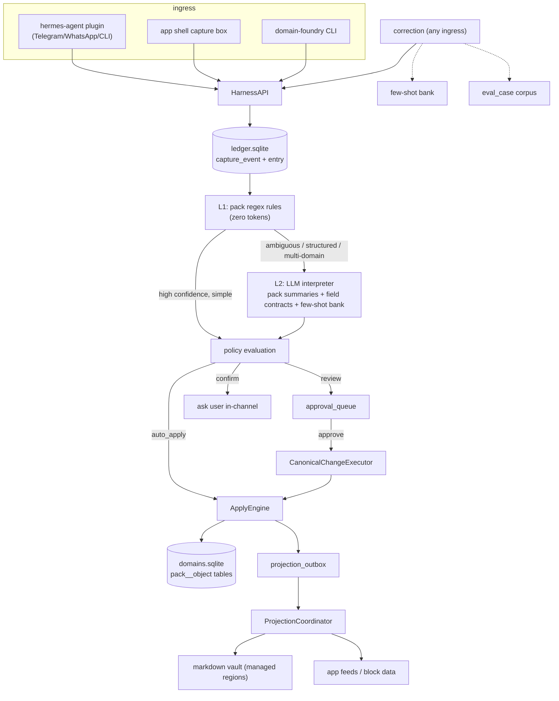

# Architecture

`domain_foundry` is a runtime-agnostic Python core with a stable HTTP surface. The
CLI, the React app shell, and every runtime adapter are thin clients of the same
`HarnessAPI` ([ADR-001](adr/ADR-001-http-adapter-contract.md)).

## End-to-end data flow

## Process model

There is **one local daemon**: `domain-foundry serve` runs FastAPI on
`127.0.0.1:8787`, serving both the `HarnessAPI` JSON endpoints and the built SPA
static assets. The CLI can run one-shot commands in-process or talk to a running
daemon; adapters always talk over HTTP.

A background **projection drain loop** runs inside the FastAPI lifespan: it
drains the `projection_outbox` into materialized views (markdown vault + block
data) and advances per-adapter watermarks. Killing and restarting the daemon
converges projections from durable state — no work is lost.

## Modules (core)

| Module | Responsibility |
|---|---|
| ledger / substrate | Append-only capture, entry dedup, journal, revisions, schema registry. |
| pack loader + compiler | Parse/validate the six YAML files; compile schema + routing into the registry. |
| router (L1/L2) | Hybrid routing with a cost guard; heuristic + cassette/live LLM providers. |
| apply engine | Execute the closed operation vocabulary; policy gates; correction resolution. |
| projection coordinator | Outbox drain, managed-region markdown adapter, direct-query block data, retries + watermarks. |
| review API | Filtered/diffed/bulk approval queue with SLO counters. |
| wizard | Goal → interview → generate → validate → dry-run → test-drive → harden. |
| evals | Cassette store, scoring, per-pack scorecards, baseline diff, backfill/export. |
| clock | The single injectable time source (frozen in tests; audit-enforced). |

## The two databases

- `ledger.sqlite` — the capture substrate (see [The ledger](concepts/ledger.md)).
- `domains.sqlite` — pack-owned tables named `<pack>__<object>`.

Cross-DB references are **soft** (`entry_id` / `object_uid` strings), so a pack
migration can never break the substrate and a future Postgres export is a
translation, not a redesign ([ADR-002](adr/ADR-002-two-database-layout.md),
[ADR-003](adr/ADR-003-ulid-identity.md)).

## The HTTP surface (selected)

| Method + path | Purpose |
|---|---|
| `POST /api/capture` | Capture raw text (the only real write path besides correct). |
| `POST /api/correct` | Plain-language correction. |
| `GET /api/query` | Read canonical objects by domain/filter. |
| `GET /api/objects/{domain}/{type}/{uid}` | Detail + provenance chain. |
| `GET /api/blocks/{view}/data` | Read-only, parameterized block data. |
| `GET /api/review`, `POST /api/review/{id}/resolve`, `/api/review/bulk-resolve` | Approval queue. |
| `POST /api/wizard`, `POST /api/wizard/{id}/reply` | Guided domain creation. |
| `POST /api/projections/drain` | Force a projection drain. |
| `GET /api/health` | Integrity, projection lag, LLM spend, routing score. |

Read paths use **read-only** SQLite connections; writes are **parameterized**
and validated against the compiled schema registry. See [Security](security.md).

## Reference architectures (described, not shipped)

Some of the design lineage comes from private applications that are **described**
here, never shipped: they informed the events-vs-regimens modeling, the
open-context hint, and the cross-domain link design. The public repo ships
neutral templates and synthetic reference packs only.
