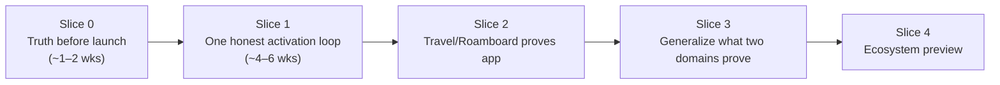

# Build Plan 2026-08 — Overview

**Status:** Approved plan of record, authored 2026-08-10.
**Scope:** Everything between the current commit and the final release standard in
[`../VISION_GAP_REVIEW_2026-08-08.md`](../VISION_GAP_REVIEW_2026-08-08.md).
**Audience:** Any developer (human or agent) executing the work. The Slice 0 and
Slice 1 documents assume no prior knowledge of this repository.

---

## What this kit is

The vision-gap review of 2026-08-08 was a *decision document*: it identified five
release blockers, scored the product, and asked for strategic choices before any
implementation. Those choices have now been made (see the decision record below).
This kit converts the decided direction into executable build documents:

| Doc | Contents | Resolution |
|---|---|---|
| [`00-OVERVIEW.md`](00-OVERVIEW.md) | This file: decisions, slice map, usage rules | — |
| [`01-SLICE-0-TRUTH.md`](01-SLICE-0-TRUTH.md) | Truth before launch: restore the HTTP write seam, rewrite 410-asserting tests, ADR-006, fail-first Playwright harness, copy/docs truth pass, mesh demotion, hermetic release audit, npm triage | Junior-dev executable: file-level, line-referenced, before/after code |
| [`02-SLICE-1-ACTIVATION.md`](02-SLICE-1-ACTIVATION.md) | One honest activation loop: URL routing, new IA, domain-aware capture, Ask, wizard LLM design + model confirm + held-out eval + repair, plain receipts + refile, packaging/doctor, Gate-1 conformance, frontend infra, demo script | Junior-dev executable: file-level, line-referenced, full module specs |
| [`03-SLICE-2-TRAVEL.md`](03-SLICE-2-TRAVEL.md) | Travel/Roamboard proves "app": in-shell import/reconcile, policy-gated apply seam, NL reshape with rollback, shadow gate | Medium: designs + endpoint specs, some implementation freedom |
| [`04-SLICE-3-GENERALIZE.md`](04-SLICE-3-GENERALIZE.md) | Sourdough + Japanese golden outcomes, seam-extraction rules | Milestones + acceptance criteria |
| [`05-SLICE-4-ECOSYSTEM.md`](05-SLICE-4-ECOSYSTEM.md) | Pack lifecycle, conformance kit, external authors, security review | Milestones + acceptance criteria |
| [`06-RISKS-DECISIONS-SCOPE.md`](06-RISKS-DECISIONS-SCOPE.md) | Risk register, not-in-scope list, human gates, verification matrix | Full |

**These documents change nothing by themselves.** They are the specification; the
work happens in PRs that cite them. No code, test, config, or existing doc was
modified when this kit was written — `git status` at authoring time shows only new
files under `docs/build-plan-2026-08/`.

## How to use this kit

1. Read this overview, then the slice you are executing, top to bottom, before
   touching code.
2. Line numbers were verified against the working tree on 2026-08-10 (branch
   `main`, clean except untracked review artifacts). Every quoted excerpt carries
   enough surrounding code that drift is detectable: **if a quote no longer matches
   the file, stop and re-verify before editing** — do not apply a change spec to
   moved code by line number alone.
3. Follow the PR sequencing inside each slice doc. Slice 0's fail-first E2E
   protocol (red Playwright journey lands *before* the fix) is deliberate: it is
   the proof that the activation loop was broken and then repaired.
4. Each slice ends with an exit-gate checklist. A slice is not done until every
   box is checked with evidence (a green CI run, a command transcript, a recorded
   artifact). This mirrors how `docs/USER_STORIES.md` pairs claims with evidence.
5. Discrepancy sections inside the slice docs record places where this kit's
   source brief disagreed with the code. The code won; the discrepancy is noted.
   Treat those sections as authoritative errata.

## Decision record (locked 2026-08-09/10)

These were the open checkboxes in the vision-gap review. They are now decided and
are **not** to be re-litigated inside implementation PRs. Changing one requires
updating this file first.

1. **v0.1 posture — Option A, sequenced A→B→C.** Market v0.1 as the
   structured-life data layer for agent runtimes, demonstrated through MCP and one
   first-party app. "Get an app" narrows honestly to "get a useful structured
   view" until Slice 2 (Travel/Roamboard) earns the app-foundry promise. The
   per-domain agent mesh stays experimental and demoted.
2. **Canonical write seam — restore the HTTP daemon contract.** The local FastAPI
   daemon (`domain-foundry serve`) is the canonical mutation seam shared by the
   SPA, MCP, Telegram, and Roamboard. ADR-001 is re-affirmed via new ADR-006
   (drafted in full inside `01-SLICE-0-TRUTH.md`). All `410 Gone` write stubs are
   replaced with real handlers; contract tests are rewritten to exercise the
   journey instead of asserting the outage. In-process `HarnessAPI` embedding
   remains legal only for adapters that pass the Gate-1 conformance suite.
3. **Scope — full Slices 0–4**, with resolution decreasing by slice (0–1
   excruciating, 2 medium, 3–4 milestones) because later slices depend on what
   earlier slices prove.
4. **Launch — build to release-ready; publishing stays human.** The plan reaches
   Gate 0 (clean-machine wheel install, TestPyPI dry-run scripted, demo storyboard
   from the release artifact). The actual PyPI publish, git tag, GitHub release,
   demo recording, and launch posts remain human gates per
   [`../../LAUNCH_CHECKLIST.md`](../../LAUNCH_CHECKLIST.md).
5. **Wizard — always atlas-browse first; jobs compile ideas; starters are analogs.**
   `new_domain` lands on an idea-atlas neighborhood (buckets → practices → app
   ideas, world + foundry). The user picks or mixes an idea; `compile_jobs` turns
   its jobs into a pack. Bundled packs install only after a 1:1 idea pick —
   including plants and sourdough. When a provider is configured, field design
   after commit runs on the **sota** tier. No-key mode still returns the shipped
   neighborhood and can compile without a model. Capture after idea commit stays
   one-shot. A domain is not "live" until held-out acceptance *and* ≥1 real
   capture. Revises the Aug 14 “name it, then talk / skip interview” auto-install.
6. **App shell IA — restructure in Slice 1.** Slice 0 only un-breaks writes and
   fixes false/technical copy in place. Slice 1 ships the new information
   architecture — **Today / Your passions / Inbox / Settings** — plus real URL
   routing and deep links.
7. **"Talk to it" — capture + correct + Ask.** Slice 1 adds a read-only
   natural-language query mode next to capture: NL → validated structured plan →
   existing query surfaces only (the model never writes SQL) → answer grounded in
   records with required citations, cost-capped through `CostGuard`.
8. **Telemetry — none at all.** Not even opt-in metrics. The README's "local
   first, no telemetry" promise stays absolute.
9. **Resolved forks:** a real `domain-foundry export` command is the Gate-1
   data-ownership step (secrets-free JSON per domain; `eval_export` is not that
   tool). Slice-2 domain actions (checklist toggles, mark-done) go through a
   **policy-gated `POST /api/apply`** exposing the existing
   `HarnessAPI.apply_operation`, restricted to operations a pack's `policy.yaml`
   declares UI-safe — not through overloaded corrections.
10. **Decision-sheet defaults adopted as recommended:** MCP is the first generic
    agent protocol; subscription-backed CLI-runtime adapters only after MCP is
    green; declarative packs + separately-installed permissioned behavior
    adapters; universal shell with deeper declarative capabilities; shared
    schedules/actions only (mesh experimental); pipx technical-preview
    distribution; SQLite ×2 stays; curated gallery before any open registry.

## Slice map

| Slice | Exit condition (summary — full checklist in each doc) |
|---|---|
| 0 | No advertised control is knowingly nonfunctional; the Playwright activation journey flips red→green; ADR-006 merged; docs/claims truthful; mesh honest; release audit hermetic |
| 1 | A new user reaches an *activated foundry* in <10 minutes from a public-shaped artifact; Gate-1 journey green through CLI, HTTP, and MCP drivers plus the packaged SPA; wizard held-out ≥0.90 with the 8 review captures handled; Ask grounded with citations under a visible cost cap |
| 2 | A full trip runs on Foundry under/instead of Roamboard: import→reconcile→ ≥7-day zero-diff shadow; one NL reshape applied and rolled back; filmed vertical slice |
| 3 | A new domain with similar needs implements without editing unrelated core modules; capability model published |
| 4 | A third party builds→publishes→installs→removes a pack unaided; external security review complete |

**Activation definition** (from the review, used throughout): created/installed
successfully · one held-out user-authored capture became the intended canonical
object · visible in a useful domain view · correctable from the same surface ·
survives a runtime restart.

## Source documents

- [`../VISION_GAP_REVIEW_2026-08-08.md`](../VISION_GAP_REVIEW_2026-08-08.md) — the governing review (blockers, scorecard, gates 0–6, 90-day sequence)
- `.impeccable/critique/2026-08-09T02-04-00Z__app-src-app-tsx.md` — app-shell UI critique (20/40 Nielsen; P0 = flagship creation impossible in shell)
- [`../adr/ADR-001-http-adapter-contract.md`](../adr/ADR-001-http-adapter-contract.md) — the contract being restored
- [`../../LAUNCH_CHECKLIST.md`](../../LAUNCH_CHECKLIST.md) — human launch gates
- [`../OPEN_GATES.md`](../OPEN_GATES.md) — calendar/human gates 4–6 (mesh QA, cutover, shadow streak)

## Ground rules for every PR in this plan

- Full gates before merge: `pytest` (all suites), `ruff check`, `pyright`, and for
  app changes `npm run build` plus the E2E suite once S0.4 lands. Report exact
  pass counts.
- Never assert a 410 for an advertised feature again. If an endpoint is removed
  deliberately, the SPA control that calls it must be removed in the same PR and
  an ADR must record the decision.
- Copy changes follow the plain-language rule: internal nouns (`ledger`,
  `disposition`, `object_type`, `unfiled`, `projection`) do not appear in
  user-facing surfaces; the receipts translator in Slice 1 is the single place
  that maps internal states to human sentences.
- This kit is maintainer material: it is deliberately **not** in the public
  MkDocs nav (`mkdocs.yml` has no strict mode, so un-navved files are build-safe;
  the Slice 0 docs pass adds the kit to the `not_in_nav` block alongside the
  other maintainer records).
