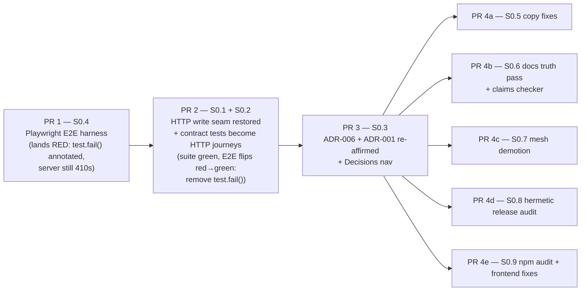

# Slice 0 — Truth Before Launch

**Plan date:** 2026-08-10
**Source review:** [`docs/VISION_GAP_REVIEW_2026-08-08.md`](../VISION_GAP_REVIEW_2026-08-08.md) — see its §"The critical web contract failure", §"Gap register → P0", and §"Proposed 90-day sequence → Slice 0".
**Slice 0 exit condition (from the review):** *"No advertised control is knowingly nonfunctional; one executable contract matches docs and ADRs."*

The web app today renders a capture box, Install buttons, correction actions, review controls, and (via clients) wizard calls whose server endpoints deliberately return `410 Gone` (`core/domain_foundry_core/api/app.py`, mesh P0). The contract tests assert the 410s, so the suite is green over a broken user journey. Slice 0 makes every advertised control functional again, records the decision, and puts an executable browser journey in CI so this class of drift can never be silently green again.

---

## How to use this document

- This is an **execution spec**, not a discussion document. Every workstream (S0.1–S0.9) contains: a **Files touched** table, **Current state** (real code quoted with line numbers as of 2026-08-10 — if the line numbers have drifted when you read this, re-locate by content before editing), a **Change specification** (before/after or complete new-file contents), **Tests** (named, with old assertion → new assertion), and **Verify** (copy-pasteable commands).
- Code in fenced blocks under "New file" or "after" headings **is the spec** — type it in as written (adjusting only for drift you find and note).
- Follow the [PR sequencing](#pr-sequencing). Do not merge S0.1 without S0.2 in the same PR — the suite must stay green at every merge.
- Line references use `L<n>` and are 1-based, matching `cat -n` / editor gutters.
- Where this plan's source brief contradicted the code, the code won; each case is listed in [Discrepancies found while drafting](#discrepancies-found-while-drafting).
- Run all commands from the repository root with the repo venv active (`source .venv/bin/activate`) unless a command says otherwise.

## Locked decisions

These were decided before this plan was written. Record them; do not re-litigate them inside Slice 0 PRs.

1. **Restore the HTTP daemon write seam.** The local FastAPI daemon (`domain-foundry serve`) is the canonical mutation seam for the SPA and for any adapter that does not embed the harness. This **re-affirms ADR-001** via a new **ADR-006** (S0.3). The mesh-P0 removal of HTTP writes changed the implementation without superseding the accepted decision record; that ends now.
2. **Mesh stays experimental.** Default-off flags, honest status output ("config only", "not running"), an EXPERIMENTAL banner on `domain-foundry mesh …` commands. No mesh claims in launch-facing copy. (S0.7)
3. **Adapters may embed `HarnessAPI` in-process only if they pass the Gate-1 conformance suite** — defined in the Slice 1 doc `02-SLICE-1-ACTIVATION.md`. S0.2 seeds that suite's HTTPDriver by driving the existing `DomainExpertClient` through `TestClient`.

## PR sequencing



Rules:

- **PR 1 (S0.4)** lands first, in its own PR, with the E2E spec annotated `test.fail()` and linked to the tracking issue. This proves the harness runs in CI and documents the breakage executable-ly.
- **PR 2 (S0.1 + S0.2)** is one PR: endpoint restoration and test conversion are inseparable — restoring endpoints alone turns the 410-asserting tests red; converting tests alone leaves them red against 410s. This PR also deletes the `test.fail()` annotation from `activation.spec.ts` so the E2E goes green in the same merge.
- **PR 3 (S0.3)** records what PR 2 did. It may be prepared in parallel but merges after, so the ADR describes shipped reality.
- **PRs 4a–4e (S0.5–S0.9)** are independent of each other and parallelizable. 4b (docs truth) should merge after 4a/4c where copy overlaps (catalog descriptions, mesh wording) to avoid the claims checker flagging in-flight text.

## Discrepancies found while drafting

The brief for this plan was checked against the actual code. Where they disagreed, the code won:

1. **README has no mesh sections.** The brief asked to label README mesh sections experimental; `README.md` (read in full) never mentions the mesh. S0.7's README task is therefore vacuous; the honest-status work is in the CLI/API return shapes and the mesh docs page (removed from nav in S0.6). Noted in S0.7.
2. **`docs/HANDOFF.md` is not in the mkdocs nav.** The brief listed it for removal; it is already absent (see the current nav quoted in S0.6). It is added to `not_in_nav` for completeness only. `FOUNDER_VALIDATION.md` *is* in the nav and is removed.
3. **`npm audit` currently reports 2 advisories, not 4** (1 high: nanoid < 3.3.17; 1 moderate: postcss ≤ 8.5.22). The review of 2026-08-08 saw four; the lockfile has since moved (resolved `vite@6.4.3`). S0.9 documents the current two and their fix.
4. **`cli.py new-domain` (L893) has no success copy of its own** — it prints raw wizard-turn JSON. The "'X' is live … 100%" copy lives solely in `wizard/engine.py::_activated_turn` (L333–348). S0.5 fixes the engine; no `cli.py` copy change is needed.
5. **Latent decision-vocabulary bug discovered:** the SPA sends review decisions `"approve"` / `"deny"` (`app/src/blocks/ReviewQueue.tsx` L93–97, L125–133), but `CanonicalChangeExecutor.resolve_approval` (`core/domain_foundry_core/apply/executor.py` L261–262) raises `ValueError` unless the decision is `approved|denied|expired`. This was never hit because the HTTP endpoints 410'd before reaching the executor, and the in-process test only bulk-resolves when the queue happens to be non-empty. S0.1's `ResolveBody`/`BulkResolveBody` normalize at the HTTP boundary.
6. **`Supervisor.register` already returns `"running": false` and a stub note** (`mesh/supervisor.py` L152–158). S0.7 sharpens `"registered": True` → `"registered": "config_only"` (or `"running"` when actually spawned) rather than adding fields from scratch.
7. **Timeline empty-state exact text** is "Capture something above and it will appear here, newest first." (`app/src/blocks/Timeline.tsx` L12–16) — quoted exactly in S0.5.
8. **`docs/concepts/packs.md` also claims a `pack upgrade` command** (L65) that does not exist in `cli.py` (verified by grep) — added to the S0.6 fix list alongside the Git-URL and entry-point-handler claims.

---

## S0.1 — Restore the HTTP write seam

**Goal:** every mutation the shipped clients already send (`app/src/lib/api.ts`, `adapters/hermes_agent/.../client.py`) is served by `create_app` with validated bodies, the existing auth posture, and unchanged receipt shapes.

### Files touched

| File | Action |
|---|---|
| `core/domain_foundry_core/api/app.py` | Rewrite module docstring; delete `_WRITE_PATH_GONE` + `_gone()`; replace 8 stub endpoints with real handlers; extend CORS; rewrite no-SPA hint |
| `core/domain_foundry_core/api/schemas.py` | **New file** — Pydantic request models |

### Current state

Module docstring and the 410 constant — `core/domain_foundry_core/api/app.py` L1–5 and L40–49:

```python
"""FastAPI application: read-only SPA surface (query/health/blocks).

Mesh P0: mutating routes return 410 Gone. Writes go in-process via the CLI
or the hermes-agent ``LocalHarnessClient`` (embedded ``HarnessAPI``).
"""
```

```python
# Mesh P0: the HTTP surface is READ-ONLY. Every mutating endpoint returns
# 410 Gone — writes go in-process through the CLI or the hermes-agent
# adapter's LocalHarnessClient (embedded HarnessAPI). A dead server can no
# longer block capture. The background projection drain loop stays until
# Domain Experts own draining (mesh P1/P2).
_WRITE_PATH_GONE = (
    "write endpoints were removed (mesh P0): the HTTP server is a read-only "
    "viewer. Use the domain-foundry CLI or the hermes-agent adapter, which "
    "embed the harness in-process."
)
```

The harness instance and auth closure — `app.py` L59 and L82–88:

```python
    api = HarnessAPI(home)
```

```python
    def _auth(authorization: str | None) -> None:
        if not token:
            return
        if not authorization or not authorization.startswith("Bearer "):
            raise HTTPException(status_code=401, detail="bearer token required")
        if authorization.removeprefix("Bearer ").strip() != token:
            raise HTTPException(status_code=403, detail="invalid token")
```

The CORS allowlist — `app.py` L75–80:

```python
    app.add_middleware(
        CORSMiddleware,
        allow_origins=["http://127.0.0.1:8787", "http://localhost:8787"],
        allow_methods=["*"],
        allow_headers=["*"],
    )
```

The `_gone()` helper — `app.py` L102–103:

```python
    def _gone() -> None:
        raise HTTPException(status_code=410, detail=_WRITE_PATH_GONE)
```

**All eight 410 stubs**, enumerated from the file (each is the complete current handler):

`app.py` L105–108:

```python
    @app.post("/api/capture")
    def capture() -> dict[str, Any]:
        _gone()
        return {}
```

`app.py` L179–182:

```python
    @app.post("/api/correct")
    def correct() -> dict[str, Any]:
        _gone()
        return {}
```

`app.py` L222–225:

```python
    @app.post("/api/review/bulk-resolve")
    def review_bulk_resolve() -> dict[str, Any]:
        _gone()
        return {}
```

`app.py` L241–244:

```python
    @app.post("/api/packs/activate")
    def packs_activate() -> dict[str, Any]:
        _gone()
        return {}
```

`app.py` L284–287:

```python
    @app.post("/api/projections/drain")
    def projections_drain() -> dict[str, Any]:
        _gone()
        return {}
```

`app.py` L334–337:

```python
    @app.post("/api/review/{approval_id}/resolve")
    def review_resolve(approval_id: str) -> dict[str, Any]:
        _gone()
        return {}
```

`app.py` L350–353:

```python
    @app.post("/api/wizard")
    def wizard_new_domain() -> dict[str, Any]:
        _gone()
        return {}
```

`app.py` L355–358:

```python
    @app.post("/api/wizard/{session_id}/reply")
    def wizard_reply(session_id: str) -> dict[str, Any]:
        _gone()
        return {}
```

The no-SPA hint — `app.py` L378–392:

```python
        @app.get("/")
        def root() -> dict[str, Any]:
            ws = api.workspace
            return {
                "name": "domain_foundry",
                "version": "0.1.0",
                "home": str(ws.home),
                "docs": "/docs",
                "hint": (
                    "No web app bundled with this install. Use the API and CLI, or "
                    "run from a checkout: `cd app && npm install && npm run build`. "
                    "Writes go in-process (CLI / hermes-agent); this HTTP surface "
                    "is read-only."
                ),
            }
```

The non-local-bind guard that keeps the auth posture honest — `app.py` L398–413 (`run_server`, **unchanged** by S0.1; quoted because ADR-006 and the auth tests cite it):

```python
def run_server(
    home: Path | None = None,
    *,
    host: str = "127.0.0.1",
    port: int = 8787,
    api_token: str | None = None,
) -> None:
    import uvicorn

    if host not in {"127.0.0.1", "localhost", "::1"} and not (
        api_token or os.environ.get("DOMAIN_FOUNDRY_API_TOKEN")
    ):
        raise SystemExit(
            "Refusing non-local bind without DOMAIN_FOUNDRY_API_TOKEN "
            "(or --token). Pass --host 127.0.0.1 for local-only mode."
        )
```

#### The HarnessAPI methods the handlers wire to

Exact current signatures from `core/domain_foundry_core/api/harness.py` (quote-verified):

```python
# harness.py L65–72
def capture(
    self,
    text: str,
    channel: str = "cli",
    source_ref: str | None = None,
    attachments: list[dict[str, Any]] | None = None,
    actor: str | None = None,
) -> CaptureReceipt:
```

```python
# harness.py L342–352
def correct(
    self,
    text: str | None = None,
    entry_id: str | None = None,
    object_uid: str | None = None,
    action: str | None = None,
    fields: dict[str, Any] | None = None,
    merge_into_uid: str | None = None,
    target_domain: str | None = None,
    channel: str = "cli",
) -> dict[str, Any]:
```

```python
# harness.py L576
def activate_pack(self, name: str) -> dict[str, Any]:
```

```python
# harness.py L413–419
def review_resolve(
    self,
    approval_id: str,
    decision: str,
    note: str | None = None,
    resolver: str = "user",
) -> dict[str, Any]:
```

```python
# harness.py L395–401
def review_resolve_bulk(
    self,
    approval_ids: list[str],
    decision: str,
    note: str | None = None,
    resolver: str = "user",
) -> dict[str, Any]:
```

```python
# harness.py L444–446
def drain_projections(
    self, *, adapters: list[str] | None = None, limit: int = 100
) -> dict[str, Any]:
```

```python
# harness.py L764
def new_domain(self, goal_text: str, *, test_drive: int = 5) -> dict[str, Any]:
```

```python
# harness.py L768
def wizard_reply(self, session_id: str, text: str) -> dict[str, Any]:
```

#### The bodies the clients already send

The handlers must accept exactly these shapes — do not invent new field names.

SPA capture — `app/src/lib/api.ts` L74–78:

```ts
  capture: (text: string, channel = "web") =>
    req<CaptureReceipt>("/api/capture", {
      method: "POST",
      body: JSON.stringify({ text, channel }),
    }),
```

SPA correct (note the spread + forced `channel: "web"`) — `api.ts` L105–117:

```ts
  correct: (body: {
    text?: string;
    entry_id?: string;
    object_uid?: string;
    action?: string;
    fields?: Record<string, unknown>;
    merge_into_uid?: string;
    target_domain?: string;
  }) =>
    req<CorrectionReceipt>("/api/correct", {
      method: "POST",
      body: JSON.stringify({ ...body, channel: "web" }),
    }),
```

SPA activate / resolve / bulk-resolve — `api.ts` L91–95 and L127–136:

```ts
  activatePack: (name: string) =>
    req<{ name: string }>("/api/packs/activate", {
      method: "POST",
      body: JSON.stringify({ name }),
    }),
```

```ts
  resolve: (approvalId: string, decision: string, note?: string) =>
    req(`/api/review/${approvalId}/resolve`, {
      method: "POST",
      body: JSON.stringify({ decision, note }),
    }),
  bulkResolve: (approvalIds: string[], decision: string) =>
    req<{ applied: number; failed: number; count: number }>("/api/review/bulk-resolve", {
      method: "POST",
      body: JSON.stringify({ approval_ids: approvalIds, decision }),
    }),
```

Hermes HTTP client capture / correct / resolve / wizard — `adapters/hermes_agent/src/domain_foundry_hermes_agent/client.py` L88–106 (capture sends explicit nulls for optionals), L128–152 (correct payload), L169–180 (resolve adds `resolver`), L182–188 (wizard bodies):

```python
    def correct(
        self,
        *,
        text: str | None = None,
        entry_id: str | None = None,
        object_uid: str | None = None,
        action: str | None = None,
        fields: dict[str, Any] | None = None,
        merge_into_uid: str | None = None,
        target_domain: str | None = None,
        channel: str = "hermes-agent",
    ) -> dict[str, Any]:
        return self._post(
            "/api/correct",
            {
                "text": text,
                "entry_id": entry_id,
                "object_uid": object_uid,
                "action": action,
                "fields": fields,
                "merge_into_uid": merge_into_uid,
                "target_domain": target_domain,
                "channel": channel,
            },
        )
```

```python
    def new_domain(self, goal_text: str, *, test_drive: int = 5) -> dict[str, Any]:
        return self._post(
            "/api/wizard", {"goal_text": goal_text, "test_drive": test_drive}
        )

    def wizard_reply(self, session_id: str, text: str) -> dict[str, Any]:
        return self._post(f"/api/wizard/{session_id}/reply", {"text": text})
```

Because the hermes client sends explicit `null` for optional fields, every optional model field must default to `None` (not use `exclude_unset` semantics).

#### Receipt shapes (must not change)

The SPA types in `app/src/lib/types.ts` model the responses and must keep working untouched:

- `CaptureReceipt` (types.ts L13–21) mirrors the Pydantic `CaptureReceipt` (`core/domain_foundry_core/ledger/models.py` L21–31). The server model has one extra field, `llm_error: str | None` — extra JSON fields are ignored by the SPA, so returning `receipt.model_dump()` is exactly right.
- `CorrectionReceipt` (types.ts L172–179: `action`, `object_uid`, `revision`, `applied`, `error`, `details?`) matches `HarnessAPI.correct(...)`'s `receipt.to_dict()`.
- `bulkResolve`'s expected `{ applied, failed, count }` matches `resolve_bulk`'s return (`core/domain_foundry_core/apply/review.py` L263–269: `count`, `applied`, `failed`, `decision`, `results`).
- `activatePack`'s expected `{ name }` is a subset of `activate_pack`'s `{name, version, title, agent?, expert?}` (harness.py L576–586).

**Conclusion:** every handler returns the harness result unchanged (`model_dump()` for the capture receipt; dicts pass through). No response-shape work is needed.

### Change specification

#### 1. Module docstring (app.py L1–5)

Before: quoted above. After:

```python
"""FastAPI application: the local daemon serving the SPA and the harness contract.

ADR-006 (re-affirming ADR-001): this daemon is the canonical mutation seam for
the SPA and for any adapter that does not embed ``HarnessAPI`` in-process.
Reads and writes share one auth posture: open on localhost by default,
bearer-token gated on every endpoint once a token is configured, and non-local
binds refuse to start without a token (see ``run_server``).
"""
```

#### 2. Delete `_WRITE_PATH_GONE` (L40–49) and `_gone()` (L102–103)

Remove both blocks entirely, including the "Mesh P0" comment above `_WRITE_PATH_GONE`. After this, `grep -n "410\|_gone\|GONE" core/domain_foundry_core/api/app.py` must return nothing.

#### 3. CORS allowlist (app.py L75–80)

Before: quoted above. After:

```python
    app.add_middleware(
        CORSMiddleware,
        allow_origins=[
            "http://127.0.0.1:8787",
            "http://localhost:8787",
            # Vite dev server (app/vite.config.ts). `npm run dev` proxies /api
            # and /health to :8787, but direct browser calls (and websocket-free
            # tools) hit this origin — allow both spellings.
            "http://127.0.0.1:5173",
            "http://localhost:5173",
        ],
        allow_methods=["*"],
        allow_headers=["*"],
    )
```

Confirmed against `app/vite.config.ts` L6–12 (dev server on port 5173, proxying `/api` and `/health` to `http://127.0.0.1:8787`):

```ts
  server: {
    port: 5173,
    proxy: {
      "/api": "http://127.0.0.1:8787",
      "/health": "http://127.0.0.1:8787",
    },
  },
```

#### 4. New file: `core/domain_foundry_core/api/schemas.py`

Complete proposed contents:

```python
"""Request bodies for the HTTP write seam (ADR-006).

Field names and optionality mirror what the shipped clients already send:

- the SPA (``app/src/lib/api.ts``): ``{text, channel:"web"}`` captures,
  ``correct`` bodies with a forced ``channel:"web"``, ``{name}`` activation,
  ``{decision, note}`` resolves, ``{approval_ids, decision}`` bulk resolves.
- the hermes-agent HTTP client
  (``adapters/hermes_agent/src/domain_foundry_hermes_agent/client.py``):
  the same operations with explicit ``null`` for every optional field, plus
  ``{goal_text, test_drive}`` / ``{text}`` wizard bodies.

Every optional field therefore defaults to ``None`` (explicit nulls must
validate). Decision vocabulary: the SPA sends ``approve``/``deny`` while the
executor requires ``approved``/``denied``/``expired``
(``apply/executor.py::resolve_approval``); ``normalized_decision()`` maps the
SPA forms so both dialects are legal at the HTTP boundary.
"""

from __future__ import annotations

from typing import Any

from pydantic import BaseModel, Field

_DECISION_ALIASES = {
    "approve": "approved",
    "deny": "denied",
    "expire": "expired",
}


class CaptureBody(BaseModel):
    text: str
    channel: str = "web"
    source_ref: str | None = None
    attachments: list[dict[str, Any]] | None = None
    actor: str | None = None


class CorrectBody(BaseModel):
    text: str | None = None
    entry_id: str | None = None
    object_uid: str | None = None
    action: str | None = None
    fields: dict[str, Any] | None = None
    merge_into_uid: str | None = None
    target_domain: str | None = None
    channel: str = "web"


class ActivateBody(BaseModel):
    name: str


class _DecisionMixin(BaseModel):
    decision: str
    note: str | None = None
    resolver: str = "user"

    def normalized_decision(self) -> str:
        return _DECISION_ALIASES.get(self.decision, self.decision)


class ResolveBody(_DecisionMixin):
    pass


class BulkResolveBody(_DecisionMixin):
    approval_ids: list[str]


class DrainBody(BaseModel):
    adapters: list[str] | None = None
    limit: int = Field(default=100, ge=1, le=1000)


class WizardBody(BaseModel):
    goal_text: str
    test_drive: int = Field(default=5, ge=0, le=50)


class WizardReplyBody(BaseModel):
    text: str
```

#### 5. Replace the eight 410 stubs with real handlers

Add the import near the top of `app.py` (after the existing `from domain_foundry_core.api.harness import HarnessAPI` at L20):

```python
from domain_foundry_core.api.schemas import (
    ActivateBody,
    BulkResolveBody,
    CaptureBody,
    CorrectBody,
    DrainBody,
    ResolveBody,
    WizardBody,
    WizardReplyBody,
)
```

Every handler: (a) calls the existing `_auth(authorization)` closure (L82) so writes are token-gated exactly like reads, (b) delegates to the `api` instance created at L59, (c) maps `ValueError → 400` and missing pack/session/approval → `404`, and (d) never leaks a stack trace (FastAPI's default `HTTPException` handling plus these explicit catches; anything else is a genuine 500 bug to fix, not to catch).

Replace L105–108 (`/api/capture`) with:

```python
    @app.post("/api/capture")
    def capture(
        body: CaptureBody,
        authorization: str | None = Header(default=None),
    ) -> dict[str, Any]:
        _auth(authorization)
        try:
            receipt = api.capture(
                body.text,
                channel=body.channel,
                source_ref=body.source_ref,
                attachments=body.attachments,
                actor=body.actor,
            )
        except ValueError as exc:
            raise HTTPException(status_code=400, detail=str(exc)) from exc
        return receipt.model_dump()
```

Replace L179–182 (`/api/correct`) with:

```python
    @app.post("/api/correct")
    def correct(
        body: CorrectBody,
        authorization: str | None = Header(default=None),
    ) -> dict[str, Any]:
        _auth(authorization)
        try:
            return api.correct(
                text=body.text,
                entry_id=body.entry_id,
                object_uid=body.object_uid,
                action=body.action,
                fields=body.fields,
                merge_into_uid=body.merge_into_uid,
                target_domain=body.target_domain,
                channel=body.channel,
            )
        except ValueError as exc:
            raise HTTPException(status_code=400, detail=str(exc)) from exc
```

(Note: `CorrectionService` reports most user errors *inside* the receipt — `{"applied": false, "error": "..."}` — which the SPA already renders; only genuine input errors raise.)

Replace L222–225 (`/api/review/bulk-resolve`) with:

```python
    @app.post("/api/review/bulk-resolve")
    def review_bulk_resolve(
        body: BulkResolveBody,
        authorization: str | None = Header(default=None),
    ) -> dict[str, Any]:
        _auth(authorization)
        try:
            return api.review_resolve_bulk(
                body.approval_ids,
                decision=body.normalized_decision(),
                note=body.note,
                resolver=body.resolver,
            )
        except ValueError as exc:
            raise HTTPException(status_code=400, detail=str(exc)) from exc
```

Replace L241–244 (`/api/packs/activate`) with:

```python
    @app.post("/api/packs/activate")
    def packs_activate(
        body: ActivateBody,
        authorization: str | None = Header(default=None),
    ) -> dict[str, Any]:
        _auth(authorization)
        try:
            return api.activate_pack(body.name)
        except FileNotFoundError as exc:
            # PackRegistry.activate_bundled raises FileNotFoundError for an
            # unknown bundled name (packs/registry.py L91–96).
            raise HTTPException(status_code=404, detail=str(exc)) from exc
        except ValueError as exc:
            raise HTTPException(status_code=400, detail=str(exc)) from exc
```

Replace L284–287 (`/api/projections/drain`) with:

```python
    @app.post("/api/projections/drain")
    def projections_drain(
        body: DrainBody | None = None,
        authorization: str | None = Header(default=None),
    ) -> dict[str, Any]:
        _auth(authorization)
        spec = body or DrainBody()
        return api.drain_projections(adapters=spec.adapters, limit=spec.limit)
```

(The body is optional: the pre-mesh CLI/tests POST with no body at all — `client.post("/api/projections/drain")` must be 200.)

Replace L334–337 (`/api/review/{approval_id}/resolve`) with:

```python
    @app.post("/api/review/{approval_id}/resolve")
    def review_resolve(
        approval_id: str,
        body: ResolveBody,
        authorization: str | None = Header(default=None),
    ) -> dict[str, Any]:
        _auth(authorization)
        try:
            result = api.review_resolve(
                approval_id,
                decision=body.normalized_decision(),
                note=body.note,
                resolver=body.resolver,
            )
        except ValueError as exc:
            raise HTTPException(status_code=400, detail=str(exc)) from exc
        # resolve_approval reports an unknown id inside the receipt
        # (apply/executor.py L270–276) rather than raising — surface it as 404.
        if result.get("error") and "not found" in str(result["error"]):
            raise HTTPException(status_code=404, detail=str(result["error"]))
        return result
```

Replace L350–353 (`/api/wizard`) with:

```python
    @app.post("/api/wizard")
    def wizard_new_domain(
        body: WizardBody,
        authorization: str | None = Header(default=None),
    ) -> dict[str, Any]:
        _auth(authorization)
        try:
            return api.new_domain(body.goal_text, test_drive=body.test_drive)
        except ValueError as exc:
            raise HTTPException(status_code=400, detail=str(exc)) from exc
```

Replace L355–358 (`/api/wizard/{session_id}/reply`) with:

```python
    @app.post("/api/wizard/{session_id}/reply")
    def wizard_reply(
        session_id: str,
        body: WizardReplyBody,
        authorization: str | None = Header(default=None),
    ) -> dict[str, Any]:
        _auth(authorization)
        result = api.wizard_reply(session_id, body.text)
        # WizardEngine.wizard_reply reports an unknown session inside the dict
        # (wizard/engine.py L63–66) — surface it as 404.
        if str(result.get("error", "")).startswith("unknown wizard session"):
            raise HTTPException(status_code=404, detail=str(result["error"]))
        return result
```

Also update the comment above `/api/ingest/preview` (app.py L110–112), which currently reads:

```python
    # Ingest is a *local, server-side* operation: this process reads local files
    # and drives its own in-process HarnessAPI. That is different from the remote
    # write path above (410), which forces clients to the in-process harness.
```

→

```python
    # Ingest is a *local, server-side* operation: this process reads local files
    # and drives its own in-process HarnessAPI. Unlike the JSON write endpoints
    # above, the request carries a filesystem path, so it only makes sense
    # against the daemon's own machine.
```

#### 6. No-SPA hint text (app.py L386–391)

Before: quoted above ("Writes go in-process … read-only"). After:

```python
                "hint": (
                    "No web app bundled with this install. Use the API and CLI, or "
                    "run from a checkout: `cd app && npm install && npm run build`. "
                    "The full read/write harness contract is served here "
                    "(ADR-006); interactive API docs at /docs."
                ),
```

#### 7. Auth posture — no change, now covering writes

Keep localhost-open default: with no token configured, `_auth` returns immediately (L83–84), so writes are open on localhost exactly like reads. With a token configured, every handler above calls `_auth`, so writes are enforced everywhere. Non-local binds still refuse to start without a token (`run_server` L407–413, quoted in Current state). S0.2 updates `tests/security/test_api_auth.py` to pin all three postures.

### Tests

Owned by S0.2 (same PR). Headline flips:

| Test | Old assertion | New assertion |
|---|---|---|
| `tests/contract/test_api.py::test_fastapi_reads_serve_writes_are_gone` | `POST /api/capture` → 410 | renamed `test_fastapi_serves_reads_and_writes`; → 200 + receipt |
| `tests/contract/test_app_shell.py::test_full_walkthrough` | in-process writes; HTTP correct → 410 | full journey over `client.post` |
| `tests/contract/test_wizard.py::test_wizard_http_endpoints_are_gone` | wizard POSTs → 410 | renamed `test_wizard_http_journey`; → 200 state machine |
| `tests/security/test_api_auth.py::test_token_gates_endpoints` | writes → 410 with or without token | 401 without token, 200 with |

### Verify

```bash
# unit/contract suite (green before merge)
python -m pytest tests/contract/test_api.py tests/contract/test_app_shell.py \
  tests/contract/test_wizard.py tests/security/test_api_auth.py -q

# no 410 machinery left
grep -rn "410\|_gone\|WRITE_PATH_GONE" core/domain_foundry_core/api/app.py; echo "exit=$? (want 1)"

# live smoke against a scratch home
export DOMAIN_FOUNDRY_HOME="$(mktemp -d)"
domain-foundry init
domain-foundry serve --port 8791 &   # then, in another shell (or after `sleep 2`):

curl -s -X POST http://127.0.0.1:8791/api/packs/activate \
  -H 'Content-Type: application/json' -d '{"name":"sourdough"}' | python -m json.tool
curl -s -X POST http://127.0.0.1:8791/api/capture \
  -H 'Content-Type: application/json' \
  -d '{"text":"baked a 75% hydration country loaf, bulk 5h, came out great","channel":"web"}' | python -m json.tool
# expect: {"status": "applied", "routed": [{"domain": "sourdough", ...}], ...}
curl -s -X POST http://127.0.0.1:8791/api/packs/activate \
  -H 'Content-Type: application/json' -d '{"name":"nope"}' -o /dev/null -w '%{http_code}\n'
# expect: 404
curl -s -X POST http://127.0.0.1:8791/api/wizard \
  -H 'Content-Type: application/json' -d '{"goal_text":"log my running"}' | python -m json.tool
# expect: {"state": "interview", ...}
kill %1
```

---

## S0.2 — Contract tests become HTTP journeys

**Goal:** zero tests assert 410 for advertised features; the same journeys previously driven in-process are driven over `client.post`; the hermes `DomainExpertClient` gets an HTTP-driven journey that seeds Slice 1's Gate-1 HTTPDriver.

### Files touched

| File | Action |
|---|---|
| `tests/contract/test_app_shell.py` | Docstring + 4 tests converted to HTTP writes |
| `tests/contract/test_wizard.py` | L197–216 test renamed/rewritten |
| `tests/contract/test_api.py` | L12–37 and L69–72 rewritten |
| `tests/security/test_api_auth.py` | L45–54 rewritten; localhost-open write added |
| `tests/unit/test_ingest.py` | L105–106 rewritten |
| `tests/contract/test_hermes_agent_adapter.py` | L120–137 updated; new HTTP-driver test added |
| `adapters/mcp/src/domain_foundry_mcp/__init__.py` | Stale docstring updated |

### `tests/contract/test_app_shell.py`

#### Current state

Docstring (L1–16) currently says:

```python
"""P5 app-shell acceptance walkthrough (API + data-contract level).
...
Mesh P0: writes go through the embedded HarnessAPI; the FastAPI surface is
read-only (SPA block views / query / health). POST write paths assert 410.
...
"""
```

The `_client()` helper (L27–37) — **keep this shape**; the shared-registry trick (returning `app.state.harness` so activation and reads share one in-memory `PackRegistry`) still matters for the places that keep in-process setup:

```python
def _client(workspace) -> tuple[HarnessAPI, TestClient]:
    """Writes via the embedded harness (mesh P0); reads via the HTTP app.

    Return the *app's* HarnessAPI so pack activation and captures share the
    same in-memory registry as the read endpoints (two HarnessAPI instances
    over one home would leave the HTTP registry stale after activate).
    """
    HarnessAPI(workspace.home).init()
    app = create_app(workspace.home, enable_drain_loop=False)
    client = TestClient(app)
    return app.state.harness, client
```

410 assertions to remove: L65, L139, L183–186, L206–209 (quoted per test below).

#### Change specification

Rewrite the docstring:

```python
"""App-shell acceptance walkthrough over the real HTTP contract (ADR-006).

Scripted synthetic-data walkthrough mirroring the P5 acceptance gate, now
driven the way the SPA drives it — every mutation over ``client.post``:

    install two packs → capture from the web box → see it in
    timeline/search/stats → correct from the detail view → revision chain
    visible → review queue drains to zero → health panel green.

The embedded ``HarnessAPI`` returned by ``_client`` is kept for *setup and
inspection only* (e.g. reading canonical UIDs); anything a user can click goes
over HTTP. The browser layer above this is app/e2e/activation.spec.ts.
"""
```

Update the `_client` docstring first line to `"""HTTP app + its embedded harness (harness for setup/inspection only)."""` (keep the registry-sharing note).

**`test_home_starts_empty_then_lists_installed_domains`** — current install block (L62–65):

```python
    # Install two packs in-process (HTTP activate is gone).
    assert api.activate_pack("sourdough")["name"] == "sourdough"
    assert api.activate_pack("plants")["name"] == "plants"
    assert client.post("/api/packs/activate", json={"name": "sourdough"}).status_code == 410
```

Replace with:

```python
    # Install two packs exactly as the SPA does (POST /api/packs/activate).
    r = client.post("/api/packs/activate", json={"name": "sourdough"})
    assert r.status_code == 200
    assert r.json()["name"] == "sourdough"
    assert client.post("/api/packs/activate", json={"name": "plants"}).json()["name"] == "plants"
    # Unknown bundled pack is a legible 404, not a stack trace.
    assert client.post("/api/packs/activate", json={"name": "not-a-pack"}).status_code == 404
```

(`api` becomes unused in this test — change the unpack to `_api, client = _client(workspace)` or drop it.)

**`test_full_walkthrough`** — current capture (L95–101) and correct (L137–139):

```python
    # 1. Capture in-process (web channel still recorded on the receipt).
    cap = api.capture(
        "baked a 75% hydration country loaf, bulk 5h, came out great",
        channel="web",
    )
    assert cap.status == "applied"
    assert any(s.domain == "sourdough" for s in cap.routed)
```

```python
    corrected = api.correct(object_uid=uid, action="amend", fields={"hydration": 80})
    assert corrected["applied"] is True
    assert client.post("/api/correct", json={"object_uid": uid, "action": "amend"}).status_code == 410
```

Replace setup + steps 1 and 4 with (rest of the test body — steps 2, 3, 5, 6 — is read-only and unchanged):

```python
def test_full_walkthrough(workspace):
    _api, client = _client(workspace)
    assert client.post("/api/packs/activate", json={"name": "sourdough"}).status_code == 200
    assert client.post("/api/packs/activate", json={"name": "plants"}).status_code == 200

    # 1. Capture from the web box (POST /api/capture, channel=web).
    r = client.post(
        "/api/capture",
        json={"text": "baked a 75% hydration country loaf, bulk 5h, came out great", "channel": "web"},
    )
    assert r.status_code == 200
    cap = r.json()
    assert cap["status"] == "applied"
    assert any(s["domain"] == "sourdough" for s in cap["routed"])
```

```python
    # 4. Correct from the detail view (amend hydration 75 → 80) — over HTTP,
    # exactly the CorrectionDialog payload (app/src/lib/api.ts correct()).
    r = client.post(
        "/api/correct",
        json={"object_uid": uid, "action": "amend", "fields": {"hydration": 80}, "channel": "web"},
    )
    assert r.status_code == 200
    corrected = r.json()
    assert corrected["applied"] is True
```

**`test_review_queue_drains_to_zero`** — current body (L158–189) seeds captures in-process, hedges on whether anything is pending, and asserts the 410 at L183–186:

```python
        res = api.review_resolve_bulk(ids, decision="approve")
        assert res["count"] == len(ids)
        assert client.post(
            "/api/review/bulk-resolve",
            json={"approval_ids": ids, "decision": "approve"},
        ).status_code == 410
```

Replace the whole test with a deterministic HTTP journey. A `merge` is review-gated by the sourdough pack policy (`packs/sourdough/policy.yaml`: `- {operation: merge, action: review}`), so two captures plus a merge correction put exactly one item in the queue:

```python
def _uids(workspace, domain: str) -> list[str]:
    conn = connect_ro(workspace.ledger_db)
    try:
        rows = conn.execute(
            "SELECT uid FROM canonical_object "
            "WHERE domain = ? AND status = 'active' ORDER BY created_at DESC",
            (domain,),
        ).fetchall()
    finally:
        conn.close()
    return [str(r["uid"]) for r in rows]


def test_review_queue_drains_to_zero(workspace):
    _api, client = _client(workspace)
    assert client.post("/api/packs/activate", json={"name": "sourdough"}).status_code == 200

    client.post("/api/capture", json={"text": "baked a 75% hydration country loaf, bulk 5h", "channel": "web"})
    client.post("/api/capture", json={"text": "baked a 68% hydration seeded rye loaf, bulk 4h", "channel": "web"})
    uids = _uids(workspace, "sourdough")
    assert len(uids) >= 2

    # merge is review-gated by pack policy (packs/sourdough/policy.yaml) →
    # a deterministic pending approval.
    r = client.post(
        "/api/correct",
        json={"object_uid": uids[1], "action": "merge", "merge_into_uid": uids[0], "channel": "web"},
    )
    assert r.status_code == 200

    stats = client.get("/api/review/stats").json()
    assert stats["pending"] >= 1

    items = client.get("/api/review", params={"include_diff": True}).json()["items"]
    assert len(items) == stats["pending"]
    assert "diff" in items[0]

    # Bulk-resolve with the SPA's decision vocabulary ("approve", not
    # "approved") — the HTTP boundary normalizes (schemas._DECISION_ALIASES).
    ids = [it["approval_id"] for it in items]
    res = client.post(
        "/api/review/bulk-resolve",
        json={"approval_ids": ids, "decision": "approve"},
    )
    assert res.status_code == 200
    assert res.json()["count"] == len(ids)

    assert client.get("/api/review/stats").json()["pending"] == 0
```

(If the merge unexpectedly auto-applies on your branch, that is a policy regression — investigate; do not re-hedge the test.)

**`test_move_and_merge_corrections_no_privileged_write`** — current write + 410 (L201–209):

```python
    moved = api.correct(object_uid=uid, action="move", target_domain="sourdough")
    assert moved["action"] == "move"
    # Either applied or a legible error — never a silent raw row update.
    assert "applied" in moved
    # HTTP write surface remains gone.
    assert client.post(
        "/api/correct",
        json={"object_uid": uid, "action": "move", "target_domain": "sourdough"},
    ).status_code == 410
```

Replace with:

```python
    r = client.post(
        "/api/correct",
        json={"object_uid": uid, "action": "move", "target_domain": "sourdough", "channel": "web"},
    )
    assert r.status_code == 200
    moved = r.json()
    assert moved["action"] == "move"
    # Either applied or a legible error in the receipt — never a silent raw
    # row update, and never a 5xx.
    assert "applied" in moved
```

(Also rename the test to `test_move_and_merge_corrections_over_http` and update the capture at L197 to go through `client.post` the same way as above.)

### `tests/contract/test_wizard.py` (L197–216)

Current:

```python
def test_wizard_http_endpoints_are_gone(workspace, monkeypatch):
    """Mesh P0: wizard writes moved in-process; HTTP surface returns 410."""
    from fastapi.testclient import TestClient

    from domain_foundry_core.api.app import create_app

    monkeypatch.setenv("DOMAIN_FOUNDRY_HOME", str(workspace.home))
    api = HarnessAPI(workspace.home)
    api.init()
    client = TestClient(create_app(workspace.home, enable_drain_loop=False))

    assert client.post("/api/wizard", json={"goal_text": "log my running"}).status_code == 410
    assert client.post("/api/wizard/sess/reply", json={"text": "skip"}).status_code == 410

    # The same flow works through the embedded harness.
    body = api.new_domain("log my running")
    assert body["state"] == "interview"
    done = api.wizard_reply(body["session_id"], "skip")
    assert done["state"] == "test_drive"
    assert done["pack"]["name"] == "running"
```

Replace with:

```python
def test_wizard_http_journey(workspace, monkeypatch):
    """ADR-006: the wizard runs over the same HTTP contract the SPA/adapters use."""
    from fastapi.testclient import TestClient

    from domain_foundry_core.api.app import create_app

    monkeypatch.setenv("DOMAIN_FOUNDRY_HOME", str(workspace.home))
    HarnessAPI(workspace.home).init()
    client = TestClient(create_app(workspace.home, enable_drain_loop=False))

    r = client.post("/api/wizard", json={"goal_text": "log my running"})
    assert r.status_code == 200
    turn = r.json()
    assert turn["state"] == "interview"

    r = client.post(f"/api/wizard/{turn['session_id']}/reply", json={"text": "skip"})
    assert r.status_code == 200
    done = r.json()
    assert done["state"] == "test_drive"
    assert done["pack"]["name"] == "running"

    # Unknown session is a legible 404.
    assert client.post("/api/wizard/no-such-session/reply", json={"text": "skip"}).status_code == 404
```

### `tests/contract/test_api.py`

Current L12–37 (`test_fastapi_reads_serve_writes_are_gone`) asserts the 410 at L23–29:

```python
    # Write endpoint is gone — 410 with a pointer to the in-process path.
    r = client.post(
        "/api/capture",
        json={"text": "api capture synthetic", "channel": "web", "source_ref": "w1"},
    )
    assert r.status_code == 410
    assert "in-process" in r.json()["detail"]

    # The same write via the embedded harness is visible through HTTP reads.
    receipt = api.capture("api capture synthetic", channel="web", source_ref="w1")
    assert receipt.status == "ledger_only"
```

Replace the whole test with:

```python
def test_fastapi_serves_reads_and_writes(workspace, monkeypatch):
    """ADR-006: one daemon serves the read AND write contract."""
    monkeypatch.setenv("DOMAIN_FOUNDRY_HOME", str(workspace.home))
    HarnessAPI(workspace.home).init()
    client = TestClient(create_app(workspace.home))

    r = client.get("/health")
    assert r.status_code == 200
    assert r.json()["ok"] is True

    # HTTP write lands in the ledger and is visible through HTTP reads.
    r = client.post(
        "/api/capture",
        json={"text": "api capture synthetic", "channel": "web", "source_ref": "w1"},
    )
    assert r.status_code == 200
    receipt = r.json()
    assert receipt["status"] == "ledger_only"  # no packs installed → ledger-only
    rows = client.get("/api/query", params={"status": "ledger_only"}).json()["rows"]
    assert any(row["id"] == receipt["entry_id"] for row in rows)
```

Current L69–72 (inside `test_p4_endpoints_and_drain_loop`):

```python
        # Drain trigger moved in-process with the rest of the write surface.
        r = client.post("/api/projections/drain")
        assert r.status_code == 410
        assert "drained_count" in setup.drain_projections()
```

Replace with:

```python
        # Drain trigger over HTTP (empty body allowed).
        r = client.post("/api/projections/drain")
        assert r.status_code == 200
        assert "drained_count" in r.json()
```

### `tests/security/test_api_auth.py`

Current L45–54 (inside `test_token_gates_endpoints`):

```python
    # Write endpoints are gone entirely (mesh P0) — 410 with or without a
    # credential; nothing to gate because nothing is accepted.
    denied = client.post("/api/capture", json={"text": "synthetic", "channel": "web"})
    assert denied.status_code == 410
    with_token = client.post(
        "/api/capture",
        json={"text": "synthetic", "channel": "web"},
        headers={"Authorization": "Bearer s3cret-synthetic"},
    )
    assert with_token.status_code == 410
```

Replace with:

```python
    # Writes are back (ADR-006) and are gated exactly like reads: 401 without
    # a credential, 200 with the correct one.
    denied = client.post("/api/capture", json={"text": "synthetic", "channel": "web"})
    assert denied.status_code == 401
    with_token = client.post(
        "/api/capture",
        json={"text": "synthetic", "channel": "web"},
        headers={"Authorization": "Bearer s3cret-synthetic"},
    )
    assert with_token.status_code == 200
    assert with_token.json()["entry_id"]
```

Keep `test_localhost_default_is_open` (L57–63) and extend it — after the existing `assert client.get("/health").status_code == 200` add:

```python
    # No token configured (local-only default): writes are open too.
    r = client.post("/api/capture", json={"text": "open local capture", "channel": "web"})
    assert r.status_code == 200
```

Also update the module docstring's last clause (L1–7) from "…and that the default localhost posture stays open for zero-friction local use." to "…and that the default localhost posture stays open — for reads and writes — for zero-friction local use (non-local binds refuse to start without a token; see `run_server`)."

### `tests/unit/test_ingest.py`

Current L105–106 (inside `test_ingest_endpoints`):

```python
    # remote capture stays disabled (in-process write path only)
    assert c.post("/api/capture").status_code == 410
```

Replace with:

```python
    # remote capture is served by the same daemon (ADR-006)
    r = c.post("/api/capture", json={"text": "ingest-adjacent capture", "channel": "web"})
    assert r.status_code == 200
    # and a bodyless POST is a validation error, not a crash
    assert c.post("/api/capture").status_code == 422
```

### `tests/contract/test_hermes_agent_adapter.py`

Current L120–137 (`test_read_surface_still_served_over_http`) ends with:

```python
    with TestClient(create_app(workspace.home)) as tc:
        r = tc.get("/api/query", params={"domain": "sourdough"})
        assert r.status_code == 200
        assert r.json()["rows"]
        gone = tc.post("/api/capture", json={"text": "x"})
        assert gone.status_code == 410
```

Replace the last two lines with:

```python
        posted = tc.post("/api/capture", json={"text": "fed the rye starter", "channel": "web"})
        assert posted.status_code == 200
```

and rename the test to `test_http_surface_serves_reads_and_writes`. Update the module docstring (L1–8), which currently reads:

```python
"""Conformance test for the hermes-agent adapter (plan §11 P8; mesh P0).

Drives a scripted agent session — capture → correct → review — through the
adapter's tools using the **in-process** ``LocalHarnessClient`` (the default
since mesh P0: writes embed HarnessAPI, no HTTP server anywhere). The HTTP
``DomainExpertClient`` remains an explicit opt-in for remote mode and keeps a
read-path check against the read-only FastAPI app.
"""
```

→

```python
"""Conformance tests for the hermes-agent adapter (plan §11 P8; ADR-006).

Drives a scripted agent session — capture → correct → review — twice: once
through the **in-process** ``LocalHarnessClient`` (legal only while this
adapter passes the Gate-1 conformance suite, see Slice 1), and once through
the HTTP ``DomainExpertClient`` running against the real FastAPI app via
``TestClient`` — the seed of Gate-1's HTTPDriver.
"""
```

**New test** (append to the file) — this is the Gate-1 HTTPDriver seed. `DomainExpertClient` was explicitly built to accept a `TestClient` as its session (client.py L1–7 docstring), so no adapter code changes are needed:

```python
def test_http_driver_capture_correct_review_journey(workspace):
    """Gate-1 seed: DomainExpertClient drives the same journey over real HTTP."""
    from fastapi.testclient import TestClient

    from domain_foundry_core.api.app import create_app
    from domain_foundry_hermes_agent import DomainExpertClient

    setup = HarnessAPI(workspace.home)
    setup.init()
    setup.packs.activate_bundled("sourdough")

    app = create_app(workspace.home, enable_drain_loop=False)
    client = DomainExpertClient(session=TestClient(app))

    # 1. CAPTURE over HTTP — routed to sourdough.bake, auto-applied.
    cap = client.capture(
        "baked a 75% hydration country loaf, bulk 5h, came out great",
        source_ref="hermes-http-1",
    )
    assert cap["status"] == "applied"
    assert any(r["domain"] == "sourdough" for r in cap["routed"])

    # 2. QUERY over HTTP.
    assert client.query(domain="sourdough")["rows"]

    # 3. CORRECT over HTTP — NL amendment lands a revision.
    corrected = client.correct(text="that bake was 80% hydration not 75")
    assert corrected.get("error") is None
    assert corrected["applied"] is True or corrected["revision"] is not None

    # 4. REVIEW over HTTP — queue + stats + (if pending) a resolve round-trip.
    review = client.review_list(include_diff=True)
    assert "items" in review
    stats = client.review_stats()
    assert "pending" in stats
    for item in review["items"]:
        approval_id = item.get("approval_id") or item.get("id")
        if approval_id:
            res = client.review_resolve(approval_id, decision="approved")
            assert res.get("error") is None
            break
```

### `adapters/mcp/src/domain_foundry_mcp/__init__.py`

Current docstring L1–11:

```python
"""Domain Foundry MCP server.

Exposes the Domain Foundry harness (capture-first ledger, hybrid routing,
policy-gated apply, one-message corrections, guided domain wizard) as
Model Context Protocol tools, so any MCP client — Claude Desktop, Cursor, or a
custom agent runtime — can drive the same local-first SQLite substrate that the
CLI and the hermes-agent adapter use.

Writes run **in-process** against ``HarnessAPI`` (the harness's HTTP write path
is intentionally 410 Gone); nothing is proxied over the network.
"""
```

Replace the final paragraph (keep the first):

```python
"""Domain Foundry MCP server.

Exposes the Domain Foundry harness (capture-first ledger, hybrid routing,
policy-gated apply, one-message corrections, guided domain wizard) as
Model Context Protocol tools, so any MCP client — Claude Desktop, Cursor, or a
custom agent runtime — can drive the same local-first SQLite substrate that the
CLI and the hermes-agent adapter use.

This adapter embeds ``HarnessAPI`` in-process (no network hop). The same
operations are also served over HTTP by ``domain-foundry serve`` (ADR-006);
in-process embedding stays legal only while this adapter passes the Gate-1
conformance suite (docs/build-plan-2026-08/02-SLICE-1-ACTIVATION.md).
"""
```

### Verify

```bash
# the specific rewritten files
python -m pytest tests/contract/test_app_shell.py tests/contract/test_wizard.py \
  tests/contract/test_api.py tests/security/test_api_auth.py \
  tests/unit/test_ingest.py tests/contract/test_hermes_agent_adapter.py -q

# the new Gate-1 seed by node ID
python -m pytest "tests/contract/test_hermes_agent_adapter.py::test_http_driver_capture_correct_review_journey" -q

# nothing anywhere still asserts 410 for advertised features
grep -rn "status_code == 410" tests/ adapters/*/tests/; echo "exit=$? (want 1)"

# full suite
python -m pytest -q
```

---

## S0.3 — ADR-006: restore the HTTP write seam

### Files touched

| File | Action |
|---|---|
| `docs/adr/ADR-006-restore-http-write-seam.md` | **New file** (complete draft below) |
| `docs/adr/ADR-001-http-adapter-contract.md` | Status line edit |
| `mkdocs.yml` | Add "Decisions" nav section; remove `adr/*.md` from `not_in_nav` |

### Current state

ADR-001 in full (`docs/adr/ADR-001-http-adapter-contract.md`, 22 lines — this is the house format all six ADRs follow: title, bold Status/Date lines, Context, Decision, Consequences):

```markdown
# ADR-001: HTTP adapter contract

**Status:** Accepted
**Date:** 2026-07-16

## Context

Runtime adapters (hermes-agent, future OpenClaw/MCP) need a stable way to call
the harness. In-process imports couple adapter and core to the same venv and
Python version.

## Decision

Adapters talk to core over HTTP (`http://127.0.0.1:<port>`) against the
`HarnessAPI` surface. The CLI and SPA use the same API.

## Consequences

- Survives venv/runtime mismatches.
- Every adapter is a thin HTTP client (~same tool surface).
- Requires `domain-foundry serve` as the local daemon.
```

Existing ADRs: `ADR-001-http-adapter-contract.md`, `ADR-002-two-database-layout.md`, `ADR-003-ulid-identity.md`, `ADR-004-packs-are-data.md`, `ADR-005-name-decision.md`. `ADR-006` is unclaimed.

### New file: `docs/adr/ADR-006-restore-http-write-seam.md`

Complete draft text:

```markdown
# ADR-006: Restore the HTTP write seam

**Status:** Accepted
**Date:** 2026-08-10
**Re-affirms:** [ADR-001](ADR-001-http-adapter-contract.md)

## Context

ADR-001 (accepted 2026-07-16) decided that adapters, the CLI, and the SPA talk
to the harness over one HTTP contract served by `domain-foundry serve`.

The mesh P0 work later removed every mutating HTTP endpoint — `POST
/api/capture`, `/api/correct`, `/api/packs/activate`,
`/api/review/{id}/resolve`, `/api/review/bulk-resolve`,
`/api/projections/drain`, `/api/wizard`, `/api/wizard/{id}/reply` returned
`410 Gone` — and moved writes in-process (embedded `HarnessAPI` in the CLI,
MCP, Telegram, and hermes-agent adapters). The SPA kept all of its mutation
controls: the capture box, Install buttons, correction dialog, review
approve/deny, and bulk triage all POSTed to endpoints that could only fail.
Contract tests asserted the 410s, so the suite stayed green over a broken
product. ADR-001 was contradicted by the implementation but never superseded.

The 2026-08-08 vision/gap review (docs/VISION_GAP_REVIEW_2026-08-08.md,
§"The critical web contract failure") named this the first release blocker.

## Decision

1. **The local FastAPI daemon (`domain-foundry serve`) is the canonical
   mutation seam** for the SPA, MCP, Telegram, Roamboard, and any other
   ingress that does not embed the harness. Request bodies are validated
   Pydantic models (`core/domain_foundry_core/api/schemas.py`); receipts are
   the same shapes `HarnessAPI` returns in-process.
2. **Auth posture:** open on localhost when no token is configured; when
   `DOMAIN_FOUNDRY_API_TOKEN` (or `--token`) is set, every endpoint — read and
   write — requires the bearer token; non-local binds refuse to start without
   a token (`api/app.py::run_server`).
3. **In-process embedding remains legal, but only with conformance.** An
   adapter may embed `HarnessAPI` directly (as the MCP, Telegram, and
   hermes-agent adapters do today) *only if* it passes the Gate-1 conformance
   suite — the same create → activate → capture → query → correct → review
   journey every ingress must pass, defined in
   `docs/build-plan-2026-08/02-SLICE-1-ACTIVATION.md`. Embedding without
   conformance is not a supported integration.
4. **The mesh journal/fast-path stays experimental and default-off.** The
   Concierge/Expert/Supervisor path is not the canonical write seam. Its
   behavior flags live in `core/domain_foundry_core/mesh/flags.py`; expert
   process lifecycle (launchd install) is stubbed, and mesh CLI/API output
   says so explicitly.

## Consequences

- **Two WAL writers are supported and tested.** The daemon process and an
  embedded-harness process (e.g. the MCP server) may both write the SQLite
  stores; WAL mode plus the existing concurrency tests cover this. New
  embedded writers must run the Gate-1 suite.
- **`domain-foundry serve` is required for the SPA.** A dead daemon blocks
  browser capture (it never blocks CLI/MCP capture, which embed the harness).
  The trade against mesh P0's "a dead server can no longer block capture" is
  accepted: an advertised control that cannot work is worse than a daemon
  dependency that is visible and testable.
- The Playwright journey (`app/e2e/activation.spec.ts`) and the HTTP contract
  tests (`tests/contract/`) are the executable form of this decision; a future
  change to the write seam must flip those tests first, and must supersede
  this ADR rather than silently diverge.
- ADR-001's status gains a re-affirmation pointer to this record.
```

### Edit: ADR-001 status line

`docs/adr/ADR-001-http-adapter-contract.md` L3, before:

```markdown
**Status:** Accepted
```

After:

```markdown
**Status:** Accepted — re-affirmed by [ADR-006](ADR-006-restore-http-write-seam.md) (2026-08-10) after the mesh-P0 implementation diverged
```

### Edit: `mkdocs.yml` nav

Current nav L58–92 plus `not_in_nav` L94–97 (quoted in full in S0.6, which owns the nav rewrite). S0.3's contribution to that rewrite is the new **Decisions** section:

```yaml
  - Decisions:
      - "ADR-001: HTTP adapter contract": adr/ADR-001-http-adapter-contract.md
      - "ADR-002: Two-database layout": adr/ADR-002-two-database-layout.md
      - "ADR-003: ULID identity": adr/ADR-003-ulid-identity.md
      - "ADR-004: Packs are data": adr/ADR-004-packs-are-data.md
      - "ADR-005: Name decision": adr/ADR-005-name-decision.md
      - "ADR-006: Restore the HTTP write seam": adr/ADR-006-restore-http-write-seam.md
```

and deleting the `adr/*.md` line from `not_in_nav` (L94–97):

```yaml
not_in_nav: |
  OPEN_SOURCE_HARNESS_PLAN.md
  adr/*.md          # ← delete this line
  launch/*.md
```

If PR 3 merges before PR 4b (expected), make these two mkdocs edits in PR 3 and let PR 4b rebase its fuller nav rewrite on top.

### Tests / Verify

```bash
mkdocs build --quiet && echo "docs build OK"
grep -n "re-affirmed" docs/adr/ADR-001-http-adapter-contract.md
grep -n "ADR-006" mkdocs.yml
```

---

## S0.4 — Playwright E2E harness (fails first)

**Goal:** a real-browser journey (open → install → capture → detail → correct → review-resolve) exists in CI *before* the fix, annotated as expected-to-fail, so the S0.1/S0.2 PR must flip it red→green.

### Files touched

| File | Action |
|---|---|
| `app/playwright.config.ts` | **New file** |
| `scripts/e2e_server.sh` | **New file** |
| `app/e2e/activation.spec.ts` | **New file** (there is no `app/e2e/` directory today) |
| `app/package.json` | devDependency + scripts |
| `.github/workflows/ci.yml` | app job: python + playwright + e2e; fix the silent-skip guard |

### Current state

`app/package.json` in full (23 lines):

```json
{
  "name": "domain-foundry-app",
  "private": true,
  "version": "0.1.0",
  "type": "module",
  "scripts": {
    "dev": "vite",
    "build": "tsc -b && vite build",
    "preview": "vite preview"
  },
  "dependencies": {
    "maplibre-gl": "^4.7.1",
    "react": "^19.0.0",
    "react-dom": "^19.0.0"
  },
  "devDependencies": {
    "@types/react": "^19.0.0",
    "@types/react-dom": "^19.0.0",
    "@vitejs/plugin-react": "^4.3.4",
    "typescript": "^5.7.0",
    "vite": "^6.0.0"
  }
}
```

`.github/workflows/ci.yml` app job, L56–71 (note the `if [ -f package.json ]` smell — a deleted/renamed `package.json` would skip the whole job silently and stay green):

```yaml
  app:
    runs-on: ubuntu-latest
    steps:
      - uses: actions/checkout@v4
      - uses: actions/setup-node@v4
        with:
          node-version: "22"
      - name: Build SPA scaffold
        working-directory: app
        run: |
          if [ -f package.json ]; then
            npm install
            npm run build
          else
            echo "app package not present yet; skipping"
          fi
```

`cli.py` serve command (L561–571) — the real flags for the server script:

```python
@app.command("serve")
def serve_cmd(
    ctx: typer.Context,
    host: str = typer.Option("127.0.0.1", "--host"),
    port: int = typer.Option(8787, "--port", "-p"),
    token: str | None = typer.Option(
        None, "--token", envvar="DOMAIN_FOUNDRY_API_TOKEN"
    ),
) -> None:
    """Run local FastAPI daemon (API + future SPA)."""
    run_server(ctx.obj["home"], host=host, port=port, api_token=token)
```

The workspace root comes from the global callback (`cli.py` L32–43): `--home`, envvar `DOMAIN_FOUNDRY_HOME`. `domain-foundry init` (L52–60) creates the layout.

Real rendered markup the selectors below are derived from (verified by reading the components):

- Empty state: `<p className="empty-title">No domains yet</p>` (`Home.tsx` L39).
- Catalog cards: `.catalog-card` containing `.domain-name` (pack title, e.g. **"Sourdough Journey"** from `packs/sourdough/pack.yaml` L3) and a `btn-primary` **"Install"** button (`Home.tsx` L100–115).
- Sidebar: `nav.side-nav` with buttons Home / Capture feed / Review / Add a source / Health / Docs (`App.tsx` L62–82); installed domains listed under `.side-domains` with `.side-label` "Domains" (`App.tsx` L84–100). Review shows a `.nav-count` badge when pending > 0 (`App.tsx` L71).
- Capture box: `<textarea aria-label="Capture text">`, submit button text **"Capture"**, receipt container `.capture-receipt` with `role="status"` containing `span.badge.status-<status>` and `span.badge.badge-domain` (`CaptureBox.tsx` L32–64). Rendered only on Home and Capture feed routes (`App.tsx` L104–108).
- Timeline: `ol.timeline` → `button.timeline-card` opens the detail modal (`Timeline.tsx` L18–47).
- Detail modal: `role="dialog"` + `aria-label="Object detail"`, header **"Correct"** button, provenance `aria`-free but `.prov-kind` items render "Revision 1" after a correction (`DetailModal.tsx` L46–66, L122–136).
- Correction dialog: `role="dialog"` + `aria-label="Correct"`, seg tabs `role="tab"` named amend/move/merge/undo/mark wrong, field rows `label.field-row` with a `<span>` field name and an `<input>`, footer **"Apply correction"** (`CorrectionDialog.tsx` L90–191).
- Review queue: item list `.review-list`, per-item **"Approve"** button (`.btn-tiny-primary`), clear-state title **"Review queue is clear"** (`ReviewQueue.tsx` L76–139).

### New file: `app/playwright.config.ts`

```ts
import { defineConfig } from "@playwright/test";

// Chromium-only: one engine, deterministic CI. The webServer script builds a
// hermetic DOMAIN_FOUNDRY_HOME and serves the *built* SPA from FastAPI —
// exactly what `domain-foundry serve` ships — so this suite tests the real
// artifact, not the Vite dev server.
export default defineConfig({
  testDir: "./e2e",
  timeout: 60_000,
  expect: { timeout: 10_000 },
  retries: 0,
  reporter: process.env.CI ? [["list"], ["html", { open: "never" }]] : "list",
  use: {
    baseURL: "http://127.0.0.1:8790",
    trace: "retain-on-failure",
  },
  projects: [{ name: "chromium", use: { browserName: "chromium" } }],
  webServer: {
    command: "bash ../scripts/e2e_server.sh",
    url: "http://127.0.0.1:8790/health",
    reuseExistingServer: false,
    timeout: 60_000,
  },
});
```

### New file: `scripts/e2e_server.sh`

```bash
#!/usr/bin/env bash
# Serve domain-foundry for the Playwright E2E suite (app/playwright.config.ts).
#
# Hermetic: a throwaway DOMAIN_FOUNDRY_HOME per run, initialized before serving.
# Requires the SPA to be built (app/dist) — the FastAPI app serves those files.
set -euo pipefail

ROOT="$(cd "$(dirname "${BASH_SOURCE[0]}")/.." && pwd)"
PORT="${E2E_PORT:-8790}"

if [[ ! -f "$ROOT/app/dist/index.html" ]]; then
  echo "e2e_server: app/dist/index.html missing — run 'npm run build' in app/ first" >&2
  exit 1
fi

# Same venv convention as scripts/release_audit.sh.
if [[ -x "$ROOT/.venv/bin/domain-foundry" ]]; then
  export PATH="$ROOT/.venv/bin:$PATH"
fi
command -v domain-foundry >/dev/null 2>&1 || {
  echo "e2e_server: domain-foundry CLI not on PATH (pip install -e .)" >&2
  exit 1
}

DOMAIN_FOUNDRY_HOME="$(mktemp -d "${TMPDIR:-/tmp}/df-e2e.XXXXXX")"
export DOMAIN_FOUNDRY_HOME

domain-foundry init

domain-foundry serve --host 127.0.0.1 --port "$PORT" &
SERVER_PID=$!
cleanup() {
  kill "$SERVER_PID" 2>/dev/null || true
  rm -rf "$DOMAIN_FOUNDRY_HOME"
}
trap cleanup EXIT INT TERM
wait "$SERVER_PID"
```

(Make it executable: `chmod +x scripts/e2e_server.sh`.)

### New file: `app/e2e/activation.spec.ts`

```ts
import { expect, test, type Page } from "@playwright/test";

// The Slice 0 activation journey (VISION_GAP_REVIEW_2026-08-08 §Slice 0):
// open → empty state → install sourdough → domain appears → capture → receipt
// filed → open detail → correct a field → revision visible → force a review
// item (merge is review-gated by pack policy) → resolve it.
//
// FAIL-FIRST PROTOCOL: this spec lands in its own PR while the server still
// returns 410 for every write, annotated with test.fail() + the tracking
// issue. The S0.1/S0.2 PR deletes the annotation and this test must pass.

// TODO(S0.1): remove with the write-seam restoration PR.
// Tracking: <issue link — fill in when the Slice 0 tracking issue exists>
test.fail(
  true,
  "Server returns 410 Gone for all writes (mesh P0). Flips green in the S0.1/S0.2 PR."
);

const CAPTURE_A = "baked a 75% hydration country loaf, bulk 5h, came out great";
const CAPTURE_B = "baked a 68% hydration seeded rye loaf, bulk 4h";

async function capture(page: Page, text: string) {
  await page.getByLabel("Capture text").fill(text);
  await page.getByRole("button", { name: "Capture", exact: true }).click();
  await expect(page.locator(".capture-receipt")).toBeVisible();
}

test("activation journey: install → capture → correct → review", async ({ page }) => {
  // 1. Open / — teaching empty state, no domains installed.
  await page.goto("/");
  await expect(page.getByText("No domains yet")).toBeVisible();

  // 2. Install sourdough from the catalog grid.
  const sourdoughCard = page
    .locator(".catalog-card")
    .filter({ hasText: "Sourdough Journey" });
  await sourdoughCard.getByRole("button", { name: "Install" }).click();

  // 3. The domain appears (home card grid + sidebar).
  await expect(
    page.locator(".domain-card").filter({ hasText: "Sourdough Journey" })
  ).toBeVisible();
  await expect(page.locator(".side-domains")).toContainText("Sourdough Journey");

  // 4. Capture text from the web box; the receipt shows it was filed.
  await capture(page, CAPTURE_A);
  await expect(page.locator(".capture-receipt .badge").first()).toHaveText("applied");
  await expect(page.locator(".capture-receipt .badge-domain").first()).toContainText(
    "sourdough"
  );

  // 5. Open the domain and its timeline; open the entry's detail view.
  await page.locator(".side-domains").getByText("Sourdough Journey").click();
  const firstCard = page.locator(".timeline-card").first();
  await expect(firstCard).toBeVisible();
  await firstCard.click();
  const detail = page.getByRole("dialog", { name: "Object detail" });
  await expect(detail).toBeVisible();
  await expect(detail).toContainText("75");

  // 6. Correct a field (hydration 75 → 80); the revision becomes visible.
  await detail.getByRole("button", { name: "Correct" }).click();
  const correct = page.getByRole("dialog", { name: "Correct", exact: true });
  await expect(correct).toBeVisible();
  const hydration = correct
    .locator(".field-row")
    .filter({ hasText: "Hydration" })
    .locator("input");
  await hydration.fill("80");
  await correct.getByRole("button", { name: "Apply correction" }).click();
  await expect(detail).toContainText("Revision 1");
  await expect(detail).toContainText("80");
  await page.keyboard.press("Escape"); // close the detail modal

  // 7. Force a review item: capture a second bake, then merge it into the
  //    first — merge is review-gated by packs/sourdough/policy.yaml, so this
  //    deterministically queues one approval. The survivor UID comes from the
  //    block-data API (the merge dialog asks for a raw UID; a friendlier
  //    picker is Slice 1 UI work).
  await page.getByRole("button", { name: "Home", exact: true }).click();
  await capture(page, CAPTURE_B);

  const bakes = await page.request.get("/api/blocks/sourdough/bakes/data");
  expect(bakes.ok()).toBeTruthy();
  const rows = (await bakes.json()).rows as Array<Record<string, unknown>>;
  expect(rows.length).toBeGreaterThanOrEqual(2);
  const survivorUid = String(rows[0]["object_uid"]);
  const duplicateUid = String(rows[1]["object_uid"]);
  const merge = await page.request.post("/api/correct", {
    data: {
      object_uid: duplicateUid,
      action: "merge",
      merge_into_uid: survivorUid,
      channel: "web",
    },
  });
  expect(merge.ok()).toBeTruthy();

  // 8. Resolve it from the Review queue.
  await page.getByRole("button", { name: /^Review/ }).click();
  const reviewItem = page.locator(".review-item").first();
  await expect(reviewItem).toBeVisible();
  await reviewItem.getByRole("button", { name: "Approve", exact: true }).click();
  await expect(page.getByText("Review queue is clear")).toBeVisible();
});
```

Selector policy: prefer `getByRole`/`getByLabel` (stable, accessibility-backed); fall back to the semantic class names quoted in Current state (`.catalog-card`, `.capture-receipt`, `.timeline-card`, `.review-item`) which are the app's own styling contract. Never select by index into unnamed divs.

### Fail-first protocol

1. **PR 1** adds all four files with the `test.fail(true, …)` annotation and a tracking-issue link. CI runs the suite; Playwright treats an expected failure as pass, so CI is green while the journey is executably red. If the journey unexpectedly *passes* under `test.fail`, Playwright fails the run — which is exactly the tripwire we want against someone fixing the server without flipping the annotation.
2. **PR 2 (S0.1+S0.2)** deletes the `test.fail(...)` block (and its TODO comment). The journey must pass.
3. Nobody adds `test.fail`/`test.skip` to this spec again without an ADR-referenced reason in the annotation string.

### `app/package.json` additions

In `devDependencies` add (keep the rest of the file as quoted above):

```json
    "@playwright/test": "^1.49.0",
```

In `scripts` add:

```json
    "e2e": "playwright test",
    "e2e:headed": "playwright test --headed"
```

### `.github/workflows/ci.yml` app-job diff

Replace the app job (L56–71, quoted above) with:

```yaml
  app:
    runs-on: ubuntu-latest
    steps:
      - uses: actions/checkout@v4
      - uses: actions/setup-node@v4
        with:
          node-version: "22"
      - uses: actions/setup-python@v5
        with:
          python-version: "3.12"
      - name: Install harness (serves the built SPA for the E2E suite)
        run: |
          python -m pip install --upgrade pip
          pip install -e .
      - name: Build SPA
        working-directory: app
        run: |
          # Fail loudly: a missing package.json is a broken checkout, not a
          # reason to skip (the old guard silently green-lit exactly that).
          test -f package.json
          npm ci
          npm run build
      - name: Install Playwright (chromium)
        working-directory: app
        run: npx playwright install --with-deps chromium
      - name: Browser E2E (activation journey)
        working-directory: app
        run: npm run e2e
      - name: Upload Playwright report
        if: failure()
        uses: actions/upload-artifact@v4
        with:
          name: playwright-report
          path: app/playwright-report
```

Notes: `npm ci` replaces `npm install` (the lockfile is committed — CI should be reproducible). `.github/` is a protected path on the maintainer's machine — the implementer should expect a per-file approval prompt for this edit; that's policy working, not an error.

### Verify

```bash
# locally, from the repo root
pip install -e .            # domain-foundry CLI on PATH (repo venv)
cd app && npm install       # picks up @playwright/test
npx playwright install chromium
npm run build
npm run e2e                 # PR 1: green with "expected failure"; PR 2+: green for real

# prove the harness is honest: run against the current 410 server without the
# annotation and watch it fail at step 2 (Install).
```

---

## S0.5 — False/technical SPA + wizard copy (in place, no IA change)

**Goal:** no copy promises in-shell creation that doesn't exist, no internal migration vocabulary in the end-user catalog, no "live"/"100%" claims for heuristic scaffolds. Strings only — no information-architecture changes (that's the review's P1 work).

### Files touched

| File | Action |
|---|---|
| `app/src/components/Home.tsx` | Empty-state copy (L40–44) |
| `app/src/blocks/Timeline.tsx` | Empty-state copy (L12–16) |
| `app/src/components/CaptureBox.tsx` | Receipt vocabulary (L49–64) |
| `packs/food/pack.yaml` | Catalog description (L4) |
| `packs/health/pack.yaml` | Catalog description (L4) |
| `packs/travel/pack.yaml` | Catalog description (L4) |
| `core/domain_foundry_core/wizard/engine.py` | `_activated_turn` copy (L333–348) |

### `app/src/components/Home.tsx` — empty state

Current L38–44:

```tsx
        <div className="empty empty-hero">
          <p className="empty-title">No domains yet</p>
          <p className="empty-hint">
            Describe what you want to track — starters and bakes, plant care, dives, a reading log — and
            you get a schema, routing, and an app view. To get going right now, install one of the
            example domains below.
          </p>
```

Problem: "Describe what you want to track … and you get a schema, routing, and an app view" reads as an in-shell promise; the shell has no creation flow, and until S0.1 the Install buttons below it failed too. After:

```tsx
        <div className="empty empty-hero">
          <p className="empty-title">No domains yet</p>
          <p className="empty-hint">
            Install a starter domain below to see capture, routing, and views working end to end.
            To create your own, run <code>domain-foundry new-domain "track my …"</code> in a
            terminal, or ask your connected agent (MCP) to create one — in-app creation isn't
            built yet.
          </p>
```

(Keep `test.fail`-era honesty even after S0.1: the *creation* flow is still CLI/MCP-only until Slice 1.)

### `app/src/blocks/Timeline.tsx` — empty state

Current L10–17 (exact text differs slightly from the review's paraphrase; this is the real string):

```tsx
  if (rows.length === 0) {
    return (
      <EmptyState
        title="Nothing on the timeline yet"
        hint="Capture something above and it will appear here, newest first."
      />
    );
  }
```

Problem: inside a domain view there is no capture box "above" — `CaptureBox` renders only on Home and Capture feed (`App.tsx` L104–108). After:

```tsx
  if (rows.length === 0) {
    return (
      <EmptyState
        title="Nothing on the timeline yet"
        hint="Capture from Home or the Capture feed and entries will appear here, newest first."
      />
    );
  }
```

### `app/src/components/CaptureBox.tsx` — receipt vocabulary

Current L49–64:

```tsx
      {receipt && (
        <div className="capture-receipt" role="status">
          <span className={`badge status-${receipt.status}`}>{receipt.status}</span>
          {receipt.routed
            .filter((s) => s.domain)
            .map((s, i) => (
              <span key={i} className="badge badge-domain">
                {s.domain} · {s.object_type} · {s.disposition}
              </span>
            ))}
          {receipt.routed.every((s) => !s.domain) && (
            <span className="muted">
              Stored to the ledger. Install a matching domain to route captures like this.
            </span>
          )}
        </div>
      )}
```

Problem: raw internal statuses (`unfiled`, `ledger_only`) and "ledger" ask the user to debug the harness. After — add a label map above the component and use it for the human text while keeping the raw status as the CSS hook:

```tsx
const STATUS_LABELS: Record<string, string> = {
  applied: "Filed",
  review: "Waiting for your review",
  ledger_only: "Saved — not filed anywhere yet (fix in Review)",
  unfiled: "Saved — not filed anywhere yet (fix in Review)",
};
```

```tsx
      {receipt && (
        <div className="capture-receipt" role="status">
          <span className={`badge status-${receipt.status}`}>
            {STATUS_LABELS[receipt.status] ?? receipt.status}
          </span>
          {receipt.routed
            .filter((s) => s.domain)
            .map((s, i) => (
              <span key={i} className="badge badge-domain">
                {s.domain} · {s.object_type} · {s.disposition}
              </span>
            ))}
          {receipt.routed.every((s) => !s.domain) && (
            <span className="muted">
              Saved safely. Install a matching domain and captures like this will be filed
              automatically.
            </span>
          )}
        </div>
      )}
```

**E2E knock-on:** step 4 of `app/e2e/activation.spec.ts` asserts the badge text `"applied"`. When S0.5 lands, update that assertion to `"Filed"` (or assert on the class: `expect(page.locator(".capture-receipt .status-applied")).toBeVisible()` — prefer the class form so copy stays free to change).

### Pack catalog descriptions

`grep -rn "personal.sqlite\|Phase 0\|parity\|alias decision" packs/*/pack.yaml` finds exactly three offenders, all at L4 of their files:

`packs/food/pack.yaml` L4, before:

```yaml
description: "Cooking ideas, recipes, kitchen experiments, dining out, coffee/drink notes, and what you learn — demo lifecycle plus personal.sqlite v2 parity objects with nullable venue geo."
```

after:

```yaml
description: "Cooking ideas, recipes, kitchen experiments, dining out, coffee and drink notes, and what you learn along the way."
```

`packs/health/pack.yaml` L4, before:

```yaml
description: "Supplements, medications, fitness sessions, lab markers, and fasting — canonical objects per Phase 0 alias decisions."
```

after:

```yaml
description: "Supplements, medications, fitness sessions, lab markers, and fasting windows."
```

`packs/travel/pack.yaml` L4, before:

```yaml
description: "Trips, geo-aware timeline items, bookings-lite, and event_log parity with travel.sqlite — open-context active trip + cross-domain dining links."
```

after:

```yaml
description: "Trips, a geo-aware timeline, lightweight bookings, and links to the places you ate along the way."
```

These strings surface directly in the end-user catalog via `HarnessAPI.pack_catalog()` → `pack.manifest.description` (harness.py L549–574) and on installed cards via `pack_cards()` (L522–547).

### `core/domain_foundry_core/wizard/engine.py::_activated_turn`

Current L333–348:

```python
    def _activated_turn(self, session: WizardSession) -> dict[str, Any]:
        message = (
            f"'{session.domain}' is live (v{session.pack_version}). "
            f"Dry-run routed {session.dry_run['routed']}/{session.dry_run['total']} "
            f"examples ({session.dry_run['accuracy']:.0%}). "
            f"Send me {session.test_drive_remaining} sample messages to test-drive it — "
            "I'll explain each routing decision. You can also describe a schema edit anytime."
        )
        turn = self._turn(session, message=message, awaiting="capture")
        turn["pack"] = {
            "name": session.domain,
            "version": session.pack_version,
            "path": session.pack_path,
        }
        turn["dry_run"] = session.dry_run
        return turn
```

Problem (review §"The prompt-to-domain blind spot"): "live" + a percentage of *its own generated examples* reads as accuracy on the user's language; the held-out smoke scored 1/8 useful first captures while every pack reported 100%. After:

```python
    def _activated_turn(self, session: WizardSession) -> dict[str, Any]:
        message = (
            f"'{session.domain}' is scaffolded (v{session.pack_version}). "
            f"It routed {session.dry_run['routed']}/{session.dry_run['total']} of its own "
            "generated examples — a self-test, not a guarantee it will understand you. "
            f"Try {session.test_drive_remaining} sentences of your own to test-drive it — "
            "I'll explain each routing decision, and you can describe a schema edit anytime."
        )
        turn = self._turn(session, message=message, awaiting="capture")
        turn["pack"] = {
            "name": session.domain,
            "version": session.pack_version,
            "path": session.pack_path,
        }
        turn["dry_run"] = session.dry_run
        return turn
```

Rules going forward: never "live", never a bare percentage, for heuristic-generated packs. The `dry_run` dict (with `accuracy`) stays in the structured turn for programmatic consumers; only the human copy changes.

**`cli.py` finding:** `new-domain` (L893–914) prints wizard turns as raw JSON — there is no separate CLI success copy to fix (Discrepancy #4). No `cli.py` change in S0.5.

### Tests

| Test | Old assertion | New assertion |
|---|---|---|
| (none currently asserts the `_activated_turn` message text) | — | **Add** `tests/contract/test_wizard.py::test_activated_copy_is_scaffold_language`: `done = api.wizard_reply(turn["session_id"], "skip")`; `assert "scaffolded" in done["message"]`; `assert "live" not in done["message"]`; `assert "%" not in done["message"]` |
| `app/e2e/activation.spec.ts` step 4 | badge text `"applied"` | badge presence via class `.status-applied` (copy-independent) |

SPA copy changes are covered by `npm run build` (tsc) + the E2E; pack.yaml edits are covered by `domain-foundry pack validate` and the existing pack contract tests.

### Verify

```bash
python -m pytest tests/contract/test_wizard.py -q
grep -rn "personal.sqlite\|Phase 0\|alias decision" packs/*/pack.yaml; echo "exit=$? (want 1)"
grep -n "is live" core/domain_foundry_core/wizard/engine.py; echo "exit=$? (want 1)"
cd app && npm run build && npm run e2e
```

---

## S0.6 — Docs truth pass

**Goal:** maintainer/phase docs leave the public nav; every checked claim matches the runtime; a claims checker makes regressions executable.

### Files touched

| File | Action |
|---|---|
| `mkdocs.yml` | Nav rewrite (public IA), `not_in_nav` update |
| `docs/index.md` | "MCP later" fix (L62) |
| `docs/concepts/packs.md` | Git-URL / entry-point-handler / `pack upgrade` claims (L55–65) |
| `docs/USER_STORIES.md`, `docs/tutorial/howto-technical.md`, `docs/tutorial/testing-runbook.md`, `README.md` | Hardcoded test counts |
| `scripts/docs_claims_check.py` | **New file** |
| `scripts/release_audit.sh` | Add check 10 |

### `mkdocs.yml` nav rewrite

Current nav in full (`mkdocs.yml` L58–97):

```yaml
nav:
  - Home: index.md
  - Get started:
      - Getting started: tutorial/getting-started.md
      - Connect your agent: tutorial/connect-your-agent.md
      - Bolt onto your setup: tutorial/adopt-in-place.md
      - "How-to: no terminal": tutorial/howto-non-technical.md
      - "How-to: developers": tutorial/howto-technical.md
      - Testing runbook: tutorial/testing-runbook.md
  - Quickstart (CLI): QUICKSTART.md
  - User stories & evidence: USER_STORIES.md
  - Concepts:
      - Overview: concepts/index.md
      - The ledger: concepts/ledger.md
      - Domain packs: concepts/packs.md
      - Hybrid routing: concepts/routing.md
      - Corrections: concepts/corrections.md
      - Evaluation replay: concepts/replay.md
  - Architecture: architecture.md
  - Authoring:
      - Pack authoring guide: PACK_AUTHORING.md
      - "Tutorial: remix in an afternoon": tutorial-plant-care.md
      - Custom blocks & remix: CUSTOM_BLOCKS.md
  - Pack gallery: gallery.md
  - Adapter guide: adapter-guide.md
  - Security: security.md
  - Project:
      - Leak audit: LEAK_AUDIT.md
      - Leakscan (Phase 9): LEAKSCAN_PHASE9.md
      - Private overlay: PRIVATE_OVERLAY.md
      - Mesh as-built: MESH_AS_BUILT.md
      - Open gates: OPEN_GATES.md
      - Retirement runbook: RETIREMENT_RUNBOOK.md
      - Phase status: PHASE_STATUS.md
      - Founder validation: FOUNDER_VALIDATION.md

not_in_nav: |
  OPEN_SOURCE_HARNESS_PLAN.md
  adr/*.md
  launch/*.md
```

Verification of the removal list against reality: the entire `Project:` section (LEAK_AUDIT, LEAKSCAN_PHASE9, PRIVATE_OVERLAY, MESH_AS_BUILT, OPEN_GATES, RETIREMENT_RUNBOOK, PHASE_STATUS, FOUNDER_VALIDATION) is in the nav and goes. `HANDOFF.md` was on the brief's list but is **not** in the current nav (Discrepancy #2) — nothing to remove; it joins `not_in_nav`.

New nav — public IA `start → concepts → build a pack → connect an agent → operate/recover → decisions → contribute`:

```yaml
nav:
  - Home: index.md
  - Start:
      - Getting started: tutorial/getting-started.md
      - Quickstart (CLI): QUICKSTART.md
      - "How-to: no terminal": tutorial/howto-non-technical.md
      - "How-to: developers": tutorial/howto-technical.md
  - Concepts:
      - Overview: concepts/index.md
      - The ledger: concepts/ledger.md
      - Domain packs: concepts/packs.md
      - Hybrid routing: concepts/routing.md
      - Corrections: concepts/corrections.md
      - Evaluation replay: concepts/replay.md
      - Architecture: architecture.md
  - Build a pack:
      - Pack authoring guide: PACK_AUTHORING.md
      - "Tutorial: remix in an afternoon": tutorial-plant-care.md
      - Custom blocks & remix: CUSTOM_BLOCKS.md
      - Pack gallery: gallery.md
  - Connect an agent:
      - Connect your agent: tutorial/connect-your-agent.md
      - Adapter guide: adapter-guide.md
      - Bolt onto your setup: tutorial/adopt-in-place.md
  - Operate & recover:
      - Security: security.md
      - Testing runbook: tutorial/testing-runbook.md
      - Vault search: vault-search.md
  - Decisions:
      - "ADR-001: HTTP adapter contract": adr/ADR-001-http-adapter-contract.md
      - "ADR-002: Two-database layout": adr/ADR-002-two-database-layout.md
      - "ADR-003: ULID identity": adr/ADR-003-ulid-identity.md
      - "ADR-004: Packs are data": adr/ADR-004-packs-are-data.md
      - "ADR-005: Name decision": adr/ADR-005-name-decision.md
      - "ADR-006: Restore the HTTP write seam": adr/ADR-006-restore-http-write-seam.md
  - Contribute:
      - User stories & evidence: USER_STORIES.md
```

New `not_in_nav` (files stay in the repo as maintainer records; they just stop being the public reading path — note `adr/*.md` is gone from this list because the ADRs joined the nav, and every entry here must be absent from `nav`):

```yaml
not_in_nav: |
  OPEN_SOURCE_HARNESS_PLAN.md
  launch/*.md
  LEAK_AUDIT.md
  LEAKSCAN_PHASE9.md
  PRIVATE_OVERLAY.md
  MESH_AS_BUILT.md
  OPEN_GATES.md
  RETIREMENT_RUNBOOK.md
  PHASE_STATUS.md
  FOUNDER_VALIDATION.md
  HANDOFF.md
  PER_DOMAIN_AGENT_MESH_2026-07-20.md
  VISION_GAP_REVIEW_2026-08-08.md
  build-plan-2026-08/*.md
```

### `docs/index.md` — "MCP later"

Current L56–62:

```markdown
## Architecture at a glance

- **Python core** (`domain-foundry-core`) — ledger, packs, routing, apply, projections.
- **FastAPI** — the `HarnessAPI` surface + SPA static assets (`domain-foundry serve`).
- **React + Vite app shell** — remixable blocks driven by pack projections.
- **SQLite × 2** — `ledger.sqlite` (substrate) + `domains.sqlite` (pack tables).
- **Adapters** — a hermes-agent plugin first; MCP later.
```

L62 after (matching the README's own adapter claim at README.md L128, which is current):

```markdown
- **Adapters** — MCP server, Telegram bridge, and a hermes-agent plugin (each driven end-to-end in CI).
```

### `docs/concepts/packs.md` — resolver claims

Current L50–65:

```markdown
## Installation & discovery

A pack is installed by any of:

- a directory drop-in at `~/.domain_foundry/packs/<pack>/`,
- `domain-foundry pack add <path-or-git-url>`,
- `pip install domain-foundry-pack-<name>` (entry-point group
  `domain_foundry.packs`),
- a **private overlay** directory listed in `DOMAIN_FOUNDRY_PACKS_PATH`
  (personal packs can live entirely outside this repo — e.g.
  `~/HermesWorkspace/packs/`; see [Private overlay](../PRIVATE_OVERLAY.md)).

Discovery is a directory scan + entry-point scan at startup. Overlay paths load
**after** workspace and entry-point packs so a same-named private pack shadows
the public one. Lifecycle commands: `pack list`, `pack validate`, `pack add`,
`pack upgrade`.
```

The real resolver — `cli.py::_resolve_pack_source` L856–880 — accepts a local directory **or a bundled pack name**, nothing else:

```python
def _resolve_pack_source(src: str) -> Path:
    """Accept a path *or* a bundled pack name.

    Installed from a wheel there is no `packs/` directory to point at, so the
    documented `pack add packs/food` can only work as a name lookup.
    """
    from domain_foundry_core.packs.loader import bundled_packs_root

    candidate = Path(src)
    if candidate.is_dir():
        return candidate

    root = bundled_packs_root()
    # Tolerate "packs/food" as well as "food".
    named = root / candidate.name
    if named.is_dir():
        return named

    available = sorted(p.name for p in root.glob("*") if (p / "pack.yaml").is_file())
    typer.secho(
        f"no pack at {src!r}. Bundled packs: {', '.join(available) or '(none)'}",
        err=True,
        fg=typer.colors.RED,
    )
    raise typer.Exit(code=2)
```

Also: entry points discover pack *directories*, not executable handlers (`packs/loader.py` L236–246, `discover_entry_point_packs` — "an entry point may resolve to a path"), and there is no `pack upgrade` command in `cli.py` (grep verified; Discrepancy #8). The trust-tier text at L72–75 ("Pip-installed handlers (trusted code) … may ship a Python handler") describes an *intended* mechanism that the loader does not implement — label it planned.

Replacement for L50–65:

```markdown
## Installation & discovery

A pack is installed by any of:

- a directory drop-in at `~/.domain_foundry/packs/<pack>/`,
- `domain-foundry pack add <path-or-name>` — a local pack directory, or the
  name of a bundled pack (e.g. `pack add food`). Git URLs are not supported
  yet.
- `pip install domain-foundry-pack-<name>` (entry-point group
  `domain_foundry.packs` — the entry point resolves to the pack's *directory*;
  it does not register executable handlers),
- a **private overlay** directory listed in `DOMAIN_FOUNDRY_PACKS_PATH`
  (personal packs can live entirely outside this repo — e.g.
  `~/HermesWorkspace/packs/`; see the private-overlay maintainer notes).

Discovery is a directory scan + entry-point scan at startup. Overlay paths load
**after** workspace and entry-point packs so a same-named private pack shadows
the public one. Lifecycle commands today: `pack list`, `pack validate`,
`pack add`, `pack new`. Upgrade/rollback commands are planned, not shipped.
```

And in the trust-tiers section (L72–75), change "may ship a Python handler *only* via a separately-installed pip package registered through the `domain_foundry.packs` entry point" to "will be able to ship a Python handler via a separately-installed pip package (**planned** — the current loader discovers pack data directories only)".

(The `[Private overlay](../PRIVATE_OVERLAY.md)` link must also change to plain text as shown, since PRIVATE_OVERLAY leaves the nav; mkdocs is configured with `unrecognized_links: ignore` but dead public links are exactly what this pass removes.)

### Stale test counts — every hit

`grep -rnE "[0-9]+ passed" docs README.md` (excluding the review doc and archived phase records) finds:

| File:line | Current text | Fix |
|---|---|---|
| `docs/USER_STORIES.md:12` | `pytest                         # 288 passed / 2 skipped` | `pytest                         # full suite green (run it for the current count)` |
| `docs/USER_STORIES.md:232` | `\| \`pytest\` \| **288 passed / 2 skipped** (2 skips are opt-in live-LLM smokes) \|` | `\| \`pytest\` \| **full suite green** (the only skips are opt-in live-LLM smokes) \|` |
| `docs/USER_STORIES.md:252` | prose: "…from 281 to 288 tests comes from." | reword to not cite absolute counts: "…where the growth of the suite comes from." |
| `docs/tutorial/howto-technical.md:192` | `# → 219 passed, 2 skipped   (the skips are live-LLM smokes; see the runbook §9)` | `# → all passed, 2 skipped   (the skips are live-LLM smokes; see the runbook §9)` |
| `docs/tutorial/testing-runbook.md:42` | `219 passed, 2 skipped, 1 warning` | `NNN passed, 2 skipped   ← your count will vary; anything failed/errored is a stop` |
| `docs/tutorial/testing-runbook.md:213` | `- **219 passed / 2 skipped** across core + three adapters.` | `- **Everything passed** across core + three adapters (only the 2 opt-in live-LLM smokes skip).` |
| `README.md:143` | `**Gates:** 288 passed / 2 skipped · ruff clean · pyright 0 errors ·` | `**Gates:** full pytest suite green (2 opt-in live-LLM skips) · ruff clean · pyright 0 errors ·` |

Archived maintainer records keep their historical counts (`docs/PHASE_STATUS.md` L32–83, `docs/LEAK_AUDIT.md` L35) — they describe past commits truthfully and leave the nav in this same PR; the claims checker excludes them.

### New file: `scripts/docs_claims_check.py`

Complete proposed contents:

```python
#!/usr/bin/env python3
"""Docs claims checker (Slice 0, S0.6) — release_audit check 10.

Fails (exit 1) when public-facing docs contain:

1. Hardcoded pytest counts ("N passed") — these drift within days. State
   "full suite green" and let CI carry the number.
2. Any entry from a denylist of known-false claims that have already shipped
   once and been fixed (each entry names the fix commit's slice).

Archived maintainer records and decision history are excluded: they describe
past states truthfully and are not in the public nav.
"""

from __future__ import annotations

import re
import sys
from pathlib import Path

ROOT = Path(__file__).resolve().parent.parent

# Public-facing files: README + docs/, minus archived/maintainer material.
EXCLUDE_PREFIXES = (
    "docs/adr/",                    # decision history may quote old states
    "docs/build-plan-2026-08/",     # execution plans quote broken states on purpose
    "docs/launch/",
    "docs/tutorial/snapshots/",     # generated proof snapshots
)
EXCLUDE_FILES = {
    "docs/LEAK_AUDIT.md",
    "docs/LEAKSCAN_PHASE9.md",
    "docs/PRIVATE_OVERLAY.md",
    "docs/MESH_AS_BUILT.md",
    "docs/OPEN_GATES.md",
    "docs/RETIREMENT_RUNBOOK.md",
    "docs/PHASE_STATUS.md",
    "docs/FOUNDER_VALIDATION.md",
    "docs/HANDOFF.md",
    "docs/PER_DOMAIN_AGENT_MESH_2026-07-20.md",
    "docs/VISION_GAP_REVIEW_2026-08-08.md",
    "docs/OPEN_SOURCE_HARNESS_PLAN.md",
}

HARDCODED_COUNT = re.compile(r"\b\d+\s+passed\b")

# Known-false claims. Keep entries after they are fixed: the check is the
# regression net. Each tuple: (needle, why it is false).
DENYLIST: list[tuple[str, str]] = [
    ("MCP later", "MCP ships now (S0.6; docs/index.md said 'a hermes-agent plugin first; MCP later')"),
    ("path-or-git-url", "pack add takes a directory or bundled name; no Git sources (cli.py::_resolve_pack_source)"),
    ("pack upgrade", "no such CLI command exists (S0.6; grep cli.py)"),
    ("personal.sqlite", "internal migration vocabulary must not reach public copy (S0.5)"),
    ("Phase 0 alias", "internal migration vocabulary must not reach public copy (S0.5)"),
    ("write endpoints were removed", "the HTTP write seam is restored (ADR-006)"),
    ("410 Gone", "no advertised endpoint returns 410 anymore (ADR-006)"),
    ("read-only viewer", "the daemon serves the full read/write contract (ADR-006)"),
]


def public_files() -> list[Path]:
    files = [ROOT / "README.md"]
    for path in sorted((ROOT / "docs").rglob("*.md")):
        rel = path.relative_to(ROOT).as_posix()
        if rel in EXCLUDE_FILES:
            continue
        if any(rel.startswith(p) for p in EXCLUDE_PREFIXES):
            continue
        files.append(path)
    return files


def main() -> int:
    failures: list[str] = []
    for path in public_files():
        rel = path.relative_to(ROOT).as_posix()
        for lineno, line in enumerate(path.read_text(encoding="utf-8").splitlines(), 1):
            if HARDCODED_COUNT.search(line):
                failures.append(
                    f"{rel}:{lineno}: hardcoded test count ({line.strip()[:80]!r}) — "
                    "say 'full suite green' instead"
                )
            for needle, why in DENYLIST:
                if needle.lower() in line.lower():
                    failures.append(f"{rel}:{lineno}: known-false claim {needle!r} — {why}")
    if failures:
        print(f"docs_claims_check: {len(failures)} failure(s)")
        for f in failures:
            print(f"  {f}")
        return 1
    print(f"docs_claims_check: OK ({len(public_files())} files scanned)")
    return 0


if __name__ == "__main__":
    sys.exit(main())
```

Note: the denylist entry `"410 Gone"` will flag `docs/security.md` or concept pages **if** any still describe the removed-write posture — that is the point. Run the script locally before committing S0.6 and fix whatever it finds beyond the files already listed here (the scan, not this table, is the source of truth).

### `scripts/release_audit.sh` — wire in check 10

The current header's step list (`release_audit.sh` L9–18):

```bash
# Checks:
#   1. leakscan            — no tracked *.sqlite/binaries, no private remotes, denylist
#   2. clock audit         — no datetime.now()/time.time() outside the clock provider
#   3. no tracked databases — belt-and-suspenders over leakscan
#   4. git history origin  — first commit is the P0 bootstrap (no pre-P0 import)
#   5. ruff                — lint clean
#   6. pyright             — type-check clean (the same step CI runs)
#   7. pytest              — full suite green
#   8. mkdocs build        — docs site builds (skipped if mkdocs absent)
#   9. eval corpus replay  — routing gate vs committed baseline (skipped if CLI absent)
```

Add to the header:

```bash
#  10. docs claims check   — no hardcoded test counts / known-false claims in public docs
```

and add the check itself immediately after the mkdocs block (after L81, before the `command -v domain-foundry` block at L83):

```bash
run "docs claims check" python scripts/docs_claims_check.py
```

### Verify

```bash
python scripts/docs_claims_check.py
mkdocs build --quiet && echo "docs build OK"
grep -rnE "[0-9]+ passed" README.md docs/USER_STORIES.md docs/tutorial/ ; echo "exit=$? (want 1)"
scripts/release_audit.sh          # 10 checks, all PASS/SKIP
```

---

## S0.7 — Demote mesh claims to experimental

**Goal:** nothing mesh-related reports success for work that did not happen. Registration says "config only"; every `mesh` CLI invocation carries an EXPERIMENTAL banner; the wizard's `expert` field inherits the honest shape.

### Files touched

| File | Action |
|---|---|
| `core/domain_foundry_core/mesh/supervisor.py` | `register()` return shape (L152–158) |
| `core/domain_foundry_core/api/harness.py` | no code change (returns pass through); docstring touch (L589) optional |
| `core/domain_foundry_core/cli.py` | mesh EXPERIMENTAL banner (L24–25 + new callback) |
| `tests/contract/test_wizard_agents.py` | 4 assertions updated |

### Current state

`harness.py::register_expert` L588–607 — a config-lookup wrapper; the success shape comes from the Supervisor:

```python
    def register_expert(self, domain: str, *, spawn: bool = False) -> dict[str, Any]:
        """Hot-register a domain Expert with the Supervisor (launchd stubbed)."""
        from domain_foundry_core.mesh.supervisor import Supervisor

        pack = self.packs.get(domain)
        if pack is None:
            return {
                "domain": domain,
                "registered": False,
                "error": f"pack not installed: {domain}",
                "launchd": "stubbed",
            }
        if pack.agent is None:
            return {
                "domain": domain,
                "registered": False,
                "error": f"no agent.yaml for {domain}",
                "launchd": "stubbed",
            }
        return Supervisor(self.workspace).register(domain, spawn=spawn)
```

`mesh/supervisor.py::register` success return, L152–158:

```python
        return {
            "domain": domain,
            "registered": True,
            "running": running,
            "launchd": "stubbed",
            "note": "Expert child config registered; launchd install stubbed",
        }
```

The review's blocker #5: "`agent.yaml` registration reports success while its expert process is not running and launchd installation is stubbed." `"registered": True` is the overclaim — a caller (and the wizard's turn JSON) reads it as "the expert is registered ∴ working".

`cli.py` mesh app definition, L24–25:

```python
mesh_app = typer.Typer(help="Domain mesh (Concierge / Experts / Supervisor)")
app.add_typer(mesh_app, name="mesh")
```

`mesh_register_cmd` prints the result JSON verbatim (L943–957); `mesh_install_cmd` already prints `# TODO: mesh install — launchd write/load not implemented yet` (L1065) and errors on `--apply` (L1070–1075) — that command is already honest.

The wizard knock-on — `wizard/engine.py::_generate` L163–167:

```python
        # Hot-register Expert child config with Supervisor (launchd stubbed).
        expert = self.harness.register_expert(installed.name)
        self.store.save(session)
        turn = self._activated_turn(session)
        turn["expert"] = expert
```

No engine change needed: `turn["expert"]` inherits whatever the supervisor returns.

**README:** contains no mesh sections (Discrepancy #1) — verified by reading `README.md` in full and grepping for `mesh|Mesh|Supervisor|Concierge|Expert`. Nothing to label there. The mesh docs page (`docs/MESH_AS_BUILT.md`) leaves the public nav in S0.6.

### Change specification

#### `mesh/supervisor.py::register` (L152–158)

Before: quoted above. After:

```python
        return {
            "domain": domain,
            "registered": "running" if running else "config_only",
            "running": running,
            "launchd": "stubbed",
            "note": (
                "expert process is NOT running; launchd install is stubbed. "
                "Config persisted so a supervise loop will include this domain."
                if not running
                else "expert process spawned under the current supervise loop; "
                "launchd install is stubbed."
            ),
        }
```

`"config_only"` and `"running"` are both truthy, so `mesh_register_cmd`'s `if not result.get("registered"): raise typer.Exit(code=1)` (cli.py L956–957) and `activate_pack`'s pass-through (harness.py L583–585) keep working. The error branches in `register()` (L124–130) and `register_expert` (L593–606) keep `"registered": False`.

#### `cli.py` — EXPERIMENTAL banner on every `mesh` command

L24–25 before: quoted above. After:

```python
mesh_app = typer.Typer(
    help="[EXPERIMENTAL] Domain mesh (Concierge / Experts / Supervisor)"
)
app.add_typer(mesh_app, name="mesh")


@mesh_app.callback()
def mesh_main() -> None:
    """Domain mesh commands — EXPERIMENTAL.

    The durable substrate (journal, inboxes, outbound, DLQ) is tested, but
    expert processes do not run under launchd (`mesh install` is stubbed) and
    registration persists config only. Behavior flags are default-conservative:
    see core/domain_foundry_core/mesh/flags.py.
    """
    typer.secho(
        "EXPERIMENTAL: mesh registration is config-only — expert processes are "
        "not running and launchd install is stubbed.",
        err=True,
        fg=typer.colors.YELLOW,
    )
```

The banner goes to stderr so `mesh status | jq` pipelines keep parsing stdout.

### Tests

`tests/contract/test_wizard_agents.py` currently asserts the old boolean at four sites:

| Location | Old assertion | New assertion |
|---|---|---|
| L54 | `assert done.get("expert", {}).get("registered") is True` | `assert done.get("expert", {}).get("registered") == "config_only"` |
| L70 | `assert out["expert"]["registered"] is True` | `assert out["expert"]["registered"] == "config_only"` |
| L80 | `assert again["registered"] is True` | `assert again["registered"] == "config_only"` |
| L110 | `assert done["expert"]["registered"] is True` | `assert done["expert"]["registered"] == "config_only"` |

Add to the same file (new test):

```python
def test_register_expert_is_honest_about_process_state(workspace, monkeypatch):
    """Blocker #5 (vision gap review): registration must not read as success-running."""
    monkeypatch.setenv("DOMAIN_FOUNDRY_HOME", str(workspace.home))
    api = HarnessAPI(workspace.home)
    api.init()
    out = api.activate_pack("sourdough")
    expert = out["expert"]
    assert expert["registered"] == "config_only"
    assert expert["running"] is False
    assert "NOT running" in expert["note"]
    assert expert["launchd"] == "stubbed"
```

The existing L55 (`assert done["expert"]["launchd"] == "stubbed"`) stays as-is.

### Verify

```bash
python -m pytest tests/contract/test_wizard_agents.py -q
domain-foundry mesh status 2>err.log >/dev/null; grep EXPERIMENTAL err.log && rm err.log
domain-foundry --home "$(mktemp -d)" init >/dev/null && \
  domain-foundry pack add sourdough >/dev/null 2>&1; \
  domain-foundry mesh register sourdough | python -c "import json,sys; d=json.load(sys.stdin); assert d['registered']=='config_only' and d['running'] is False; print('honest ✓')"
```

---

## S0.8 — Hermetic release audit

**Goal:** `scripts/release_audit.sh` never touches (or depends on) the operator's real `~/.domain_foundry`; a clean shell gives the same answer as CI. The review observed the audit failing with the default home in a restricted environment and passing only with an explicit disposable `DOMAIN_FOUNDRY_HOME`.

### Files touched

| File | Action |
|---|---|
| `scripts/release_audit.sh` | Hermetic `DOMAIN_FOUNDRY_HOME` + `init` before the eval step |

### Current state

Top of the script, L20–31:

```bash
set -uo pipefail

ROOT="$(cd "$(dirname "${BASH_SOURCE[0]}")/.." && pwd)"
cd "$ROOT"

# Use the repo venv when it exists, so the audit gives the same answer whether or
# not you remembered to activate it. Without this, `python`/`domain-foundry` are
# missing (3 checks FAIL, 2 SKIP) and `ruff` resolves to whatever version happens
# to be on PATH — which reports rules the pinned version doesn't have.
if [[ -x "$ROOT/.venv/bin/python" ]]; then
  export PATH="$ROOT/.venv/bin:$PATH"
fi
```

The eval step, L83–87 — runs against whatever `DOMAIN_FOUNDRY_HOME` the shell has (usually the operator's real home), with no `init`:

```bash
if command -v domain-foundry >/dev/null 2>&1; then
  run "eval corpus replay" domain-foundry eval --full --min-accuracy 0.9
else
  skip "eval corpus replay (domain-foundry CLI not on PATH)"
fi
```

How CI already isolates the same step — `.github/workflows/ci.yml` L49–52:

```yaml
        run: |
          export DOMAIN_FOUNDRY_HOME="$(mktemp -d)"
          domain-foundry init
          domain-foundry eval --full --min-accuracy 0.9
```

("The local aggregate gate must never be weaker than the one that blocks a merge" — the script's own words at L72–74 about pyright; the same principle applies here.)

### Change specification

Insert after the venv PATH block (i.e., after L31, before `fail=0` at L33):

```bash
# Hermetic workspace: the audit must give the same answer as CI regardless of
# what lives in the operator's real ~/.domain_foundry (or whether one exists).
# Mirrors the isolation in .github/workflows/ci.yml (eval step).
DOMAIN_FOUNDRY_HOME="$(mktemp -d "${TMPDIR:-/tmp}/df-audit.XXXXXX")"
export DOMAIN_FOUNDRY_HOME
trap 'rm -rf "$DOMAIN_FOUNDRY_HOME"' EXIT
```

And change the eval block (L83–87) to initialize the hermetic home first:

```bash
if command -v domain-foundry >/dev/null 2>&1; then
  run "init (hermetic home)"   domain-foundry init
  run "eval corpus replay"     domain-foundry eval --full --min-accuracy 0.9
else
  skip "eval corpus replay (domain-foundry CLI not on PATH)"
fi
```

Placement notes: exporting the env var at the top (not just around the eval step) also hermetizes the `pytest` step's few tests that read `DOMAIN_FOUNDRY_HOME` before their fixtures override it, and any future check someone appends. `mktemp -d` + `trap … EXIT` guarantees cleanup on both PASS and FAIL paths (`set -uo pipefail` is already in force; the script deliberately does not use `-e`, so the trap is the only reliable cleanup point). Update the header comment (L9–18) with the same "10." line added in S0.6 if the PRs land separately — last one to merge reconciles the numbering.

### Verify

```bash
# from a clean shell, venv NOT activated, no ~/.domain_foundry assumptions:
env -u DOMAIN_FOUNDRY_HOME scripts/release_audit.sh
# expect: all checks PASS (or SKIP for mkdocs/CLI if genuinely absent), and
ls "${TMPDIR:-/tmp}" | grep df-audit; echo "exit=$? (want 1 — temp home cleaned)"
```

---

## S0.9 — npm audit + small frontend fixes

### Files touched

| File | Action |
|---|---|
| `app/package.json` / `app/package-lock.json` | Advisory remediation (`npm audit fix`) + in-range refresh |
| `app/README.md` | **New file** — advisory disposition record |
| `app/src/lib/api.ts` | New `quizStats` function |
| `app/src/blocks/QuizStats.tsx` | Use `api.quizStats`; drop the raw fetch and optional-domain fallback |
| `app/src/vite-env.d.ts` | Delete hand-stubbed `maplibre-gl` module declarations |
| `app/src/blocks/Map.tsx` | Type fallout from real maplibre types |

### Current dependency state

Declared ranges — `app/package.json` L11–22 (full file quoted in S0.4). Resolved versions from `package-lock.json` as of 2026-08-10:

| Package | Declared | Resolved |
|---|---|---|
| vite | `^6.0.0` | 6.4.3 |
| react / react-dom | `^19.0.0` | 19.2.7 |
| maplibre-gl | `^4.7.1` | 4.7.1 |
| typescript | `^5.7.0` | 5.9.3 |
| @vitejs/plugin-react | `^4.3.4` | 4.7.0 |
| nanoid (transitive) | — | 3.3.16 |
| postcss (transitive) | — | 8.5.19 |

`npm audit` today (Discrepancy #3 — 2, not the review's 4):

```
nanoid  <3.3.17    Severity: high      (GHSA-2v37-7h3g-55p8)
postcss <=8.5.22   Severity: moderate  (GHSA-fxqj-rqcc-2cmp)
2 vulnerabilities (1 moderate, 1 high) — fix available via `npm audit fix`
```

### Change specification — audit remediation

```bash
cd app
npm audit fix                # nanoid → ≥3.3.17, postcss → ≥8.5.23 (lockfile-only)
npm update vite              # refresh within ^6 (6.4.3 → latest 6.x)
npm run build && npm run e2e # acceptance
npm audit                    # must report 0 high
```

- **No Vite major bump in Slice 0.** Vite 7 exists but changes the supported-Node floor and buys nothing for these advisories; `^6.0.0` stays. Note it as a Slice 1+ chore in `app/README.md`.
- **Acceptance = `npm run build` green + `npm run e2e` green + `npm audit` showing 0 high.** Residual moderates (if any resist `audit fix`) are dispositioned in `app/README.md`, not silently accepted.

### New file: `app/README.md`

```markdown
# domain-foundry-app

The React + Vite SPA served by `domain-foundry serve` (FastAPI mounts
`app/dist`; from a wheel, the same files are staged into the package — see
`scripts/stage_webapp.sh`).

## Commands

```bash
npm ci            # reproducible install (CI uses this)
npm run dev       # Vite dev server on :5173, proxying /api + /health to :8787
npm run build     # tsc -b && vite build → dist/
npm run e2e       # Playwright activation journey (see ../scripts/e2e_server.sh)
```

## Dependency audit disposition

Policy: `npm audit` must report **0 high or critical** advisories on every
release branch. Moderates are either fixed or dispositioned here with a reason
and a revisit date — never silently accepted.

| Date | Advisory | Package | Severity | Disposition |
|---|---|---|---|---|
| 2026-08-10 | GHSA-2v37-7h3g-55p8 | nanoid < 3.3.17 (transitive, via Vite) | high | Fixed via `npm audit fix` → ≥ 3.3.17 |
| 2026-08-10 | GHSA-fxqj-rqcc-2cmp | postcss ≤ 8.5.22 (transitive, via Vite) | moderate | Fixed via `npm audit fix` → ≥ 8.5.23. Build-time only; no attacker-controlled sourcemaps in this pipeline. |

Known chores (deliberately deferred, tracked for Slice 1+):

- Vite 7 major bump (Node floor change; no security driver today).
- MapLibre chunk split — the maplibre-gl dynamic import still lands in an
  ~800 kB chunk; split with a manualChunks rule when the Map block earns
  optimization work.
- Server-side FTS for the Search block (client-side filter over served rows
  today — see `src/blocks/Search.tsx`).
```

### `app/src/blocks/QuizStats.tsx` — raw fetch → typed client

Current L23–40 — a raw `fetch` that bypasses the bearer-token `req<T>` helper (so the block silently breaks the moment a token is configured), with an optional `domain` that falls back to the server-side hardcoded default (`app.py` L325–332: `domain: str = Query(default="japanese")`):

```tsx
  useEffect(() => {
    let cancelled = false;
    const q = domain ? `?domain=${encodeURIComponent(domain)}` : "";
    fetch(`/api/quiz/stats${q}`)
      .then(async (r) => {
        if (!r.ok) throw new Error(`${r.status}`);
        return r.json();
      })
      .then((j) => {
        if (!cancelled) setRemote(j as QuizStatsPayload);
      })
      .catch((e: Error) => {
        if (!cancelled) setErr(e.message);
      });
    return () => {
      cancelled = true;
    };
  }, [domain]);
```

and the signature at L19:

```tsx
export function QuizStats({ data, domain }: BlockProps & { domain?: string }) {
```

`BlockProps` already requires `domain: string` (`app/src/blocks/kit.tsx` L7–13), and `DomainView` always passes it (`DomainView.tsx` L76–83: `<BlockComponent domain={pack.name} …>`), so the `& { domain?: string }` widening and the `domain ? … : ""` fallback are both dead weight that reintroduce the japanese default through the back door.

**New function in `app/src/lib/api.ts`** — add to the `api` object (after `evalRouting` at L139):

```ts
  quizStats: (domain: string) =>
    req<{
      domain: string;
      due_count?: number;
      reviewed_today?: number;
      streak_days?: number;
      grade_distribution?: Record<string, number>;
      total_reviews?: number;
      review_count?: number;
    }>(`/api/quiz/stats?domain=${encodeURIComponent(domain)}`),
```

**QuizStats.tsx after** — signature and effect:

```tsx
export function QuizStats({ data, domain }: BlockProps) {
```

```tsx
  useEffect(() => {
    let cancelled = false;
    api
      .quizStats(domain)
      .then((j) => {
        if (!cancelled) setRemote(j as QuizStatsPayload);
      })
      .catch((e: Error) => {
        if (!cancelled) setErr(e.message);
      });
    return () => {
      cancelled = true;
    };
  }, [domain]);
```

(Add `import { api } from "../lib/api";` at the top; the local `QuizStatsPayload` type stays.)

### `app/src/vite-env.d.ts` — delete the hand-stubbed maplibre types

Current file in full (19 lines):

```ts
/// <reference types="vite/client" />

declare module "maplibre-gl" {
  export class Map {
    constructor(options: Record<string, unknown>);
    on(event: string, ...args: unknown[]): void;
    addSource(id: string, source: Record<string, unknown>): void;
    addLayer(layer: Record<string, unknown>): void;
    fitBounds(bounds: unknown, options?: Record<string, unknown>): void;
    getCanvas(): { style: { cursor: string } };
    remove(): void;
  }
  export class LngLatBounds {
    extend(coord: [number, number]): this;
    isEmpty(): boolean;
  }
}

declare module "maplibre-gl/dist/maplibre-gl.css";
```

maplibre-gl 4.x ships its own TypeScript types; the hand stub shadows them and turns every map call into `unknown`-typed guesswork. After:

```ts
/// <reference types="vite/client" />

declare module "maplibre-gl/dist/maplibre-gl.css";
```

(The CSS declaration must stay — stylesheets have no types.)

**Fallout in `app/src/blocks/Map.tsx`** (the only importer — verified by grep). Run `npm run build` and fix what `tsc` reports; expected changes:

1. `new maplibre.Map({ container: …, style: …, center: …, zoom: 11 })` (L60–65) — real `MapOptions` accepts this shape; `center` may need `as [number, number]` kept (it is already cast).
2. The `map.on("click", "venues-circle", (e: { features?: … }) => …)` hand annotation (L92) — replace with maplibre's own event type:
   ```ts
   map.on("click", "venues-circle", (e: maplibre.MapLayerMouseEvent) => {
     const props = e.features?.[0]?.properties as Record<string, unknown> | undefined;
     ...
   ```
3. `mapRef` (L34) is typed structurally as `{ remove: () => void } | null` — fine as-is (real `Map` satisfies it), or tighten to `maplibre.Map | null` with `import type * as maplibre from "maplibre-gl"` hoisted (the runtime import stays dynamic for chunking).
4. `bounds.extend(f.geometry.coordinates as [number, number])` (L87) — `LngLatBounds.extend` accepts `LngLatLike`; the cast stands.

Do not restructure the component; this is a types-only change proven by `npm run build`.

### Explicitly deferred to Slice 1

- **Server-side FTS for `Search.tsx`** — today it filters client-side over the served rows (its own comment, `Search.tsx` L9–11: "filtering is client-side over the served set (direct-query, no separate FTS wiring for domain objects in v1)"). `HarnessAPI.search` (harness.py L137–162) exists; wiring the block to it is Slice 1 work.
- **MapLibre chunk split** — the ~803 kB chunk warning from `vite build`. Recorded in `app/README.md`.

### Verify

```bash
cd app
npm audit | tail -3                      # want: 0 high (ideally "found 0 vulnerabilities")
npm run build                            # tsc + vite green after the type-stub removal
npm run e2e                              # journey still green
grep -rn "fetch(" src/blocks/QuizStats.tsx; echo "exit=$? (want 1)"
grep -n "declare module \"maplibre-gl\"" src/vite-env.d.ts; echo "exit=$? (want 1)"
```

---

## Slice 0 exit gate

All boxes checked = Slice 0 done (matches the review's exit: *"No advertised control is knowingly nonfunctional; one executable contract matches docs and ADRs."*):

- [ ] **Playwright activation journey green — and it was red first.** PR 1 landed `app/e2e/activation.spec.ts` under `test.fail()` against the 410 server; PR 2 removed the annotation and CI shows the journey passing. (`cd app && npm run e2e`)
- [ ] **Zero 410-asserting tests for advertised features.** `grep -rn "status_code == 410" tests/ adapters/*/tests/` returns nothing; `grep -rn "410\|_gone\|WRITE_PATH_GONE" core/domain_foundry_core/api/app.py` returns nothing.
- [ ] **Full suite green.** `python -m pytest -q` — all passed (only the 2 opt-in live-LLM skips), including the new `test_http_driver_capture_correct_review_journey` Gate-1 seed and the honest-mesh assertions.
- [ ] **ADR-006 merged; ADR-001 re-affirmed.** `docs/adr/ADR-006-restore-http-write-seam.md` exists; ADR-001 L3 carries the re-affirmation pointer; both render under the Decisions nav section.
- [ ] **Maintainer docs out of the public nav + claims checker wired.** `mkdocs.yml` nav matches S0.6; `python scripts/docs_claims_check.py` exits 0; `scripts/release_audit.sh` runs it as check 10.
- [ ] **Mesh output honest.** `mesh register` / `activate_pack` / wizard `expert` report `"registered": "config_only"`, `"running": false`, and the NOT-running note; every `domain-foundry mesh …` invocation prints the EXPERIMENTAL banner to stderr.
- [ ] **`release_audit.sh` green from a clean shell.** `env -u DOMAIN_FOUNDRY_HOME scripts/release_audit.sh` passes with its own throwaway home, cleaned on exit.
- [ ] **`npm audit` 0 high.** `cd app && npm audit` reports no high/critical advisories; residual moderates (if any) dispositioned in `app/README.md`.
- [ ] **No false copy.** Home empty state, Timeline empty state, capture receipts, pack catalog descriptions, and the wizard activation message contain no in-shell-creation promises, no internal migration vocabulary, and no "live"/"100%" claims for heuristic scaffolds (S0.5 greps all return nothing).
