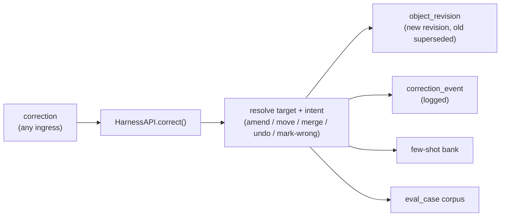

# Corrections

A correction is a **one-message, plain-language fix** to the canonical record.
It is the primary way the system gets better over time, and the reason
"provably improving" is one of the six promises.

## What a correction does

Say `that bake was 80% hydration not 75` and the harness:

1. Resolves **which** object you mean and **what** intent you have (amend a
   field, move to another object, merge duplicates, undo, mark-wrong).
2. Writes a **new `object_revision`** and supersedes the old one. The value
   changes but the history is preserved (`hydration: 75 → 80`).
3. Logs a `correction_event`.
4. Appends to the **few-shot bank** so the interpreter learns from your phrasing.
5. Backfills an **`eval_case`** so the fix becomes a regression test.

Every mutation goes through `capture()` / `correct()`. There is **no privileged
write path**. The app shell and every adapter use the same surface.

## Correction intents

| Intent | Example |
|---|---|
| Amend | "that was 80% hydration not 75" |
| Move | "that wasn't a bake, it was a starter feed" |
| Merge | "the monstera and the big monstera are the same plant" |
| Undo | "ignore that last one" |
| Mark-wrong | "that dining entry never happened" |

## History is preserved

Corrections never destroy prior state. A merge leaves **no orphan canonical
rows** (foreign keys stay clean); an amend leaves a visible revision chain; an
undo supersedes without deleting the provenance. The detail view's provenance
panel renders the full chain.

## Corrections feed the corpus

Two downstream effects make corrections compound:

- **Few-shot bank.** Your corrected phrasing improves future L2 interpretation
  for similar captures.
- **Eval corpus.** `eval backfill` can synthesize `eval_case` rows from
  pre-existing `correction_event` rows; `eval export --sanitize` strips PII so a
  correction-derived case can be contributed upstream after a human diff review.

That last property is why the eval framework can claim quality is *enforceable*:
real mistakes become permanent regression tests. See
[Evaluation replay](replay.md).
