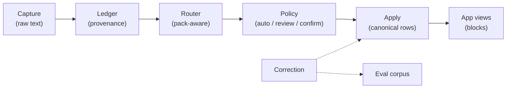

# Concepts

`domain_foundry` has a small set of ideas that compose into the whole system.
Read them in order the first time; they build on each other.

| Concept | One line |
|---|---|
| [Foundry redesign](../FOUNDRY_REDESIGN.md) | Evidence, product cuts, schema, experience, app, and proof compile from one typed contract. |
| [The ledger](ledger.md) | An append-only substrate that stores raw captures + provenance before any interpretation. |
| [Domain packs](packs.md) | Data-only bundles (YAML) that describe a domain's schema, routing, policy, and app views. |
| [Hybrid routing](routing.md) | A two-layer router: zero-token regex rules first, an LLM interpreter only when needed. |
| [Corrections](corrections.md) | One-message plain-language fixes that revise the canonical record and feed the eval corpus. |
| [Evaluation replay](replay.md) | Deterministic cassette replay + per-pack scorecards that make routing quality enforceable. |

## The mental model

Two invariants hold everywhere:

1. **Capture-first.** The raw message reaches the ledger with full provenance
   *before* interpretation. If the interpreter or the machine crashes, the
   capture is still there.
2. **Never-drop.** Every capture ends in exactly one of: applied to a domain,
   queued for review, parked as an unfiled card, or retained ledger-only. There
   is no silent loss.

Everything else — packs, routing tiers, policy gates, projections, evals — is in
service of those two invariants while staying local-first and honest about
uncertainty.

The creation path adds a third invariant: **preview equals export**. The exact
self-contained HTML inspected in Foundry Studio is the owned application
artifact written beside its schema, evidence snapshot, and content-hashed
receipt.
