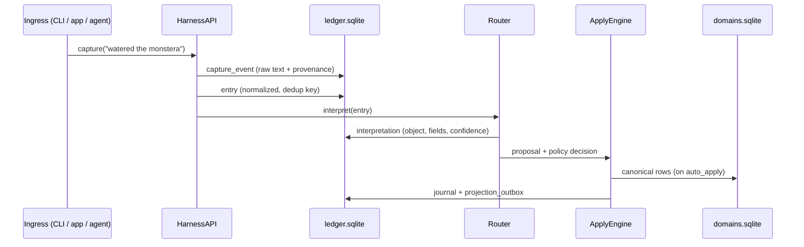

# The ledger

The ledger is the **append-only substrate** that makes capture-first and
never-drop real. It lives in `ledger.sqlite` under `~/.domain_foundry/`, separate
from the pack-owned domain tables in `domains.sqlite` (see
[ADR-002](../adr/ADR-002-two-database-layout.md)).

## Why a separate substrate

The capture substrate evolves independently from the domains you invent on top
of it. Splitting the two databases means:

- A pack migration can never corrupt the substrate.
- Substrate integrity checks run without knowing anything about a pack.
- A future Postgres export is a schema *translation*, not a redesign, because
  every id is a ULID and every timestamp is UTC ISO-8601
  ([ADR-003](../adr/ADR-003-ulid-identity.md)).

## The lifecycle of one capture

The raw `capture_event` is written **first and unconditionally**. Interpretation
is a separate, later row that references it. Nothing downstream can delete the
original.

## Core substrate tables

| Table | Holds |
|---|---|
| `capture_event` | The raw inbound message + provenance (source, channel, received-at). |
| `entry` | The normalized capture with a dedup key (idempotent re-capture). |
| `interpretation` | Router output: proposed object/operation/fields + confidence. |
| `approval_queue` | Proposals awaiting human review. |
| `journal` | An append-only record of every canonical change (who/what/when/why). |
| `object_revision` | The revision chain behind each canonical object (correction history). |
| `correction_event` | A logged plain-language correction + its resolved change. |
| `eval_case` | A replayable case derived from a fixture or a real correction. |
| `projection_outbox` | Pending projection work (drives markdown / block refresh). |
| `schema_registry` | The compiled, validated schema for every active pack object. |

## Provenance chain

Because the ledger keeps `capture_event → interpretation → journal →
object_revision`, every canonical value can be traced back to the exact words
that produced it, through every correction. The app shell renders this as the
**provenance panel** in a detail view: capture text → interpretation confidence
→ each revision.

## Idempotence & recovery

- **Idempotent re-capture.** The same message captured twice collapses to one
  `entry` via the dedup key; a re-run of the router does not create duplicate
  canonical rows.
- **Crash recovery.** Approvals apply *exactly once* even across a crash between
  "resolved" and "executed". The journal and the outbox are the durable source of
  truth, and the projection coordinator converges from durable state on restart.

These properties are locked in by the curated contract-case set (see
[Evaluation replay](replay.md)).
