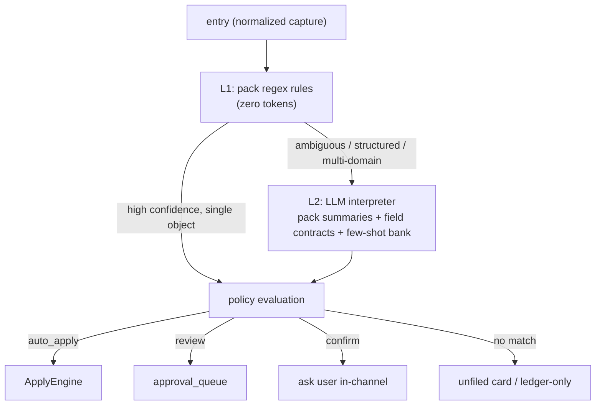

# Hybrid routing

Routing decides **which pack object and operation** a capture becomes. It is a
two-layer, cost-aware pipeline: cheap deterministic rules first, an LLM
interpreter only when the rules aren't confident enough.

## L1 — regex rules (zero tokens)

Every pack ships ordered, case-insensitive regex `rules` compiled into a single
L1 matcher. A match nominates an object and applies a `confidence_boost`. When a
rule fires with high confidence for exactly one object and the message is
simple, routing stops here — **no LLM call, no tokens spent**.

This is why packs must ship **≥8 example utterances and ≥2 negative examples**:
the examples must all route correctly in dry-run, and the negatives (plausible
sentences that must *not* route — dev/admin chatter is ideal) guard against
over-eager rules.

## L2 — LLM interpreter (only when needed)

The interpreter is invoked when L1 is ambiguous, the message is structured, or
it spans multiple domains. It receives:

- compact **pack summaries** (what each active domain is for),
- the **field contracts** (types, units, enums, required-ness),
- the **few-shot bank** (accumulated from real corrections),
- and pack-authored `llm_hints` for the one or two disambiguations a human
  reader would need.

Its output is **constrained to the structured schema** — the interpreter can
only propose objects/fields the pack declared. Captured text can never directly
trigger tool execution; it can only ever become a *proposal* subject to policy.

## Cost guard

A spend cap bounds LLM usage. If the cap is hit, routing degrades gracefully to
L1 + review rather than failing or dropping the capture (never-drop holds).
Health reports current spend against the cap.

## Multi-domain fan-out

A single capture can legitimately create rows in more than one domain — e.g.
"dinner at River Station Grill, then heading to Port City in March" fans out into
a `food.dining` record **and** a `travel.trip`, linked by an explicit
cross-domain `link`. Fan-out is a first-class routing outcome, not a workaround,
and is covered by the curated contract cases.

## Determinism in tests

In evaluation and CI the interpreter runs against **cassettes** (recorded
prompt→response pairs keyed by a normalized prompt hash), so routing is fully
deterministic and token-free on the PR gate. See
[Evaluation replay](replay.md). The heuristic inner router is deterministic on
its own, so the bundled fixtures replay without any recorded LLM at all.
