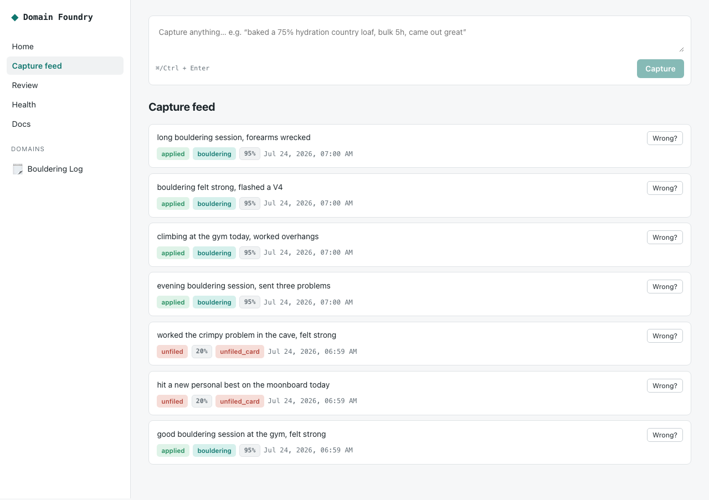

# Getting started

**Describe your passion. Talk to it. It becomes permanent, structured, correctable data — on your machine, in plain SQLite.**

You don't fill in forms. You say what happened in your own words — in Claude
Desktop, in a Telegram chat, or on the command line — and Domain Foundry captures
it, files it into a typed record, and lets you fix any mistake in one sentence.

Here is a real capture feed after five messages about bouldering. Notice the
routing badges: confident captures are **applied**; ones it isn't sure about are
kept as an **unfiled** card instead of being guessed at or dropped. Every row has
a **Wrong?** button — one tap to correct it.



Walk the same loop as a story, then do it yourself (everyone *and* the terminal):
**[Turn a hobby into an app](end-to-end.html#tutorial)**.

Pick your track. Both reach the same local data.

---

## Track A — For everyone (no terminal after install)

One install, then you never touch a terminal again: you talk to Domain Foundry
inside an app you already use.

### Option 1 — Claude Desktop (or Cursor, or any MCP client)

1. **Install once** (copy-paste this line):
   ```bash
   pipx install domain-foundry-core domain-foundry-mcp
   ```
2. In **Claude Desktop → Settings → Developer → Edit Config**, paste:
   ```json
   {
     "mcpServers": {
       "domain-foundry": {
         "command": "domain-foundry-mcp",
         "args": ["--home", "~/.domain_foundry"]
       }
     }
   }
   ```
3. Restart Claude Desktop. Now just talk:

   > **You:** i have a log of sourdough bakes
   > **Claude:** drop the notebook or the photos and i’ll ocr them.
   > **You:** folder on my desktop, photos + notes.txt
   > **Claude:** 47 bakes in. you could chart how inputs lead to crumb, generate mixes from what worked, or organize instagram.
   > **You:** i want to data visualize all my bakes
   > **Claude:** three looks for an mvp — pick one and i’ll build it.

   Same shape for anything else you already keep: a dive notebook, a climbing ticklist, a coffee log. Claude shows options; you pick in your own words.

That's it. The same config block works in Cursor and other MCP clients. Full
details: [Connect your agent → MCP](connect-your-agent.md#mcp).

### Option 2 — A Telegram bot you text

1. **Install once:**
   ```bash
   pipx install domain-foundry-core domain-foundry-telegram
   ```
2. In Telegram, message **@BotFather**, send `/newbot`, and copy the token.
3. **Start it** (once):
   ```bash
   export TELEGRAM_BOT_TOKEN=<your token>
   domain-foundry-telegram
   ```
4. Open your bot and text it like a friend who never forgets:

   > **You:** i have a log of sourdough bakes
   > **Bot:** send the photos or a notes dump — i’ll read them.
   > **You:** i want to data visualize all my bakes
   > **Bot:** three looks. reply 1, 2, or 3.

Full details, including how to keep the bot private to you:
[Connect your agent → Telegram](connect-your-agent.md#telegram).

---

## Track B — For developers (the CLI)

```bash
pipx install domain-foundry-core        # or: pip install -e . from a checkout
domain-foundry setup                    # bring your own key, then pick a starting point

# describe a passion → browse the atlas → pick an idea
domain-foundry new-domain "food"
domain-foundry new-domain "diving" --reply "dive log"

# talk to it
domain-foundry capture "cooked the shoyu ramen again, keeper"
domain-foundry query --domain recipes

# talk to it
domain-foundry capture "good bouldering session at the gym, felt strong"
domain-foundry query --domain bouldering
domain-foundry correct "rating = moderate"

# see it in a browser (the screenshot above)
domain-foundry serve   # → http://127.0.0.1:8787
```

`setup` runs `init` for you and ends by asking where you want to start. Already
have opinions? `domain-foundry setup --provider deepseek -y` (or `openrouter` /
`anthropic`) skips every question. Exported `DOMAIN_FOUNDRY_*` vars override it
entirely — see [Bring your own key](../QUICKSTART.md#bring-your-own-key).

### Shape it with a model

Without a key you still get a **simple log** you can talk to today. With a key,
describing a passion asks a stronger model to pick the fields you actually use
(dose, method, grade — not a generic journal).

DeepSeek and OpenRouter are first-class:

```bash
export DEEPSEEK_API_KEY=...            # from https://platform.deepseek.com/api_keys
domain-foundry setup --provider deepseek -y

# or one key, many models
export OPENROUTER_API_KEY=...
domain-foundry setup --provider openrouter -y
```

Then:

```bash
domain-foundry new-domain "log my pour-over coffee brews"
domain-foundry capture "V60, Ethiopia, 15g in, bergamot, rating 8"
domain-foundry ask "what was my last brew and how did it taste?"
domain-foundry correct "rating = 9"
```

If the model can't shape the interest, you still get the simple log — never an
empty failed install. In the app, the same key lives under **Settings**.

Author your own richer domains (schema, routing rules, projections) in the
[Pack authoring guide](../PACK_AUTHORING.md); remix an example in an afternoon
with the [plant-care tutorial](../tutorial-plant-care.md).

---

## What just happened

1. **Capture first.** Your exact words are stored in an append-only ledger
   *before* anything interprets them. Nothing is ever silently dropped.
2. **Routed, not guessed.** A record is created only when the system is
   confident; otherwise it waits as a review or unfiled card.
3. **One-message corrections.** A plain-language fix amends the canonical record,
   preserves history, and compiles into a replayable regression test — so the
   system provably improves.
4. **Local first.** Everything lives in SQLite on your machine. No telemetry, no
   cloud, no vector soup — files you can open with any SQLite browser.

Next: **[Connect your chat app](connect-your-agent.md)** — Claude Desktop / Cursor,
Telegram, or hermes-agent, each with a copy-paste setup.

Already have a setup? **[Bolt it on](adopt-in-place.md)** — install alongside,
pull your existing notes and logs into foundries (read-only, idempotent), and add
it to your current Hermes without rewriting anything.
