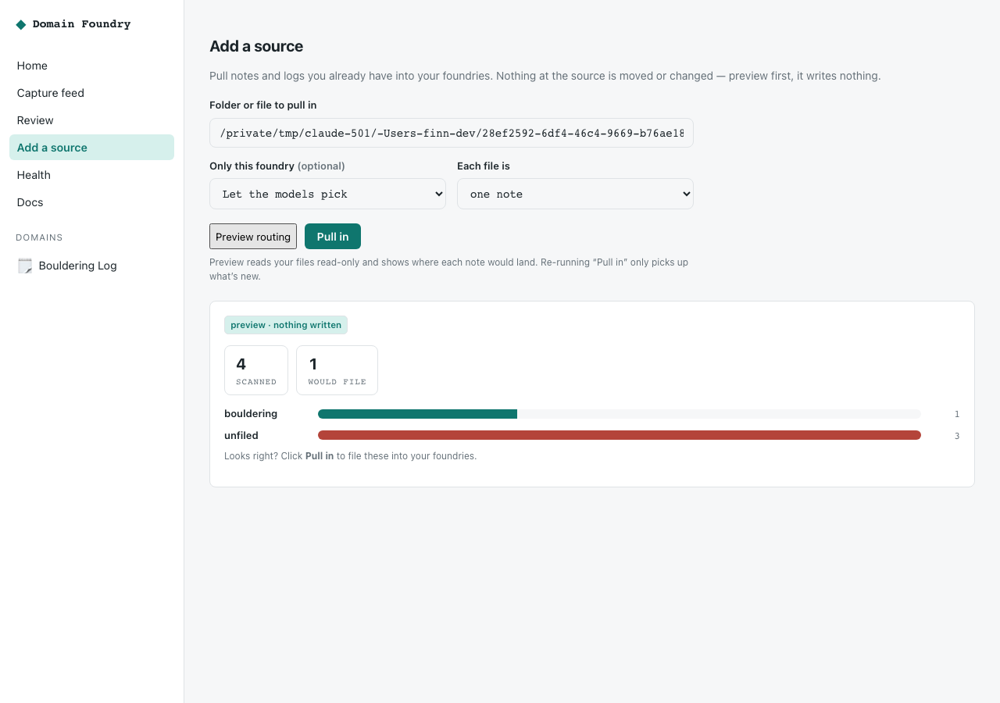

# Use Domain Foundry (the no-terminal guide)

**What it is, in one line:** you say what you did — in a chat — and it remembers it
forever as neat, organized, correctable notes on your own computer.

No spreadsheets. No forms. No "sync." You talk; it files.

> **The 20-second version**
>
> 1. Install it once (one line — ask a techy friend or paste it yourself).
> 2. Talk to it in **Claude Desktop** or a **Telegram bot**.
> 3. To fix something, just say so: *"that sunday batard was 78 not 72."*

The loop is always the same. Three weekends to steal from:

1. **Bake log** — “i have a log of sourdough bakes” → pick the scatter look → ask → fix a number.
2. **Dive notebook** — animals underwater → field-guide look → build it → log a sighting.
3. **Card binder** — “i collect pokemon cards” → Card dex → denser gallery → build it → a Charizard files.

Click through it: **[Bring the log. Pick a look.](end-to-end.html)**.

---

## Pick how you want to talk to it

You only need **one** of these. All three keep your data in one place on your
computer.

### Option A — Claude Desktop (easiest if you already use Claude)

1. Install the Claude Desktop app.
2. Someone installs Foundry from a checkout of this repo (`pip install -e .`
   then `pip install -e ./adapters/mcp` — see [Getting started](getting-started.md)).
   Packages are not on PyPI yet.
3. One-time setup: open **Settings → Developer → Edit Config** and paste this,
   then restart Claude:
   ```json
   {
     "mcpServers": {
       "domain-foundry": { "command": "domain-foundry-mcp", "args": ["--home", "~/.domain_foundry"] }
     }
   }
   ```
4. Now just chat:
   > **You:** i have a log of sourdough bakes
   > **You:** i want to data visualize all my bakes
   > **You:** the scatter one
   > **You:** that sunday batard was 78 not 72

### Option B — A Telegram bot you text

1. In Telegram, message **@BotFather**, send `/newbot`, pick a name. It gives you
   a code (a "token").
2. From the same checkout, start the bot with that token:
   ```bash
   pip install -e ./adapters/telegram
   export TELEGRAM_BOT_TOKEN=<the token>
   domain-foundry-telegram
   ```
   Optional: message **@userinfobot** for your numeric chat id, then
   `export TELEGRAM_ALLOWED_CHAT_IDS=<that id>` so only you can talk to it.
   Same steps: [Connect your chat app](connect-your-agent.md#telegram).
3. Open your bot and text it like a friend who never forgets:
   > **You:** /new I want to remember the animals I see underwater
   > **You:** the field-guide look
   > **You:** build it
   > **You:** spotted a turtle at Blue Hole, 18m

### Option C — Pull in notes you already have (a few clicks)

Already keep notes in a folder (Apple Notes export, Obsidian, plain text files)?

1. Open **http://127.0.0.1:8787** in your browser (after someone runs
   `domain-foundry serve` — one line).
2. Click **Settings** → **Sources**.
3. Type the folder, click **Preview routing** — it shows where your notes *would*
   go, and **changes nothing**.
4. Happy with it? Click **Pull in**.



Your original notes are never moved, renamed, or edited — this only *copies* the
words into your foundry.

---

## The three things worth knowing

**1. It never guesses wildly.** If it's sure where a note belongs, it files it. If
it isn't, it waits in Inbox for you to sort later. It never throws anything away.

**2. Fixing a mistake is one sentence.** Say *"no, that was Tuesday"* or *"that
sunday batard was 78 not 72"* and it corrects the record — and remembers so it
won't make that mistake again.

**3. It's all yours.** Everything lives in a file on your computer. Nothing is
uploaded, and there's no account to sign up for. You can walk away anytime and the
data is just… there.

---

## Little things you'll want

- **Keep your Telegram bot private.** Set your chat ID when you start it, as in
  Option B (or see the [Telegram section](connect-your-agent.md#telegram)).
- **"Where did my note go?"** In Claude Desktop, ask *"which hydrations actually
  sprang?"* In Telegram, send `/query` plus a word. In the browser app
  (http://127.0.0.1:8787), click the interest on the left.
- **Start with one weekend.** Bake log, dive notebook, or card binder. Add more
  whenever you like by saying *"i have a log of …"* or *"i collect …"*.
- **Want it to understand how you talk?** Add a key in **Settings**. Without one
  you still get a simple log you can talk to; with one, describing a passion
  picks fields that match how you actually speak (and you can still say
  `rating = 9` to fix a number).

That's the whole thing. Talk to it, and it remembers — accurately, forever, and
only for you. When you want the technical details, see the
[developer guide](howto-technical.md).
